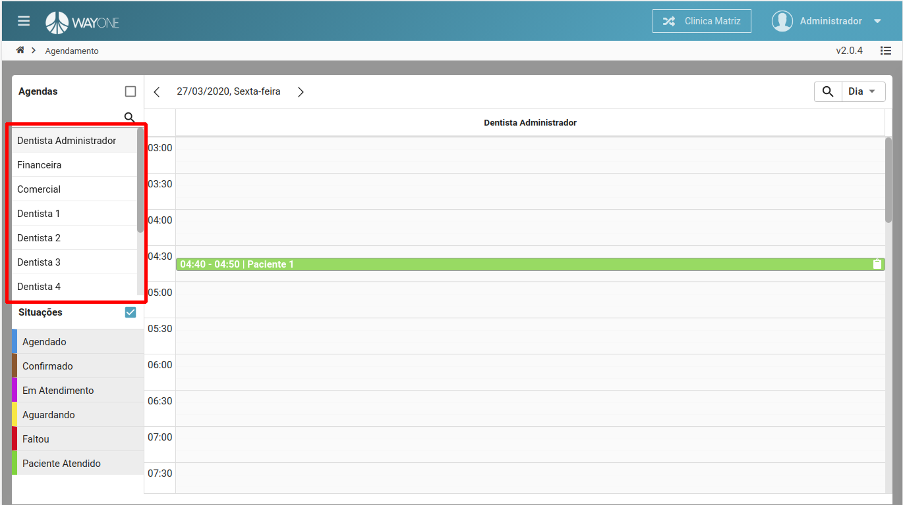
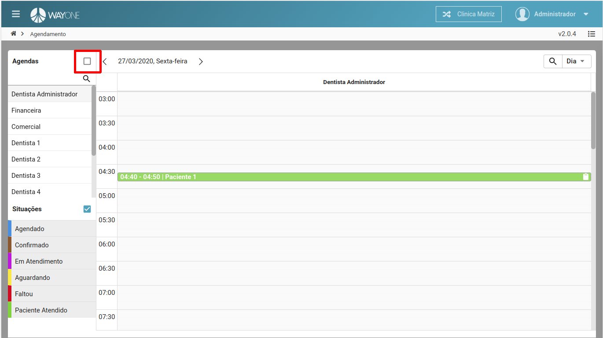
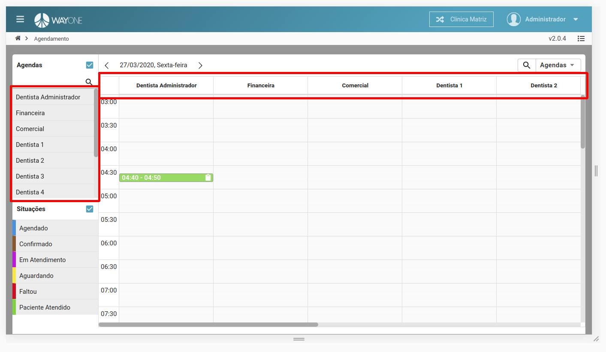
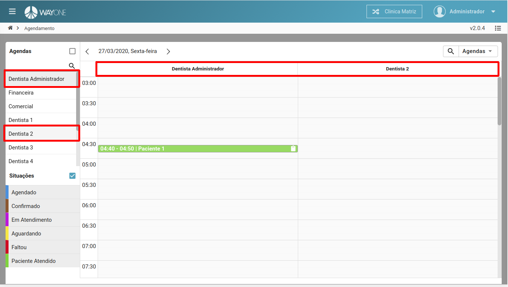

### Definição

Ao acessar a agenda, no menu lateral do lado esquerdo, na parte superior, terá um menu chamado **Agendas**, cada item desta lista é uma **agenda**, por padrão à agenda selecionado é referente ao usuário logado.

 
  

Para selecionar todas agendas, marque a **caixa de seleção** para que seja visualizado todas.

 
  

Com todas as agendas selecionadas, a visualização da tela será alterado, pois todos os agendamentos referente a cada agenda estará visível.

 
  

Para selecionar uma ou mais agendas, basta somente **clicar** sobre o nome da agenda, no menu lateral.

 
  

