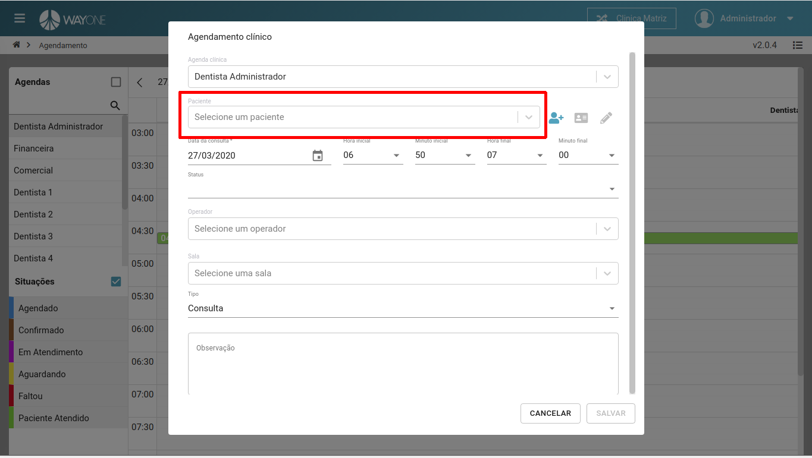
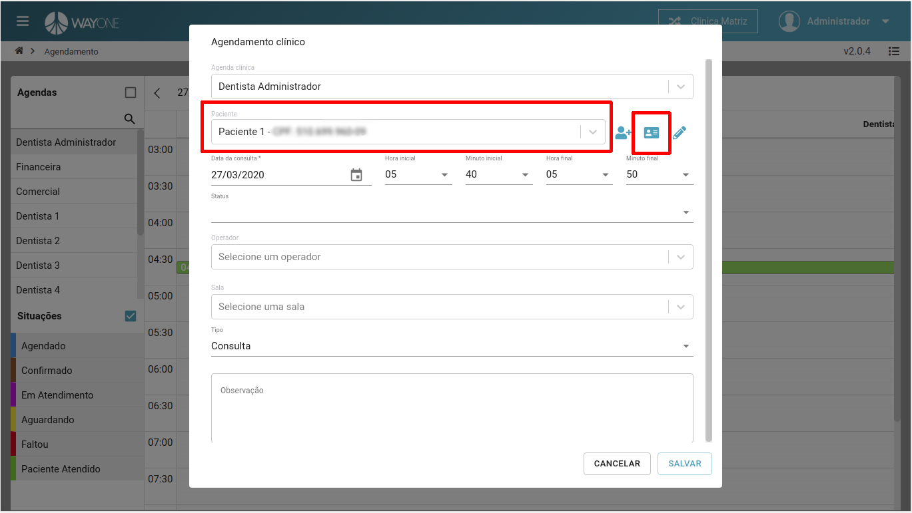
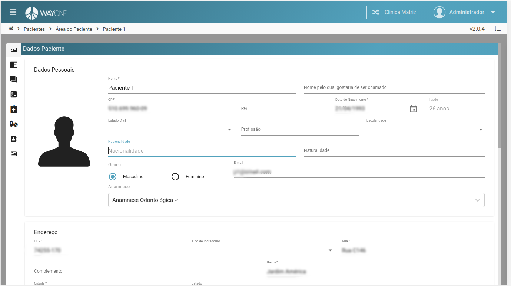

### Definição

Ao acessar a agenda, no **formulário de agendamento**, terá uma **caixa de pesquisa** para pesquisar o paciente.

  

Quando feito a pesquisa e selecionado o paciente, será habitado um **ícone**
para ser redirecionado. **Clique** sobre esse **ícone** para ser
redirecionado.

  

Formulário da área do paciente.

  

