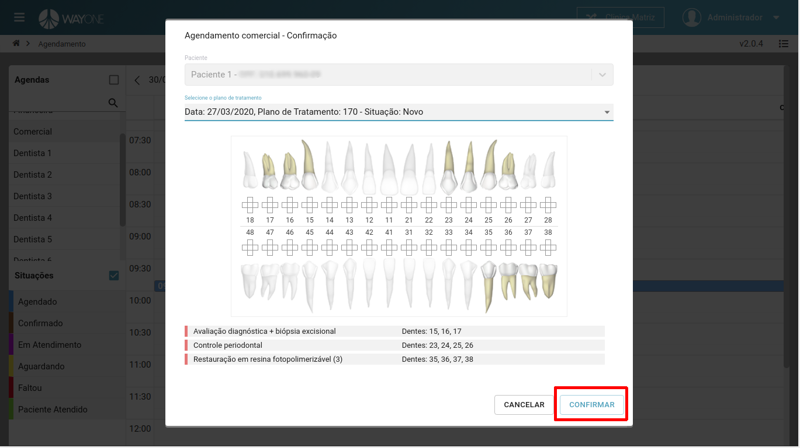

### Definição

Toda agenda pertence a um fluxo, e o agendamento consequentemente pertence ao mesmo fluxo. Existem quatro tipos de fluxo: **Clínico**, **Operacional**, **Comercial** e **Financeiro**.

* <a href="#-clínico">Atendimento Clínico</a> 
* <a href="#-operacional">Atendimento Operacional</a> 
* <a href="#-comercial">Atendimento Comercial</a> 
* <a href="#-Financeiro">Atendimento Financeiro</a> 

### Clínico
Uma vez que o agendamento foi salvo, clique sobre o botão **INICIAR ATENDIMENTO**

 
  

**Caso não conste CPF no cadastro do paciente, será redirecionado para tela de paciente.**

Confirme se deseja iniciar o atendimento clínico.

 
  

Tela de atendimento clínico.

 
  

### Operacional

Uma vez que o agendamento foi salvo, clique sobre o botão **INICIAR ATENDIMENTO**

 
  

Confirme se deseja iniciar o atendimento operacional.

 
  

Informe a descrição do atendimento para o botão de finalizar fique ativo.

 
  

### Comercial
Uma vez que o agendamento foi salvo, clique sobre o botão **INICIAR ATENDIMENTO**

 
  

Selecione um plano de tratamento.

 
  

**Clique** no botão **CONFIRMAR** para inicar o atendimento comercial.

 
  

Atendimento comercial.

 
  

### Financeiro

Uma vez que o agendamento foi salvo, clique sobre o botão **INICIAR ATENDIMENTO**

 
  

Selecione um plano de tratamento.

 
  

**Clique** no botão **CONFIRMAR** para que seja redirecionado para o caixa.

 
  

Tela de caixa para recebimento dos débitos.

 
  

