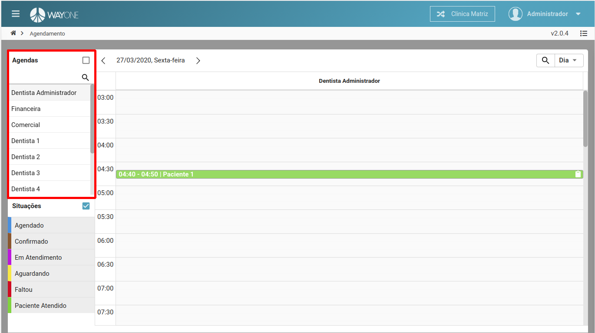
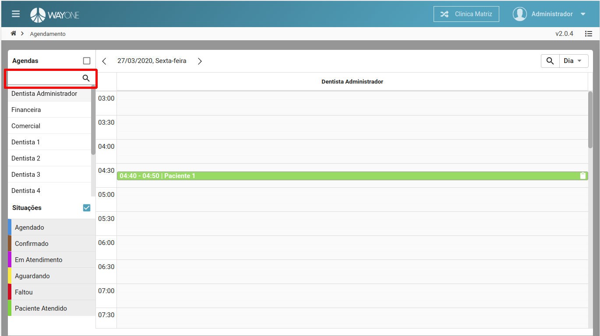
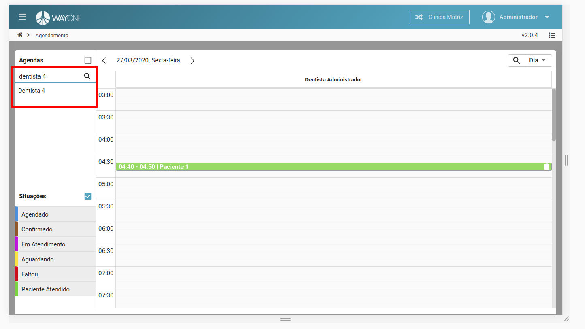
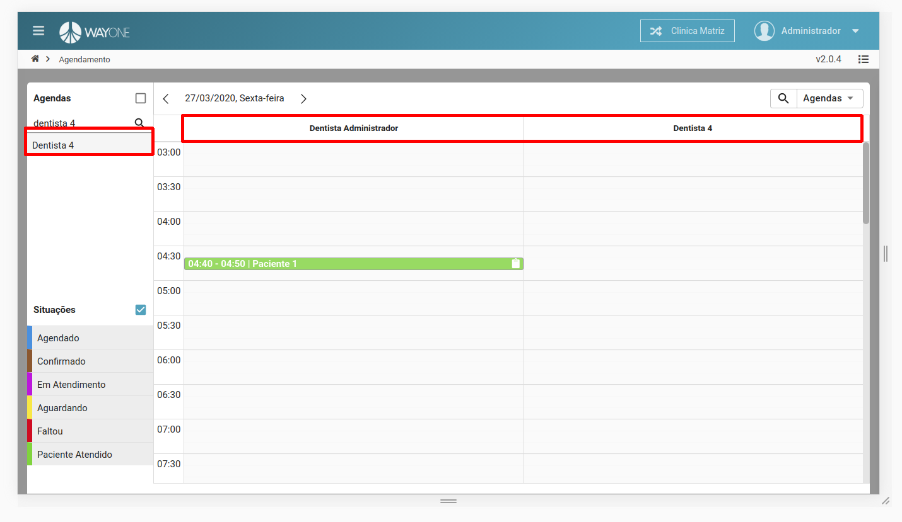

### Definição

Ao acessar a agenda, no menu lateral do lado esquerdo, na parte superior, terá um menu chamado **Agendas**, cada item desta lista é uma **agenda**, por padrão à agenda selecionado é referente ao usuário logado.

 
  

Para pesquisar uma determinada agenda, digite na **caixa de pesquisa** o nome da agenda.

 
  

A pesquisa é feita dinamicamente, de forma, que ao digitar cada letra/caractere é retornado uma ou mais agendas.

 
  

Podemos verificar nesse exemplo, que a pesquisa foi **dentista 4**, retornando à agenda. Para visualizar os agendamentos, basta **clicar** sobre agenda pesquisada.

 
  

