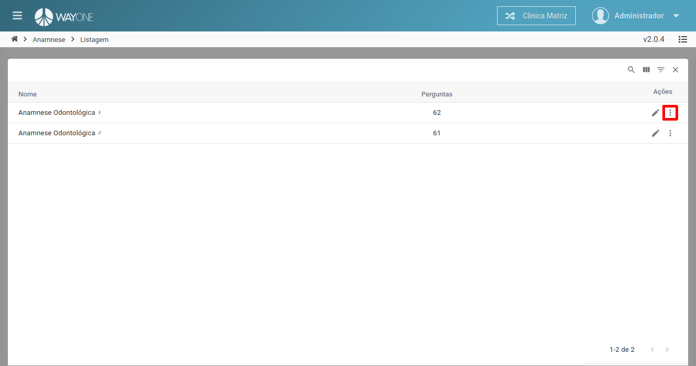
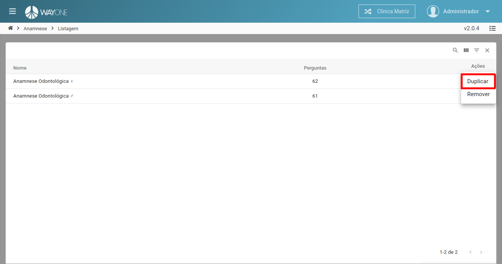
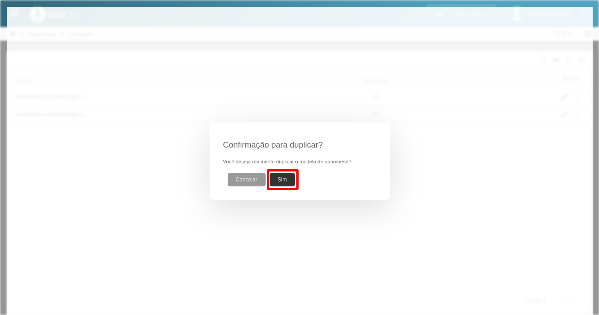
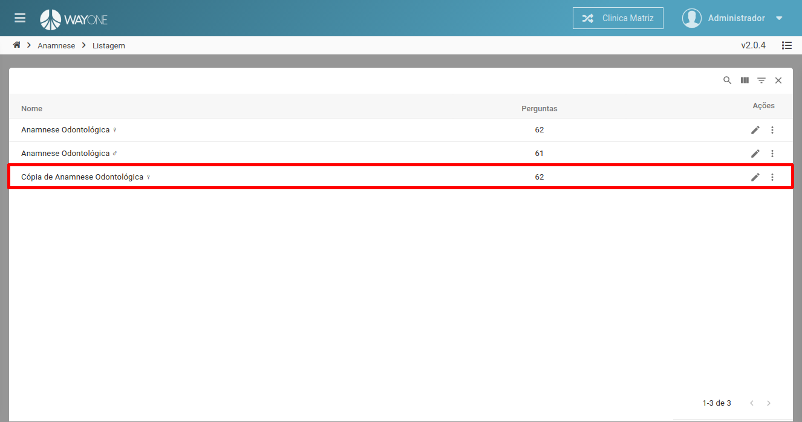

### Definição

Para duplicar uma anamnese clique sobre o **ícone mais itens** localizado na coluna de ações da tabela.

  

Sera exibido as opções de ações a ser realizadas, clique no item **duplicar** para duplicar a anamnese.

  

Sera solicitada a confirmação para duplicar.

  

Clique no botão **Sim** para confirmar a duplicação da anamnese. O novo registro ira aparecer na listagem.

  

