### Definição

Para editar uma anamnese clique sobre o **ícone lápis** localizado na coluna de ações da tabela.

 
  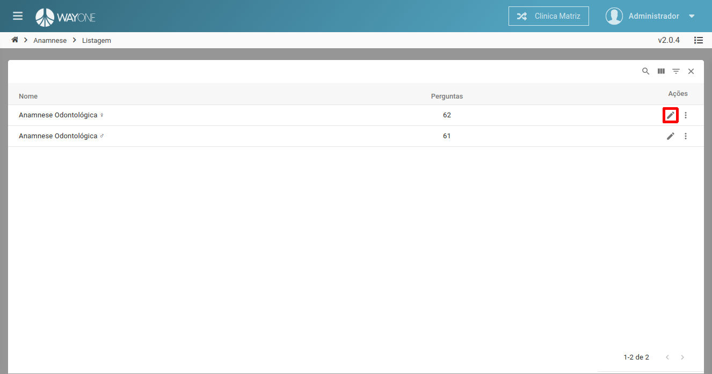

Sera apresentada a tela de edição com os dados do anamnese selecionada.

 
  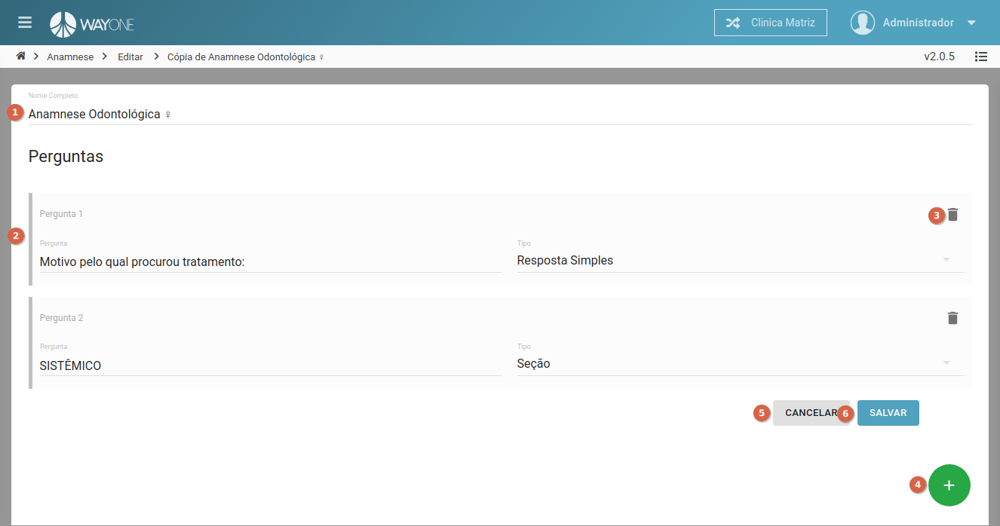

1. **Nome Completo** - informe o nome que representa a anamnese - campo **obrigatório**.
2. **Pergunta** - as perguntas que serão apresentadas ao responder a anamnese de um paciente, as perguntas podem mudar sua composição de acordo com o tipo. Os tipos de pergunta são:
    - **Resposta Simples**
        - Composição de uma pergunta com **Resposta Simples**.
        
 
          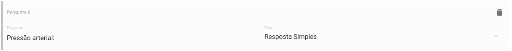
        

        - Apresentação da pergunta de **Resposta Simples**.
        
 
          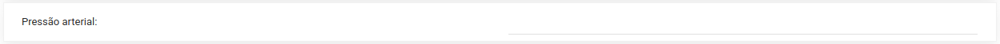
        

    - **Opções: Sim ou Não**
        - Composição de uma pergunta com **Opções: Sim ou Não**.
        
 
          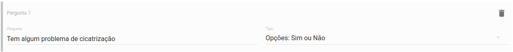
        

        - Apresentação da pergunta de **Opções: Sim ou Não**.
        
 
          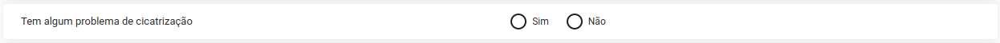
        

    - **Opções Sim ou Não e Pergunta Auxiliar**
        - Composição de uma pergunta com **Opções Sim ou Não e Pergunta Auxiliar**.
        
 
          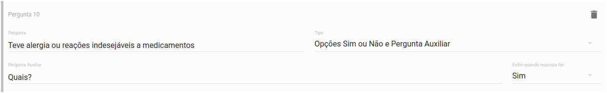
        

        - Apresentação da pergunta de **Opções Sim ou Não e Pergunta Auxiliar** caso a resposta **não atenda a condição de pergunta auxiliar.**
        
 
          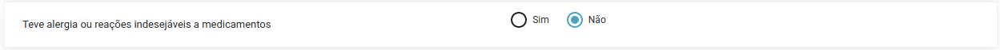
        

        - Apresentação da pergunta de **Opções Sim ou Não e Pergunta Auxiliar** caso a resposta **atenda a condição de pergunta auxiliar.**
        
 
          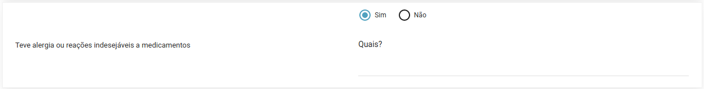
        

    - **Resposta Longa**
        - Composição de uma pergunta com **Resposta Longa**.
        
 
          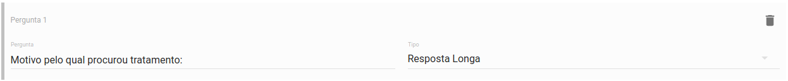
        

        - Apresentação da pergunta de **Resposta Longa**.
        
 
          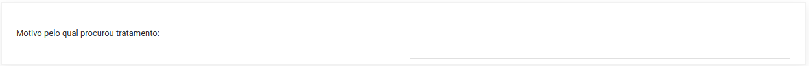
        

    - **Opções: Sim ou Não e Pergunta Auxiliar com Resposta Longa**
        - Composição de uma pergunta com **Opções: Sim ou Não e Pergunta Auxiliar com Resposta Longa**.
        
 
          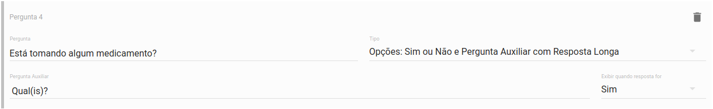
        

        - Apresentação da pergunta de **Opções: Sim ou Não e Pergunta Auxiliar com Resposta Longa** caso a resposta **não atenda a condição de pergunta auxiliar.**
        
 
          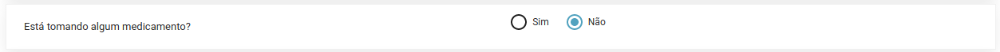
        

        - Apresentação da pergunta de **Opções: Sim ou Não e Pergunta Auxiliar com Resposta Longa** caso a resposta **atenda a condição de pergunta auxiliar.**
        
 
          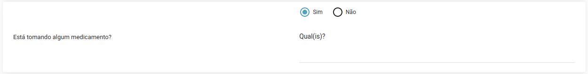
        

    - **Múltipla Escolha**
        - Composição de uma pergunta com **Múltipla Escolha**.
        
 
          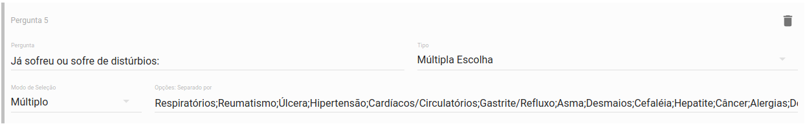
        

        - Apresentação da pergunta de **Múltipla Escolha**.
        
 
          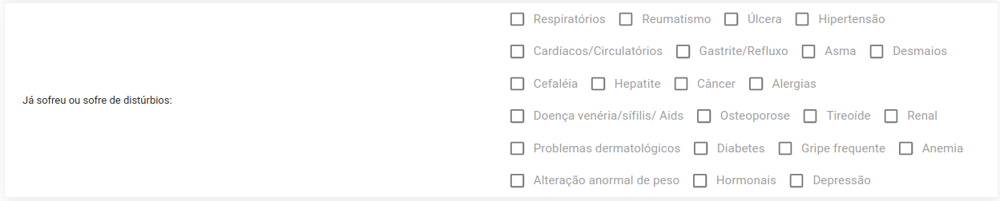
        

    - **Múltipla Escolha (com Dependência)**
        - Composição de uma pergunta com **Múltipla Escolha (com Dependência)**.
        
 
          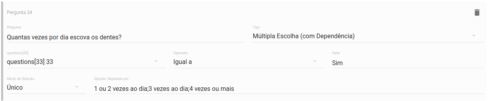
        

        - Apresentação da pergunta de **Múltipla Escolha (com Dependência)**.
        
 
          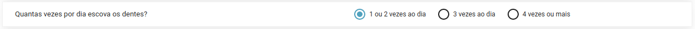
        

    - **Seção**
        - Composição de uma pergunta com **Seção**.
        
 
          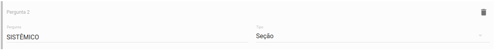
        

        - Apresentação da pergunta de **Seção**.
        
 
          
        

3. Botão **Excluir uma pergunta** - exclui a pergunta selecionada.
4. Botão **Adicionar uma pergunta** - adiciona uma nova pergunta a anamnese.
3. Botão **Cancelar** - cancela a edição da anamnese e retorna para a listagem.
4. Botão **Salvar** - salva a edição da anamnese e retorna para a listagem.

**Altere os campos desejados** e clique no botão **Salvar** para concluir a edição.

