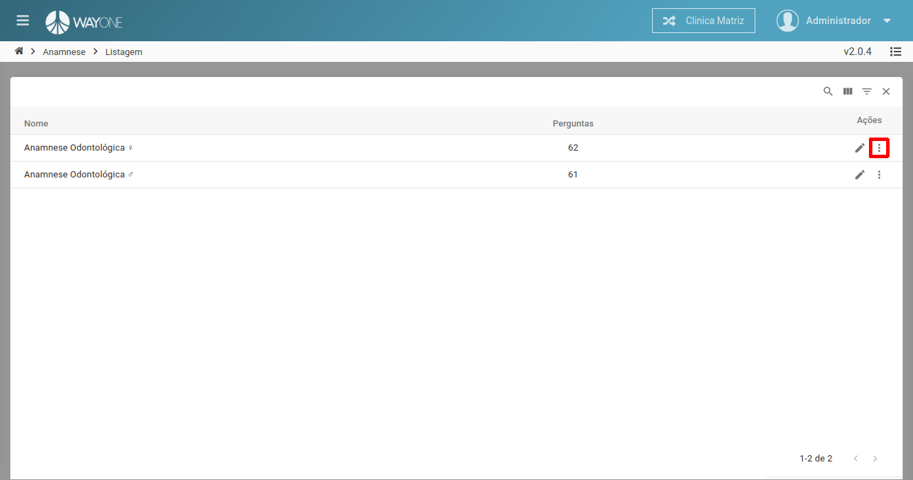
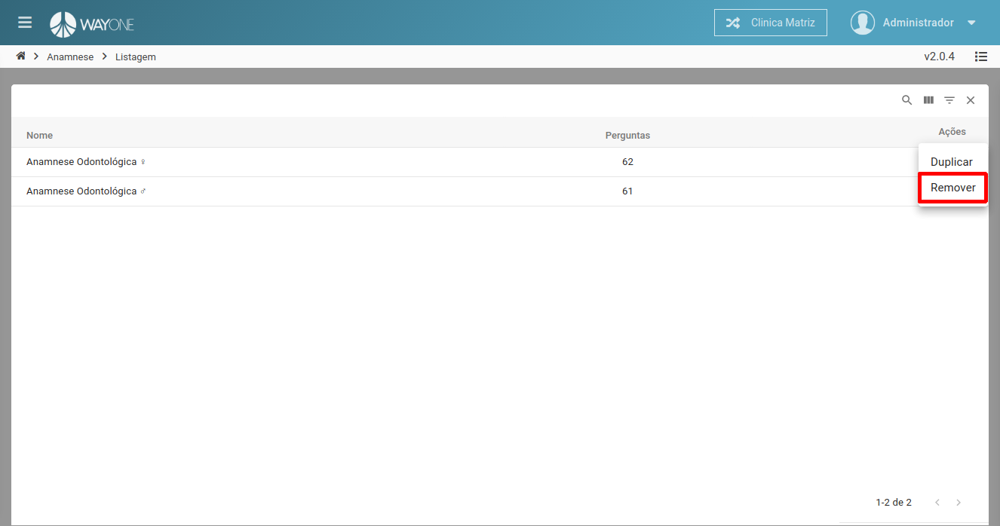
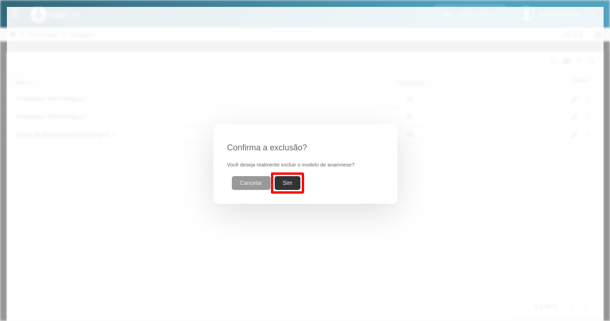

### Definição

Para excluir uma anamnese clique sobre o **ícone mais itens** localizado na coluna de ações da tabela.

 
  

Sera exibido as opções de ações a ser realizadas, clique no item **Remover** para excluir a anamnese.

 
  

Sera solicitada a confirmação para excluir.

 
  

Clique no botão **Sim** para confirmar a exclusão da anamnese.

