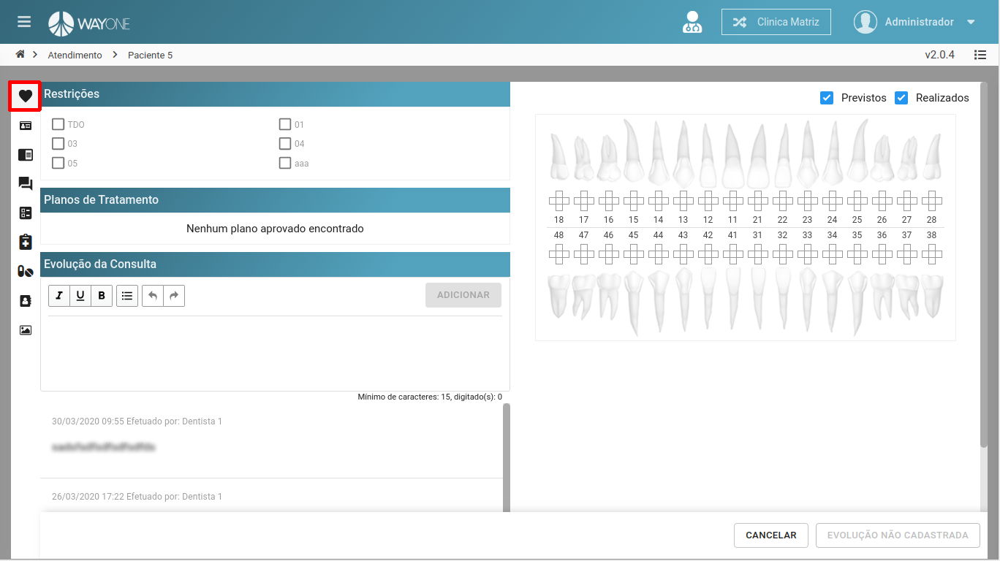
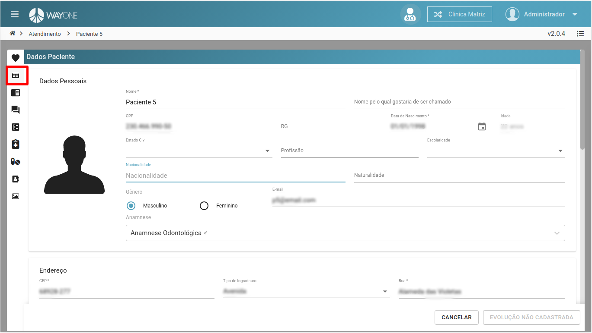
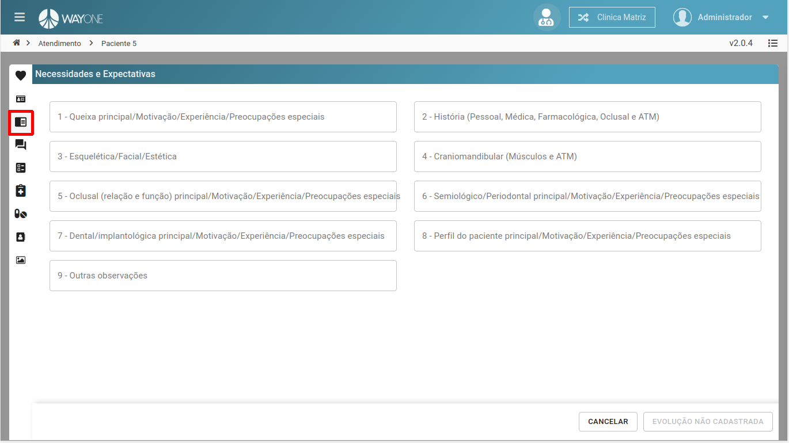
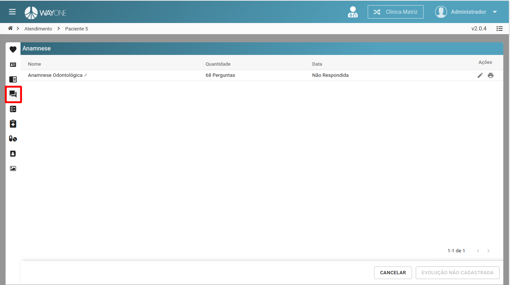
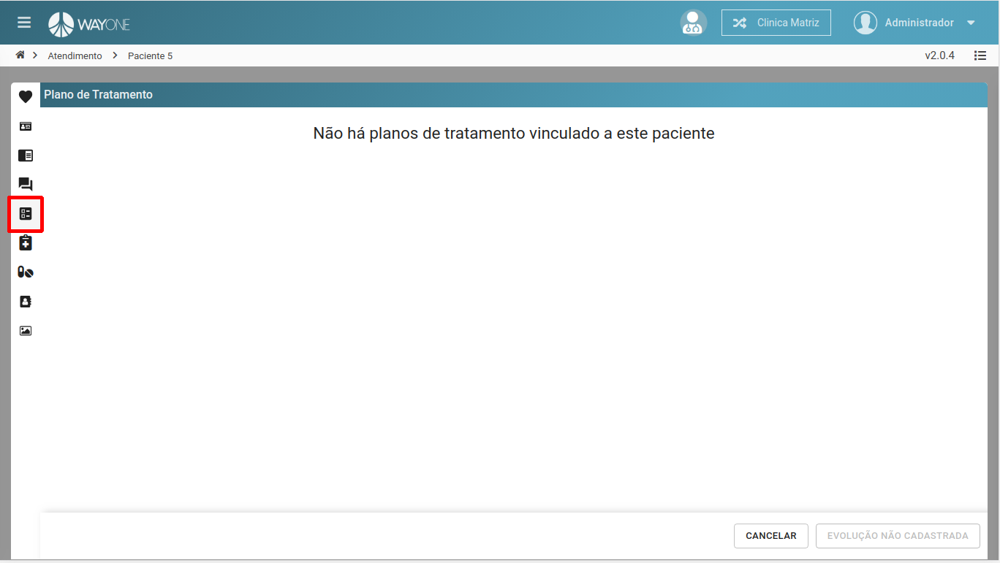
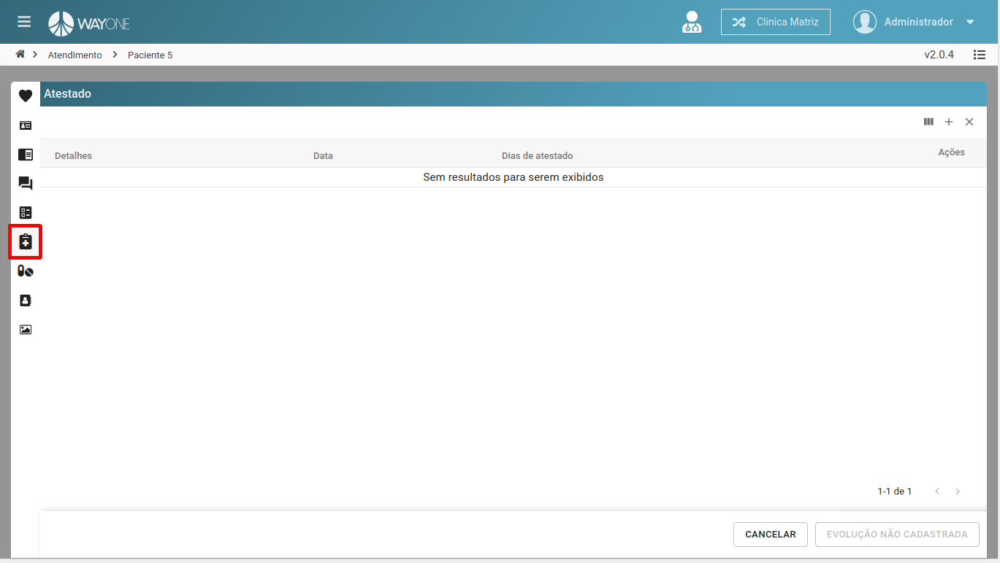
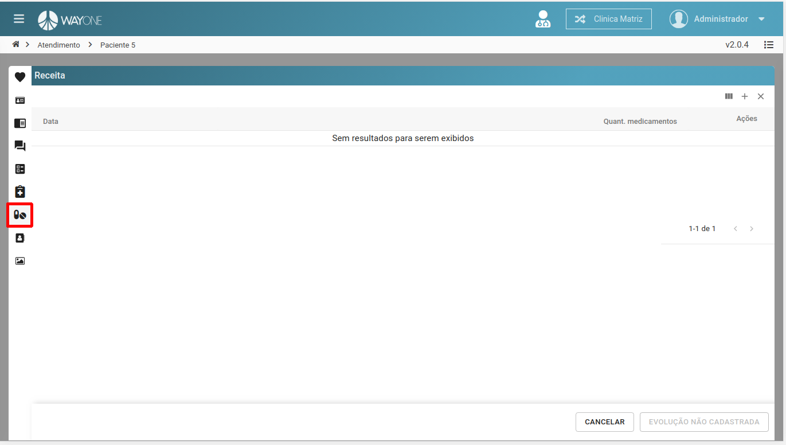
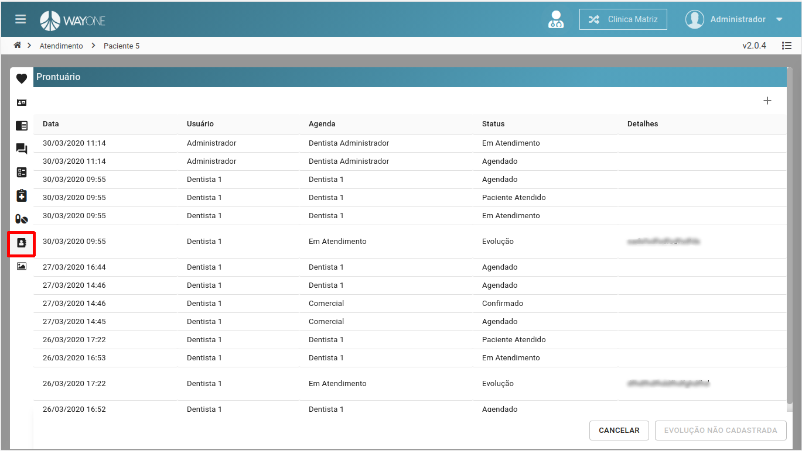
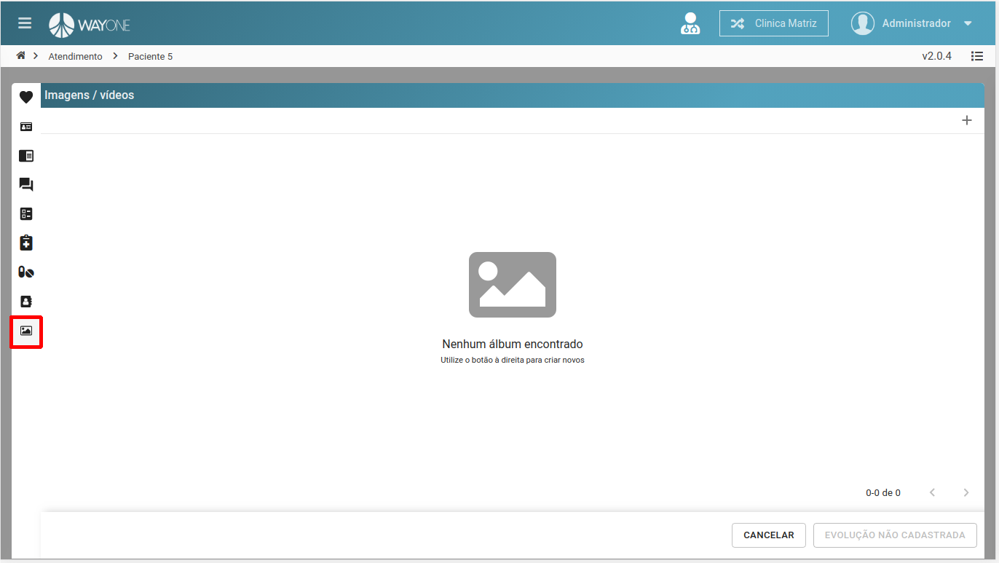

### Definição

**Atendimento** - Aba com as principais informações para o atendimento. Onde será possível marcar/desmarcar as restrições, lista de plano de tratamentos, adicionar evolução e visualizar a lista de evolução, e quando existir um plano de tratamento será possível a visualizar os dentes que serão feitos o tratamento.

 
  

**Dados do paciente** - Aba com os dados do paciente. Podendo alterar informações.

 
  

**Necessidades e Expectativas** - Aba que será possível adicionar infomações de necessidade e expectativas do paciente.

 
  

**Anamnese** - Podendo visualizar, editar e imprimir a anamnese.

 
  

**Plano de Tratamento** - Lista todos os planos de tratamento do paciente.

 
  

**Atestado** - Lista com todos atestados já feitos, podendo adicionar um novo e imprimir.

 
  

**Receitas** - Lista de todas as receitas, podendo adicionar um novo, remover e imprimir.

 
  

**Prontuário** - Prontuário/Histórico do paciente, podendo adicionar uma nova informação.

 
  

**Imagens / Vídeos** - Álbuns de imagens, vídeos, STL, PDF e ZIP, podendo visualizar, adicionar e remover.

 
  

