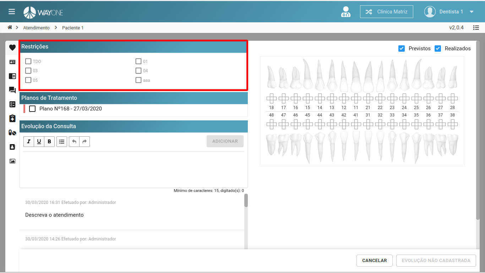
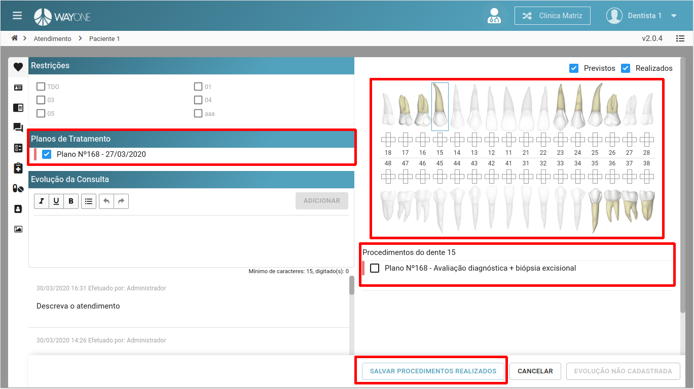
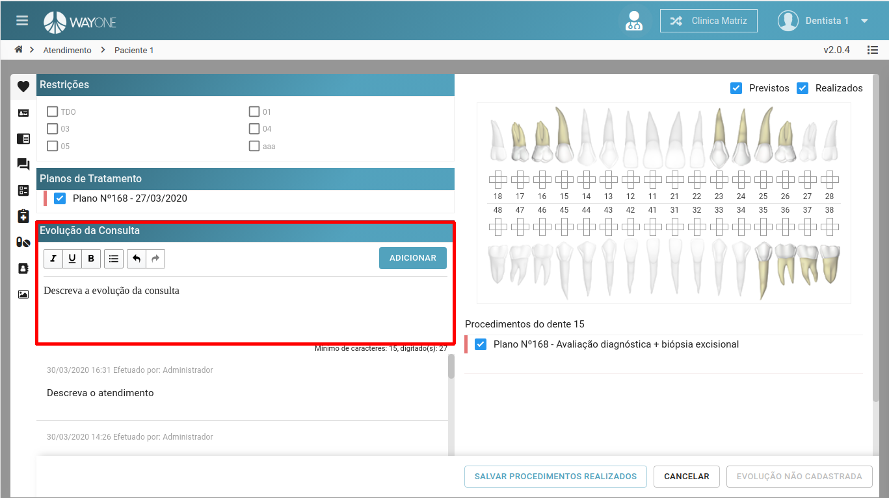
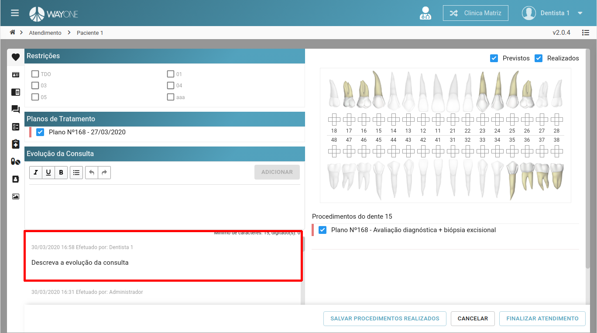
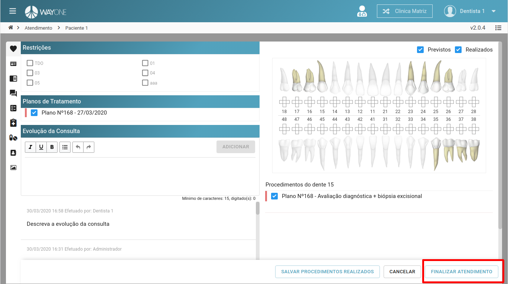
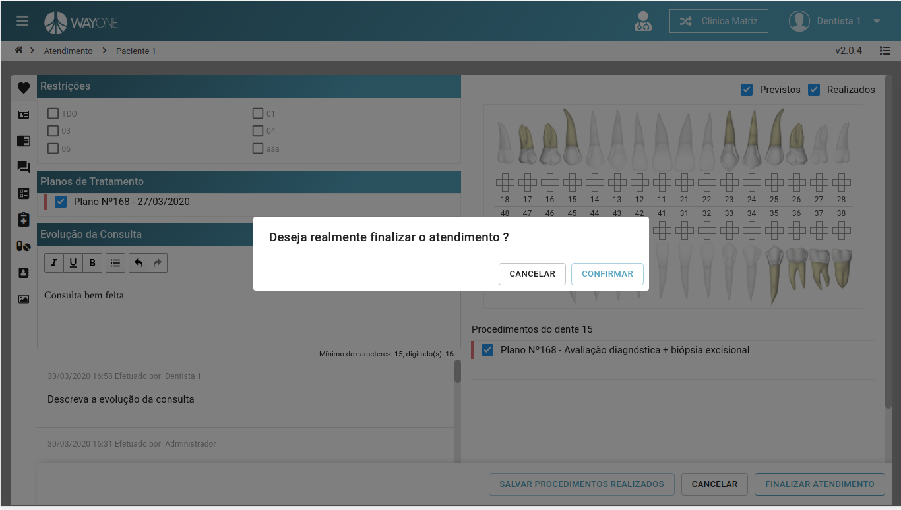

### Definição

Caso tenha dúvidas de como iniciar um atendimento clínico, [clique aqui](/pages/agenda/como-iniciar-um-atendimento).

Para realizar um atendimento, é preciso informar algumas informações.
* Restrições
* Plano de tratamento
* Evolução de consulta

### Restrições
**Clique** sobre a restrição para adicionar no histórico do paciente.

  

### Planos de Tratamento
* Selecione o plano de tratamento referente ao atendimento.
* Ao selecionar o plano de tratamento, será possível visualizar os dentes que serão feitos os procedimentos. Ao selecionar o dente, ficará visível o procedimento a ser feito.
* Quando o procedimento for feito, **clique** sobre no botão **SALVAR PROCEDIMENTOS REALIZADOS**

  

### Evolução da Consulta
Adicione a evolução da consulta para que o botão **FINALIZAR ATENDIMENTO**

  

Lista da evolução da consulta

  

* Finalizando a consulta.

  

* Confirme se a consulta pode ser finalizada.

  

