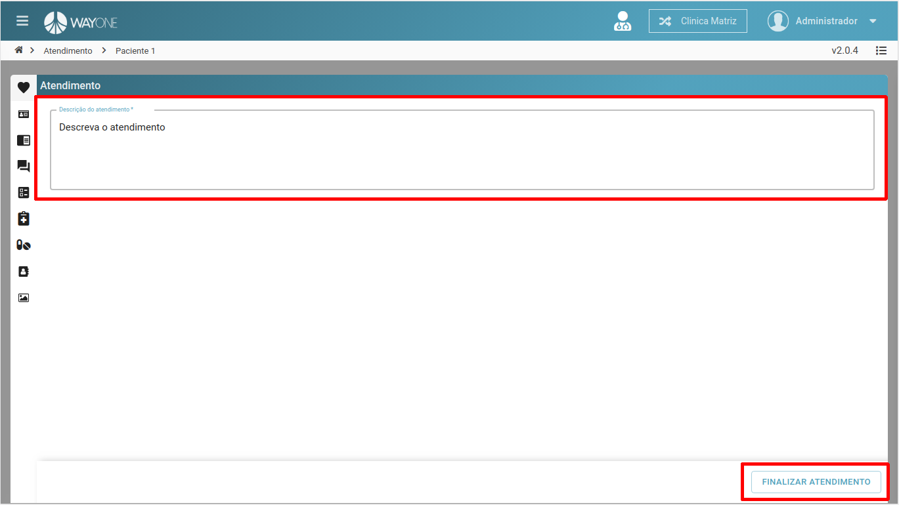

### Definição

Caso tenha dúvidas de como iniciar um atendimento operacional, [clique aqui](/pages/agenda/como-iniciar-um-atendimento).

Descreva o atendimento que foi feito e **clique** no botão **FINALIZAR ATENDIMENTO** 

 
  

