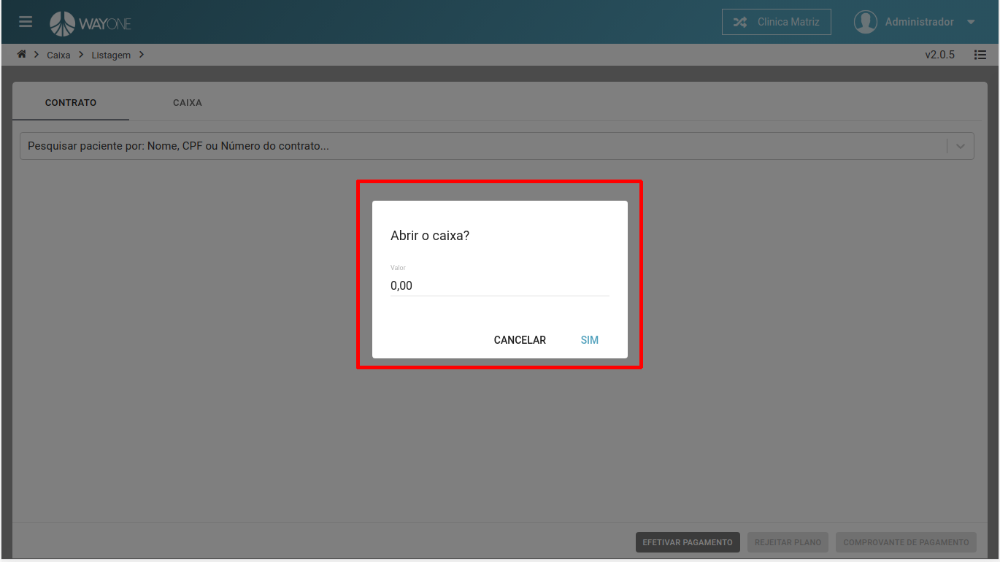
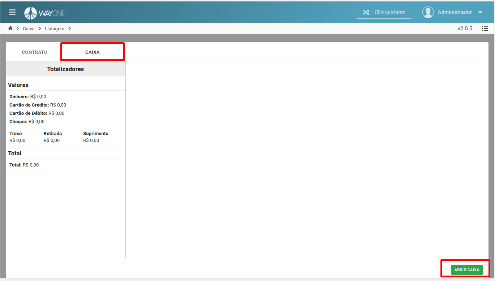
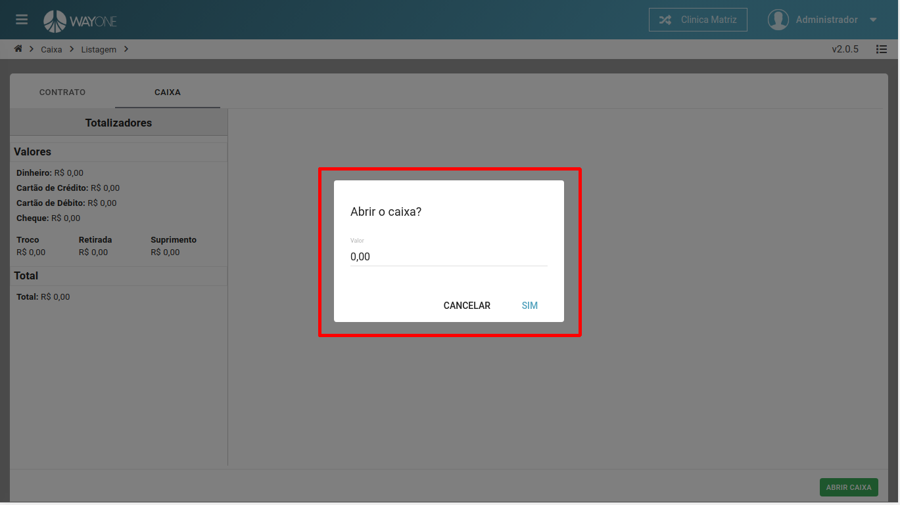

Se tiver dúvida sobre como acessar o caixa, [clique aqui](/pages/caixa/como-acessar-o-caixa)

**Existem duas formas de abrir o caixa financeiro.**

**Primeira opção:**
Quando acessado a tela de **caixa** e o caixa não estiver aberto, uma tela será visível para abrir o caixa.
Caso queira, poderá informar um **valor inicial** para caixa, também conhecido com **fundo de troco**.

 
  

**Segunda opção:**
Na **Aba CAIXA** terá o botão **ABRIR CAIXA**. Ao **clicar** será visível uma tela para abrir o caixa.

 
  

Informado o **valor inicial** do caixa, também conhecido com **fundo de troco**.

 
  

