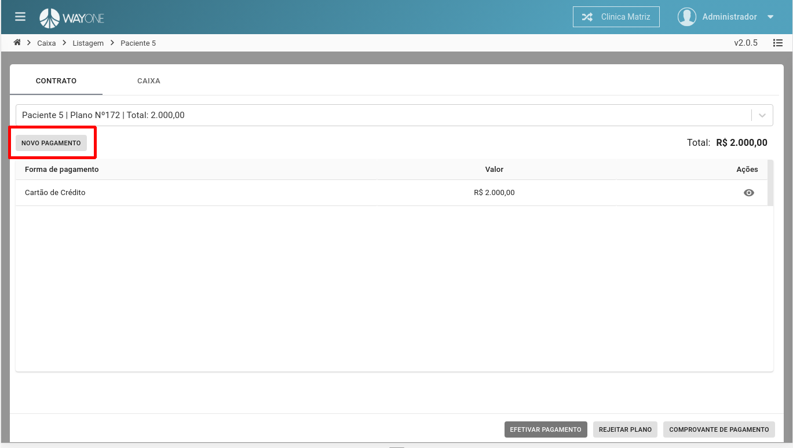
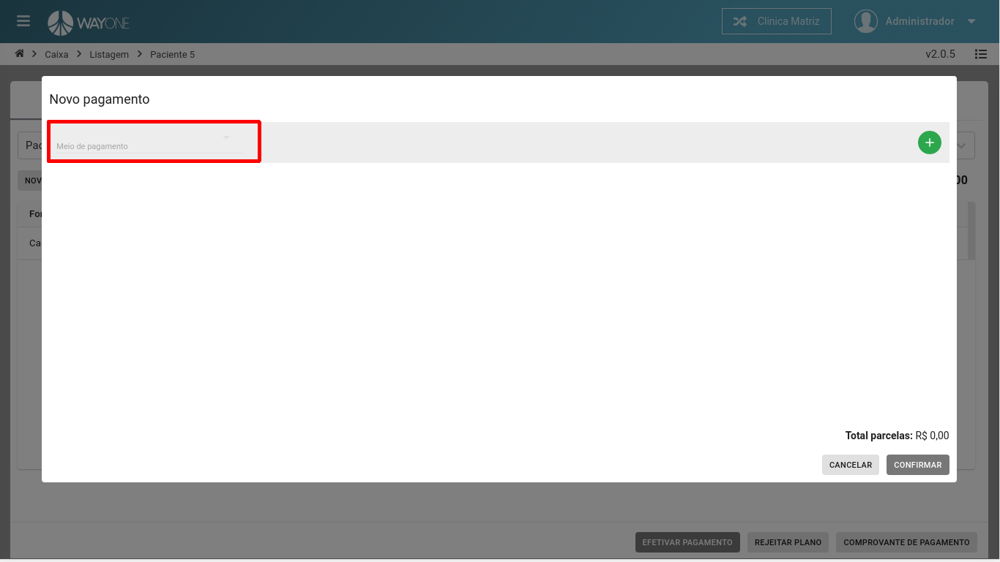
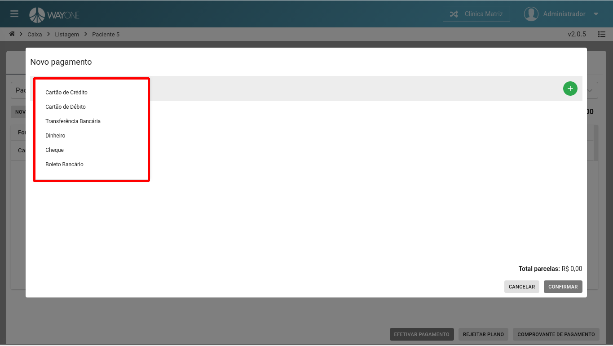
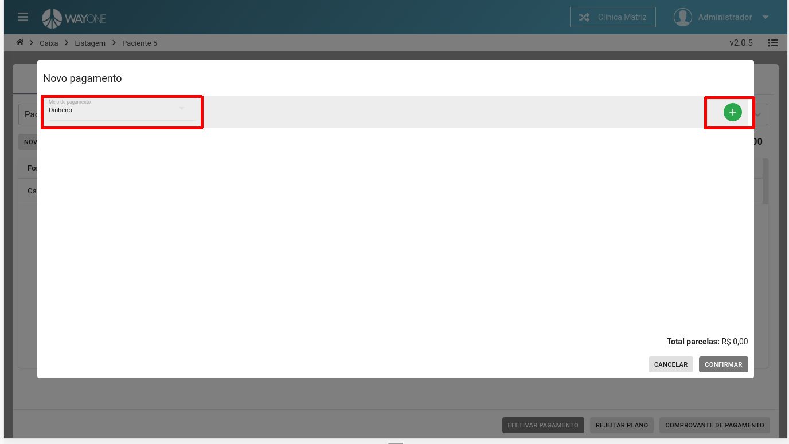
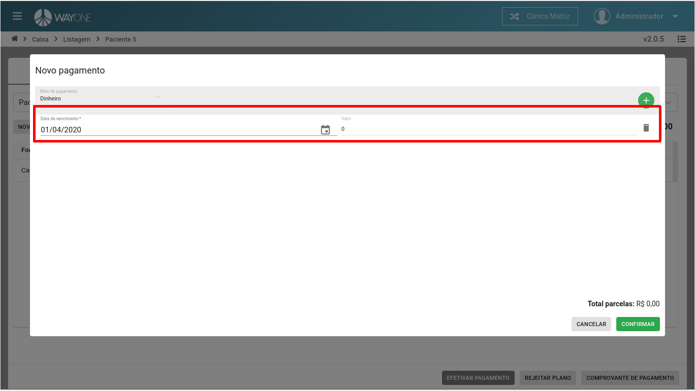
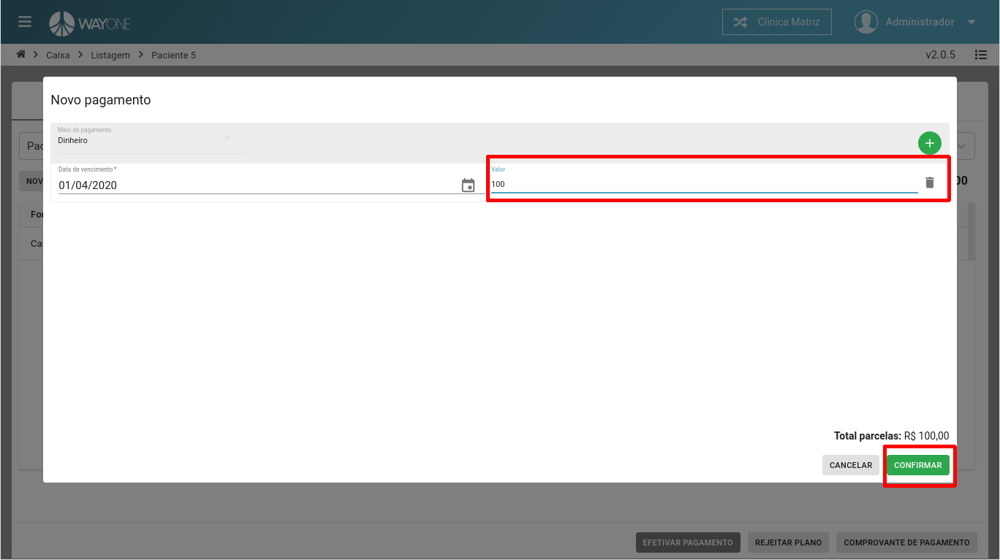

* Se tiver dúvida sobre como acessar o caixa, [clique aqui](/pages/caixa/como-acessar-o-caixa)
* Se tiver dúvida como pesquisar um paciente no caixa, [clique aqui](/pages/caixa/como-pesquisar-paciente-no-caixa)

**Clique** sobre o botão **NOVO PAGAMENTO**

 
  

Informe o **Meio de pagamento**

 
  

**Meios de pagamentos** disponíveis.

 
  

Ao selecionar o **Meio de pagamento**, clique no botão **Adicionar**

 
  

 
  

Informe a **data de vencimento** e o **valor** do pagamento. Confirme a nova forma de pagamento.

 
  

