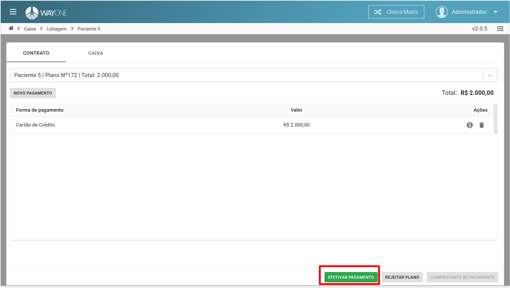
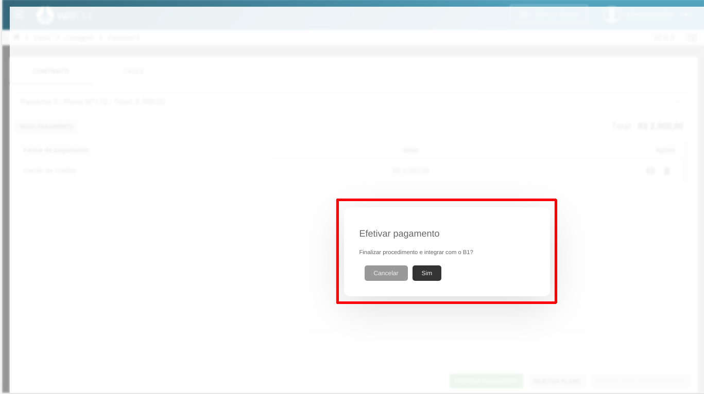

* Se tiver dúvida sobre como acessar o caixa, [clique aqui](/pages/caixa/como-acessar-o-caixa)
* Se tiver dúvida como pesquisar um paciente no caixa, [clique aqui](/pages/caixa/como-pesquisar-paciente-no-caixa)

Ao efetivar o pagamento, o sistema irá fazer a comunicação com o sistema Business One(B1), com isso
enviando informações referente a pagamentos.

**Clique** no botão **EFETIVAR PAGAMENTO**

  

Confirme se deseja efetivar o pagamento.

  

