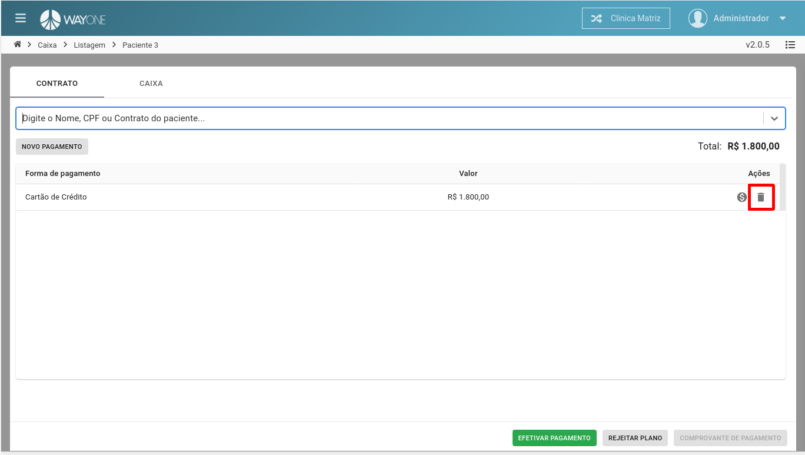
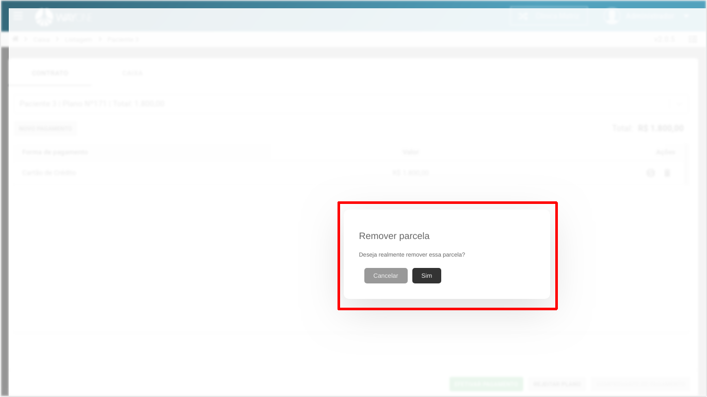

* Se tiver dúvida sobre como acessar o caixa, [clique aqui](/pages/caixa/como-acessar-o-caixa)
* Se tiver dúvida como pesquisar um paciente no caixa, [clique aqui](/pages/caixa/como-pesquisar-paciente-no-caixa)

**Clique** sobre o **ícone da lixeira** para remover a forma de pagamento.

  

Confirme se deseja remover a forma de pagamento.

  

