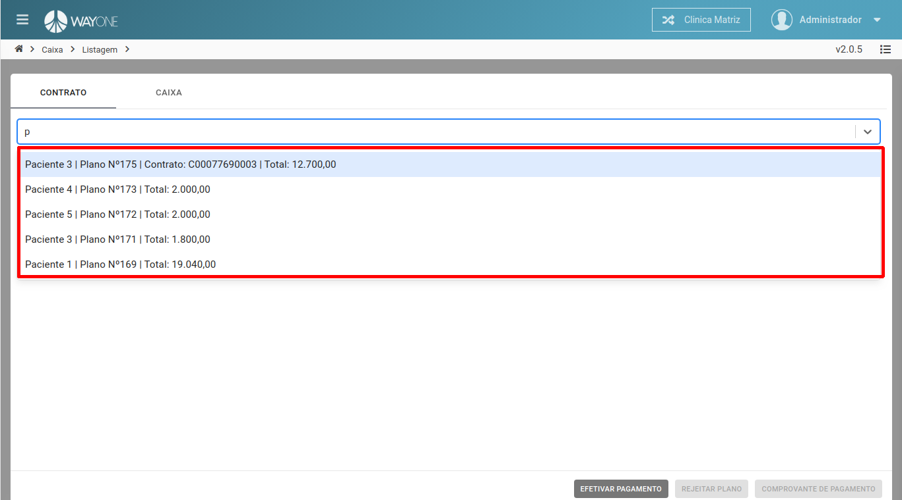
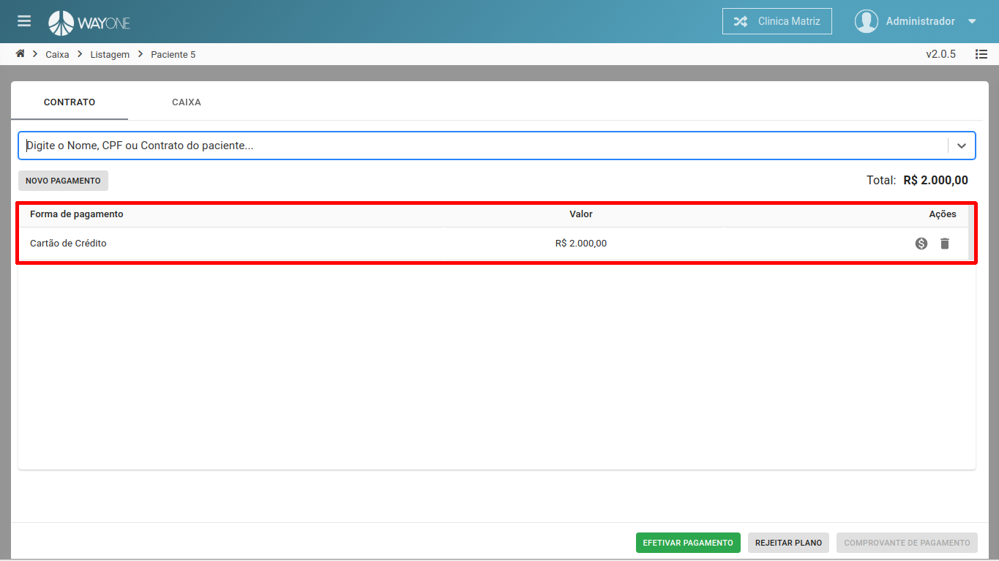
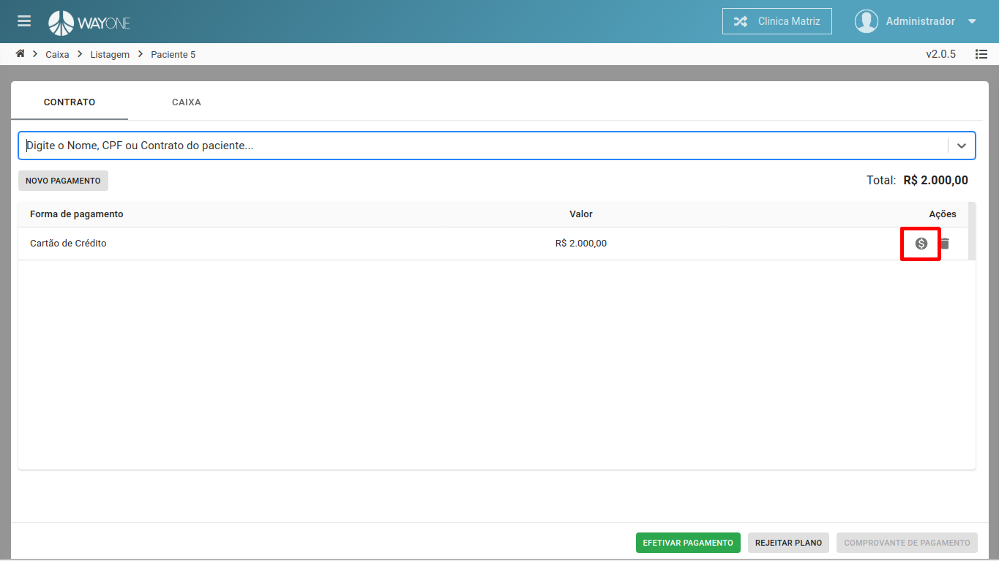
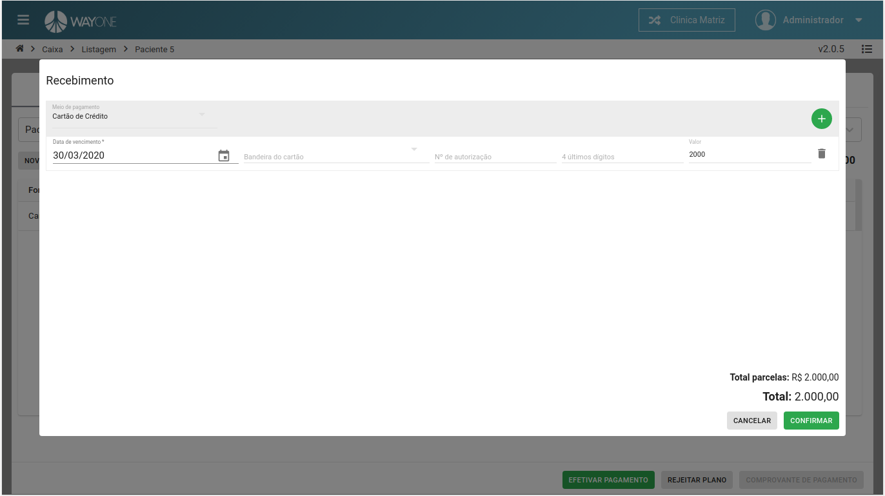
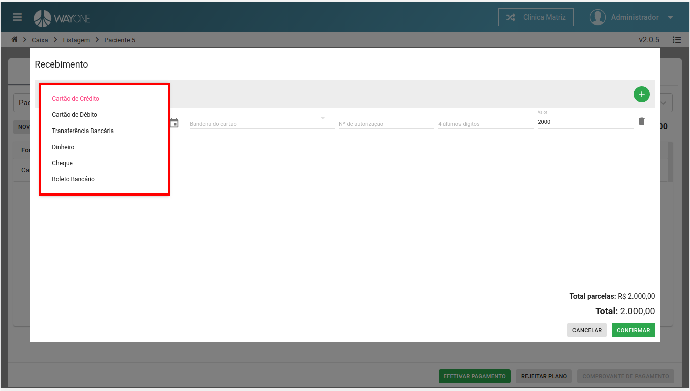
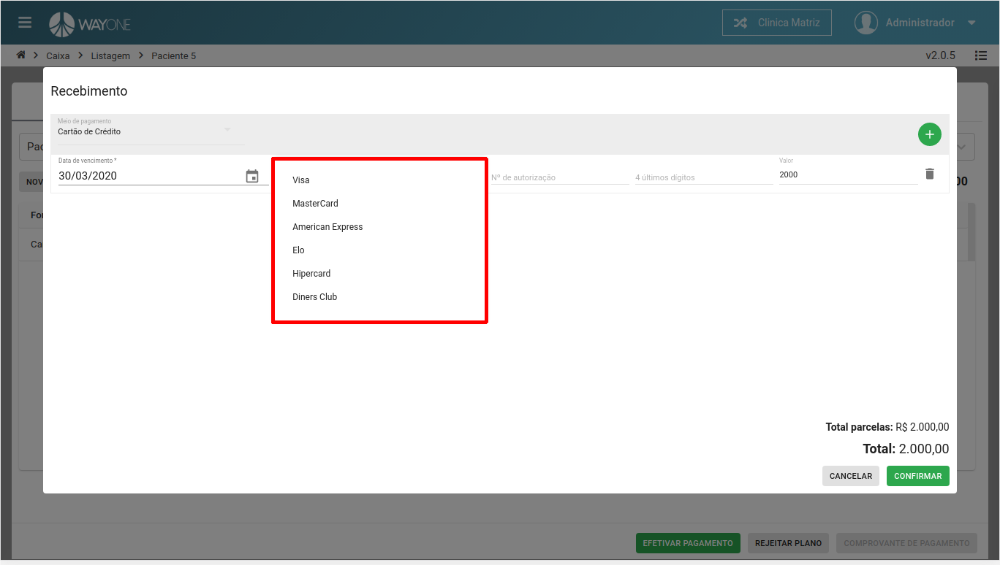
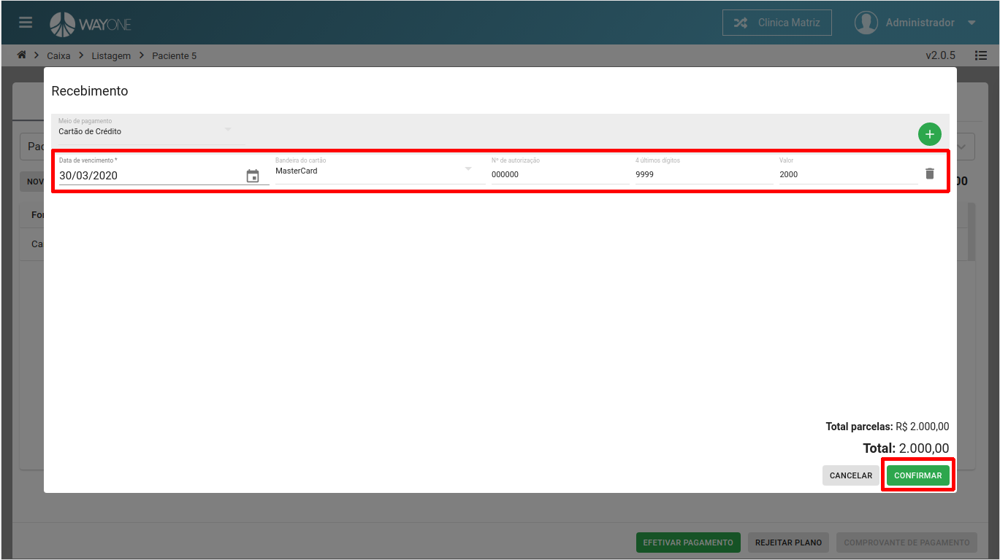
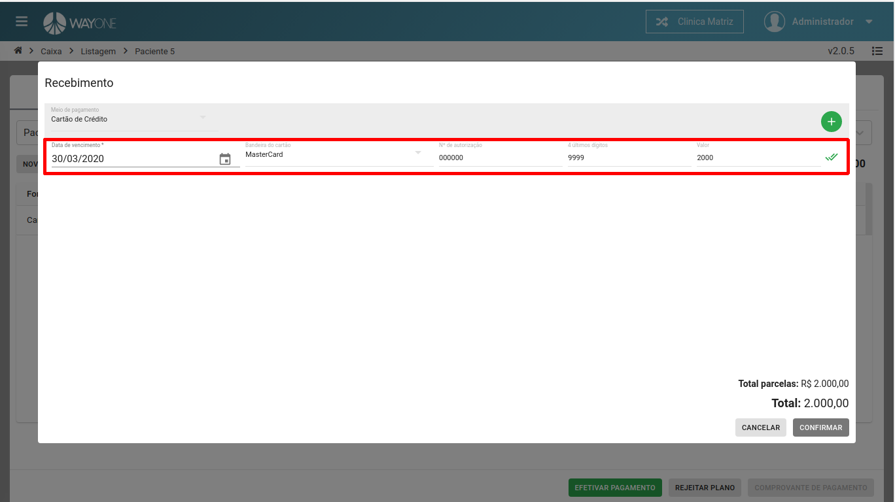

* Se tiver dúvida sobre como acessar o caixa, [clique aqui](/pages/caixa/como-acessar-o-caixa)

No exemplo a seguir, vamos fazer um recebimento usando cartão de crédito.

Pesquise o paciente através do **Nome**, **CPF** ou **Número do contrato**.

 
  

Pesquisando pelo nome do paciente. Será retornado uma lista referente a pesquisa, selecione o paciente.

 
  

Lista de débitos do paciente, onde será possível visualizar: **Forma de pagamento**, **Valor** e **Ações** a serem feitas.

 
  

Selecione o pagamento a ser recebido e **clique** sobre o **ícone**

 
  

Formulário para informar os dados do recebimento.

 
  

Caso necessário, terá a possibilidade de alterar a forma de pagamento.

 
  

Informado a bandeira do cartão.

 
  

Com todos os dados de pagamento informado, basta **clicar** sobre o botão **CONFIRMAR**

 
  

Uma vez que o recebimento foi feito, um novo ícone será visualizado, informando que já foi feito recebimento do pagamento.

 
  

