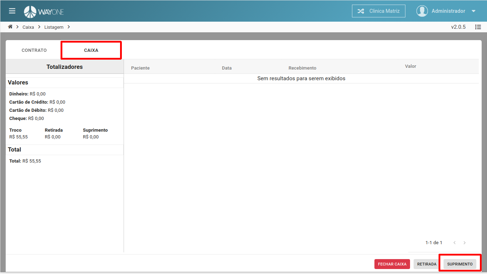
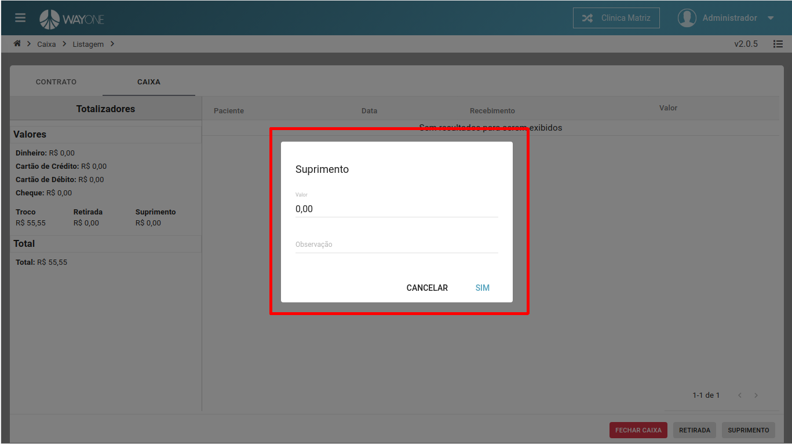

* Se tiver dúvida sobre como acessar o caixa, [clique aqui](/pages/caixa/como-acessar-o-caixa)
* Se tiver dúvida sobre os valores de suprimento, [clique aqui](/pages/caixa/onde-verificar-os-valores-recebidos)

Na **Aba CAIXA** terá o botão **SUPRIMENTO**. Ao **clicar** será visível uma tela.

  

**Informe** o **valor do suprimento** e uma observação sobre o suprimento.

  

