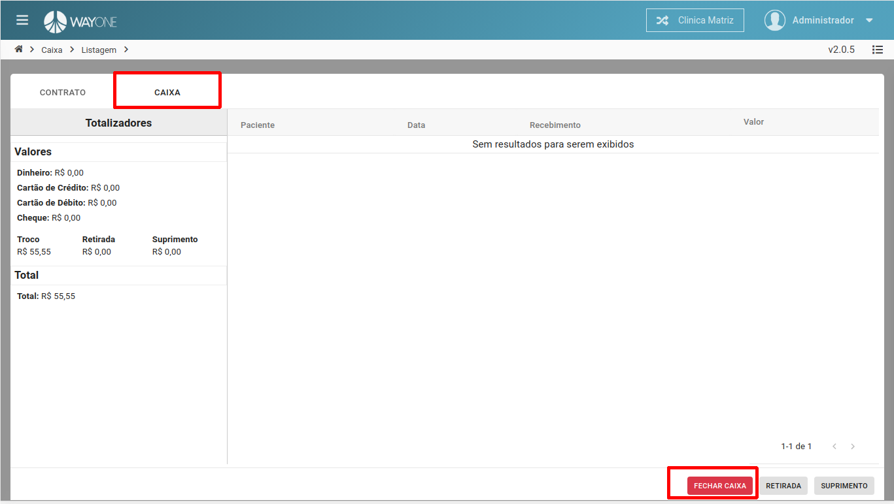
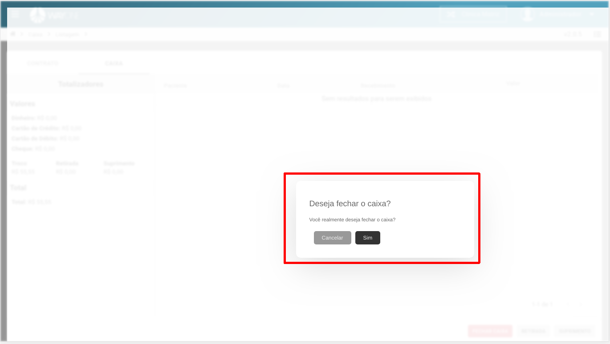

Se tiver dúvida sobre como acessar o caixa, [clique aqui](/pages/caixa/como-acessar-o-caixa)

**Existem duas formas de fechar o caixa financeiro.**

**Primeira opção:**
Quando acessado a tela de **caixa** e o caixa do dia anterior estiver em aberto, uma tela será visível para fechar o caixa.

**Segunda opção:**
Na **Aba CAIXA** terá o botão **FECHAR CAIXA**. Ao **clicar** será visível uma tela para confirmar o fechamento.

 
  

Confirmar o fechamento do caixa.

 
  

