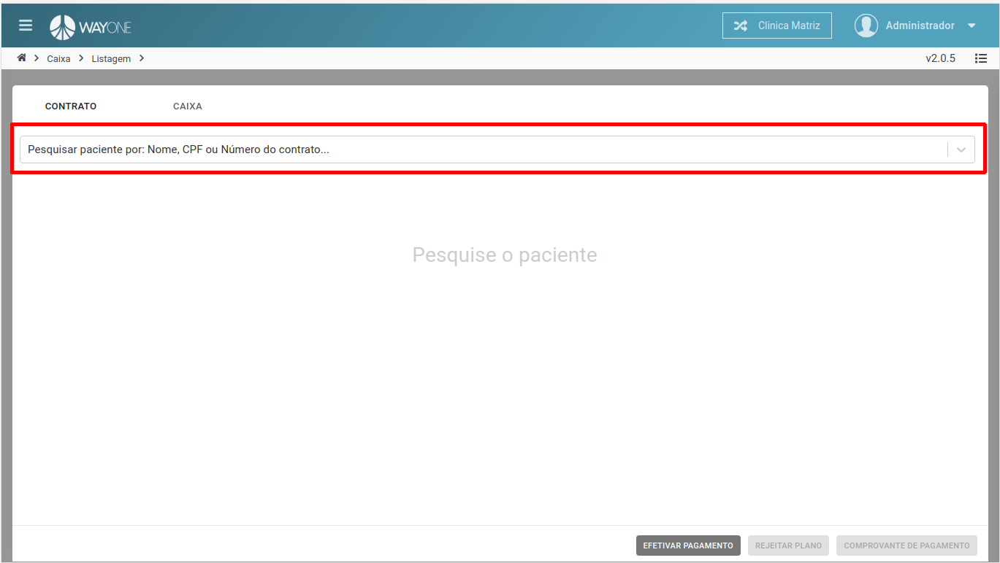

* Se tiver dúvida sobre como acessar o caixa, [clique aqui](/pages/caixa/como-acessar-o-caixa)

Pesquise o paciente através do **Nome**, **CPF** ou **Número do contrato**.

 
  

Pesquisando pelo nome do paciente. Será retornado uma lista referente a pesquisa, selecione o paciente.

 
  

