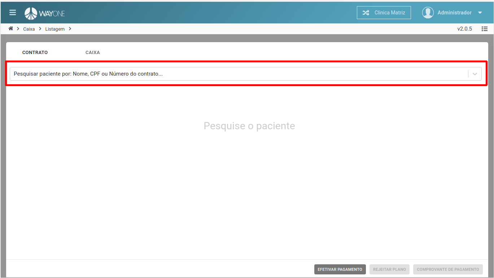
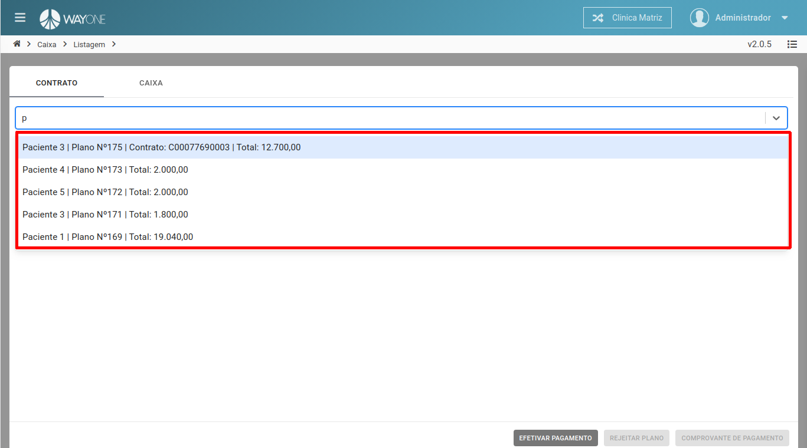
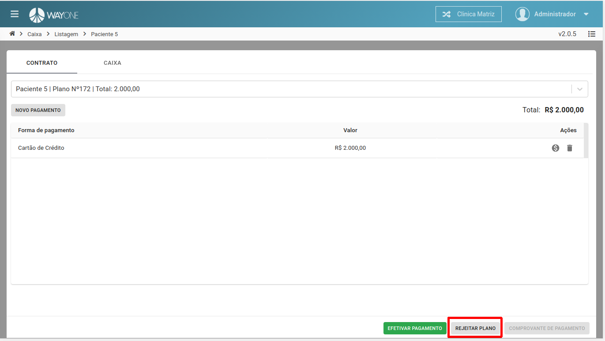
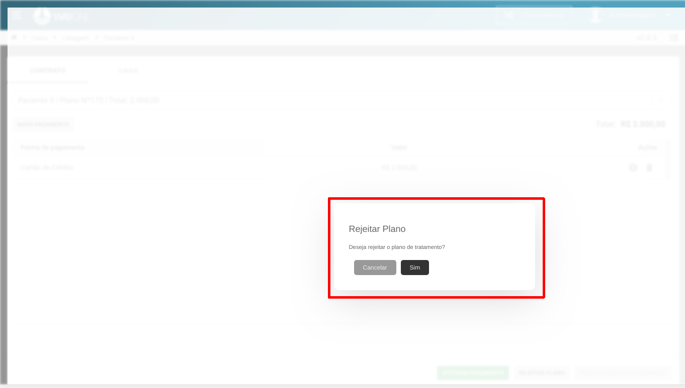

* Se tiver dúvida sobre como acessar o caixa, [clique aqui](/pages/caixa/como-acessar-o-caixa)

Pesquise o paciente através do **Nome**, **CPF** ou **Número do contrato**.

  

Pesquisando pelo nome do paciente. Será retornado uma lista referente a pesquisa, selecione o paciente.

  

**Clique** no botão **REJEITAR PLANO**

  

Confirme se deseja rejeitar o plano.

  

