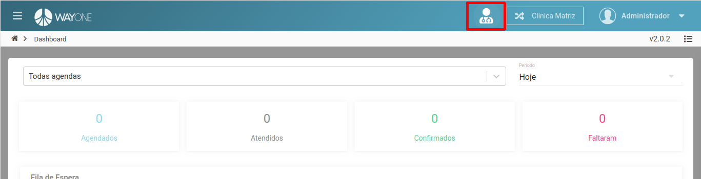

### Definição

Acessando um atendimento já iniciado.

Uma vez que o atendimento foi iniciado, e por algum motivo foi necessário sair da tela.
Como fazer para retornar para a tela de atendimento?
Estará visível um *ícone* referente a um atendimento em andamento. Clique sobre ele e será redirecionado para a tela de atendimento.

  

