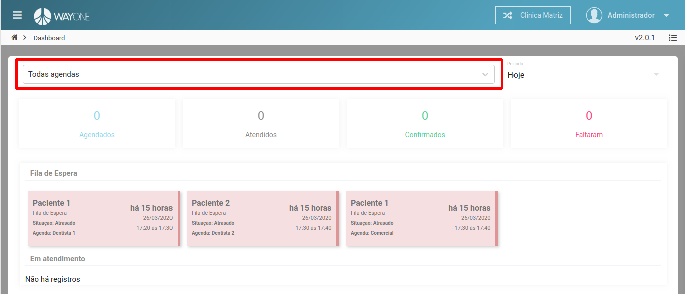
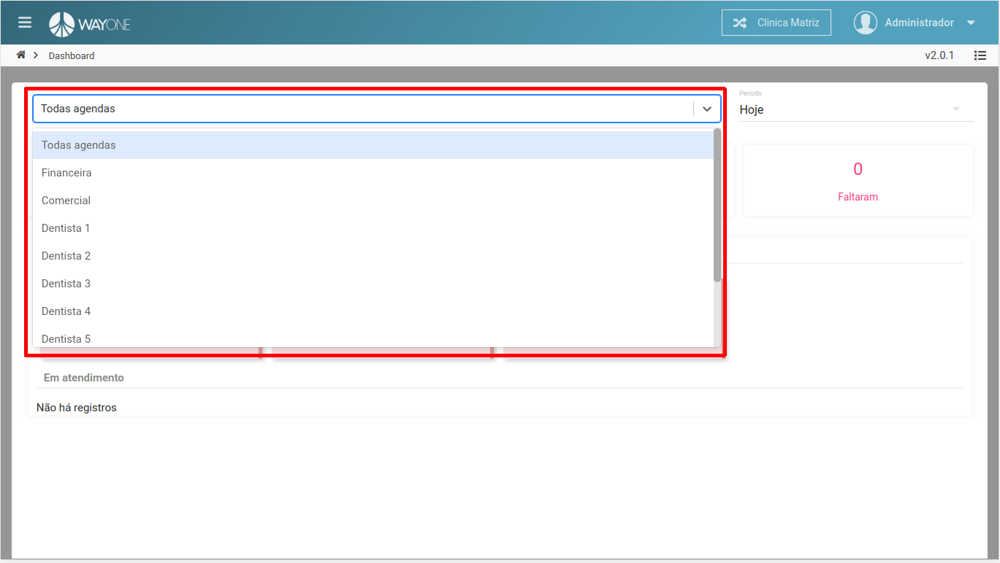
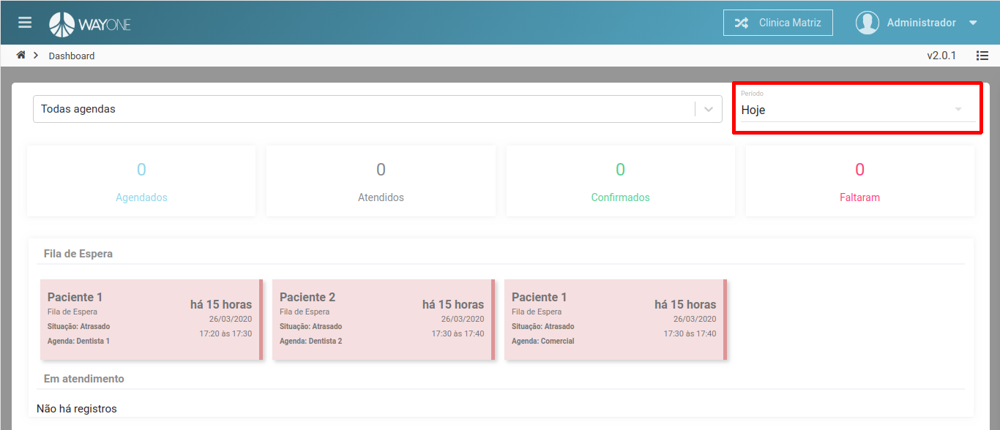
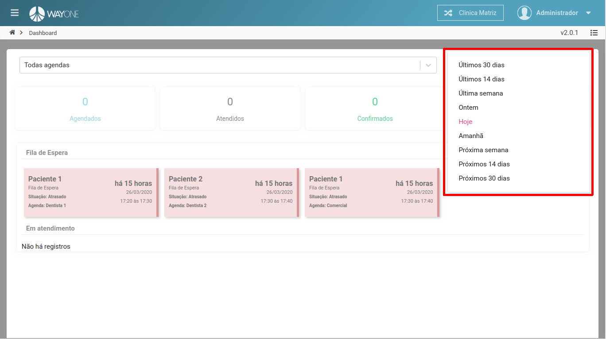

### Definição

Filtro de pesquisa para agendamento com status: **Agendados**, **Atendidos**, **Confirmados** e **Faltaram**.
A pesquisa pode ser feita através de todas agendas ou uma agenda em específica, e também através de um período a ser pesquisado.

Filtro para pesquisa de todas agendas ou uma específica.

 
  

Pesquisa através de uma agenda específica.

 
  

Filtro referente a um período a ser pesquisado.

 
  

Opções possíveis para filtro de período

 
  

