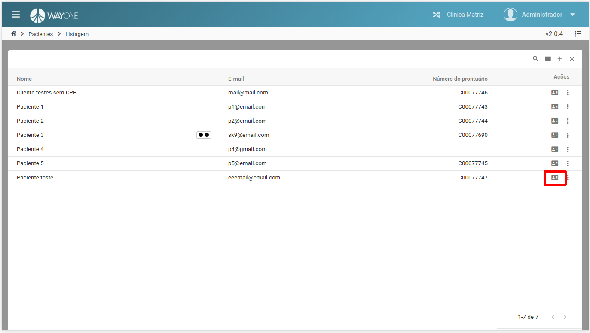

### Definição
Se tiver dúvidas sobre como pesquisar por um paciente, [clique aqui](/pages/paciente/como-pesquisar-por-um-paciente).

Após identificar na lista de pacientes a que deseja visualizar área do paciente, clique no **ícone** para ser redirecionado.

  

