### Definição
No cadastro do paciente, existe uma área para adicionar os contatos telefônicos, **Contatos**

Se tiver dúvidas sobre como pesquisar por um paciente, [clique aqui](/pages/paciente/como-pesquisar-por-um-paciente)

* **Adicionando contato**
* **Removendo contato**

#### Adicionando contato

Local que é **listado** e **adicionado** os contatos.

  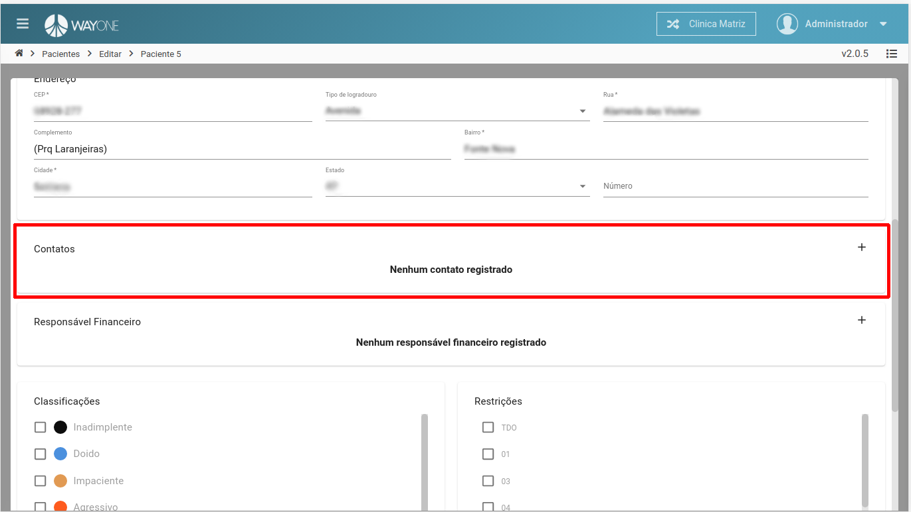

**clique** no botão **adicionar** para abrir o formulário.

  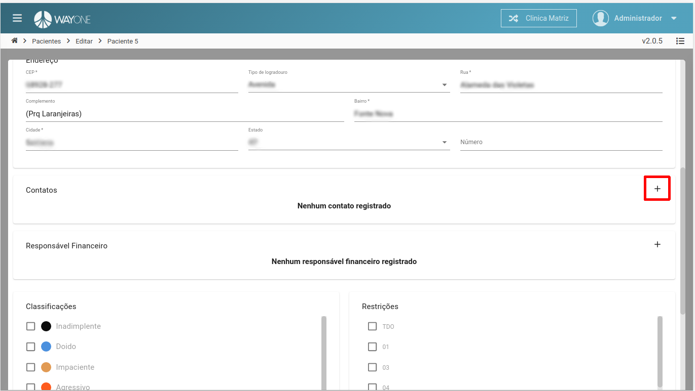

Formulário para adicionar os contatos telefônicos.

  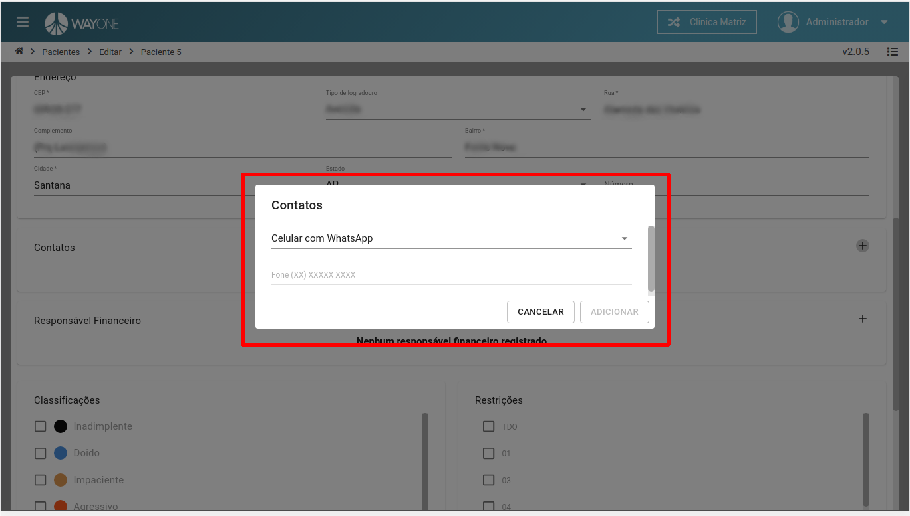

Selecione o **tipo** de contato: **Fixo**, **Comercial**, **Celular**, **Celular com WhatsApp** 

  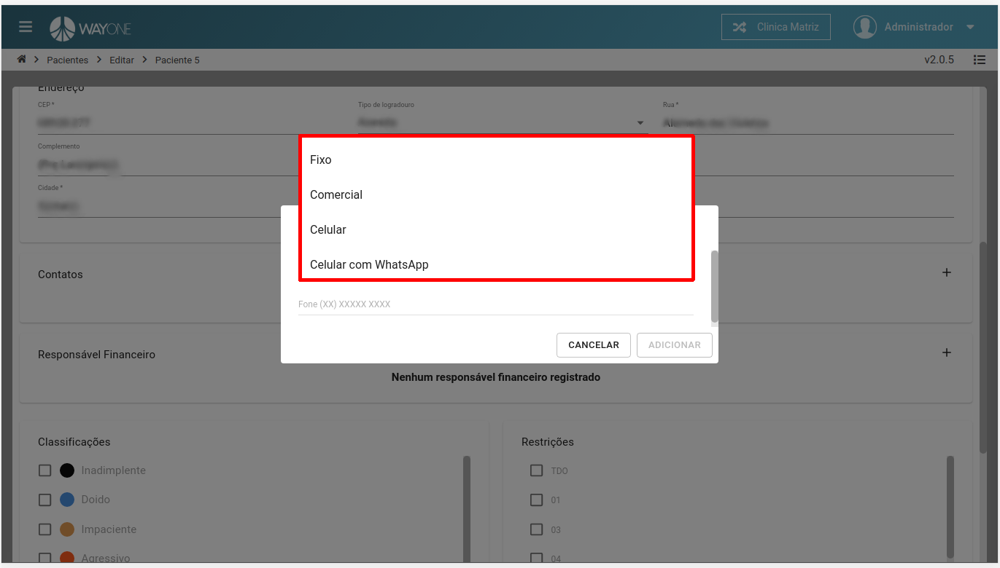

Em nosso exemplo foi selecionado o **tipo**: **Celular com WhatsApp**

  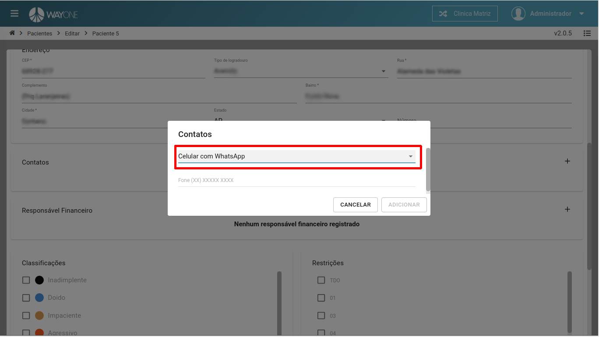

Informe o número telefônico e **clique** no botão **ADICIONAR**

  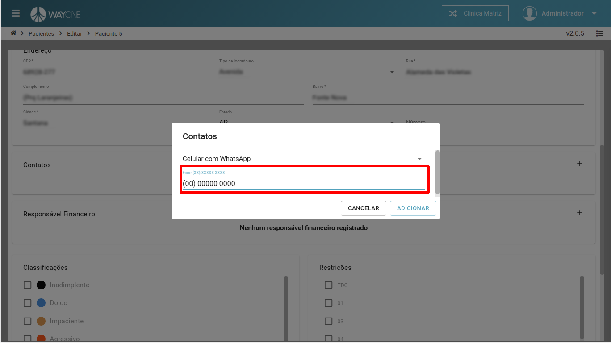

Contato adicionado na lista de contatos.

  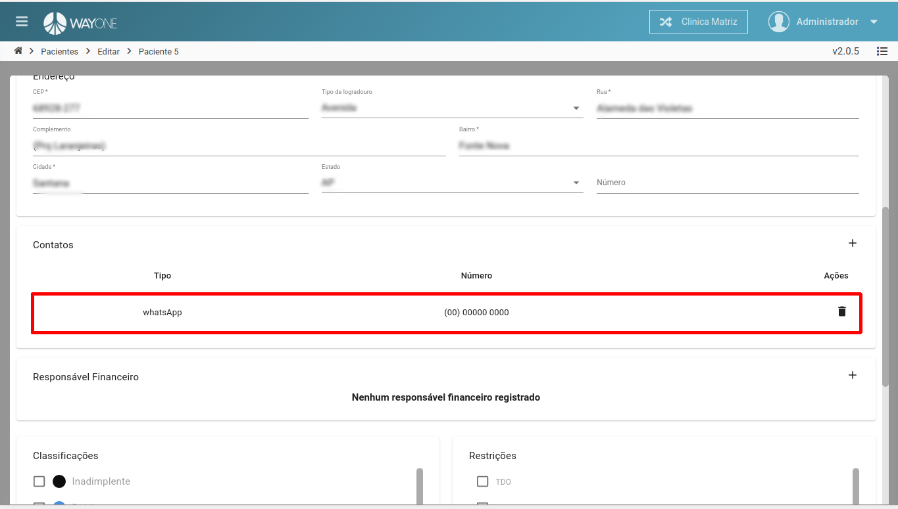

O paciente pode ter um ou mais contatos, nesse exemplo, vemos que há dois contatos.

  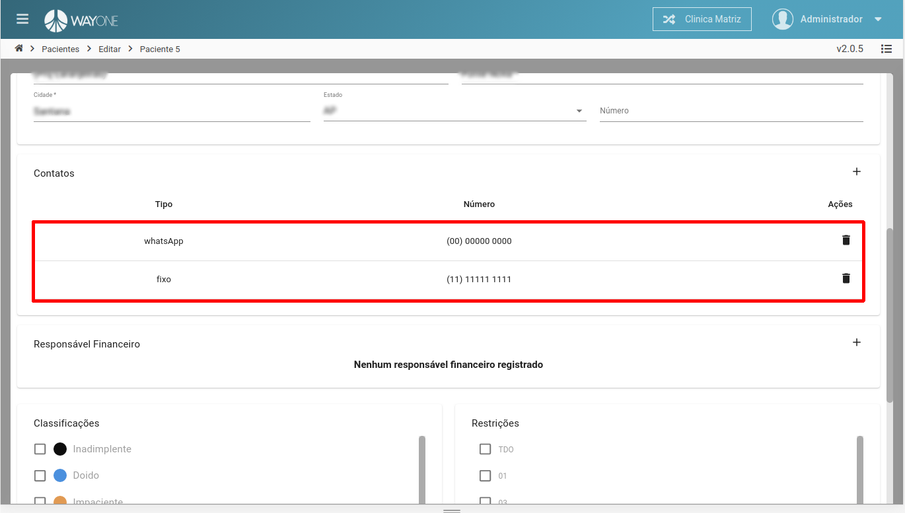

Para salvar as modificações de cadastro de contato, **clique** no botão **SALVAR**

  

#### Removendo contato

Na área de contatos, **clique** no **ícone da lixeira** para remover o contato.

  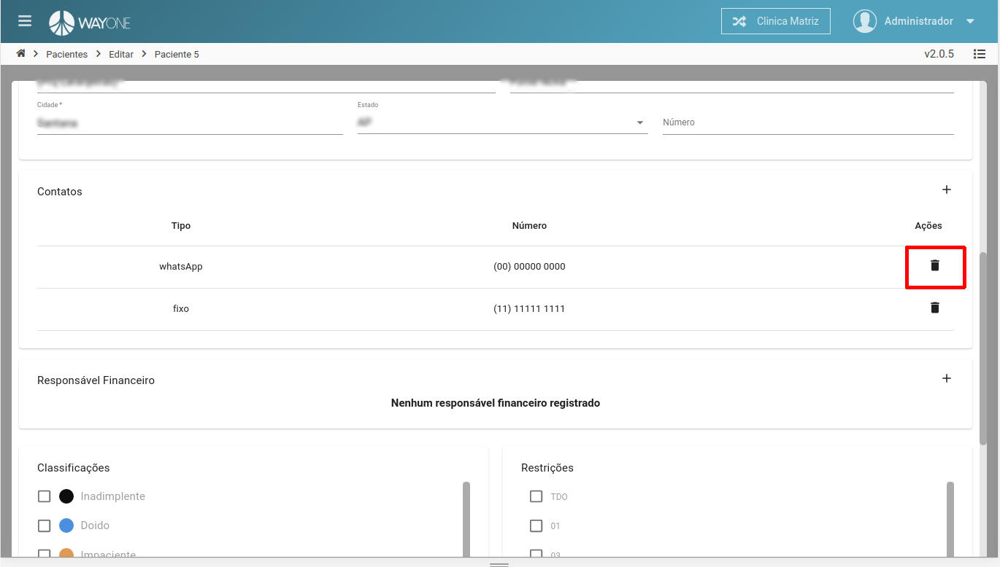

Contato removido da lista.

  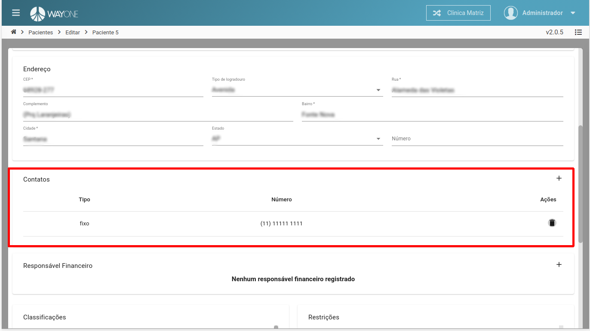

Para salvar as modificações de cadastro de contato, **clique** no botão **SALVAR**

  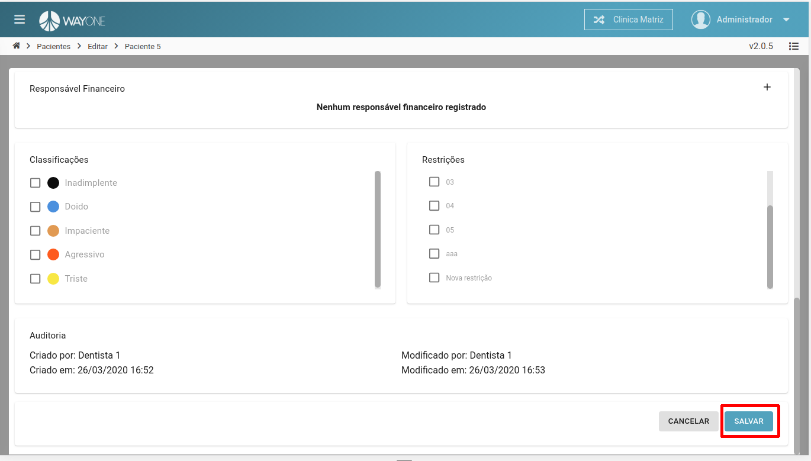

