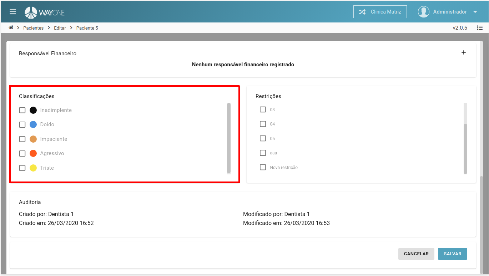
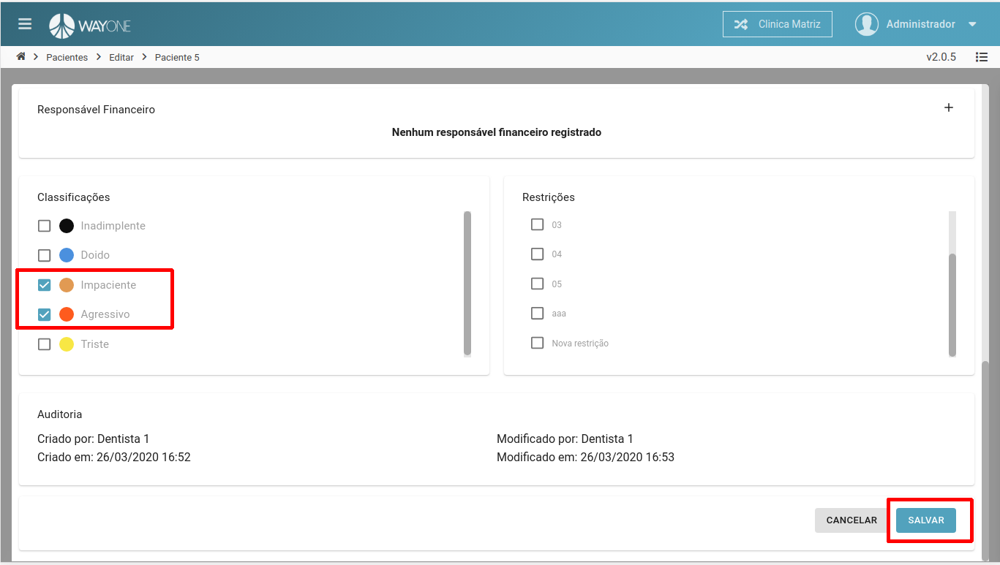
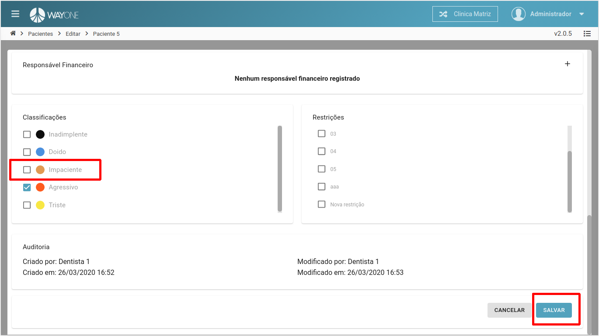

### Definição
No cadastro do paciente, existe uma área para adicionar/remover as **Classificações**

Se tiver dúvidas sobre como pesquisar por um paciente, [clique aqui](/pages/paciente/como-pesquisar-por-um-paciente)

* **Adicionando classificação**
* **Removendo classificação**

#### Adicionando classificação

Lista de todas as classificações possíveis para o paciente.

  

***Clique** sobre a **classificação** a ser adicionado ao paciente. Na imagem vemos que foram duas classificações.
Para salvar as modificações, **clique** no botão **SALVAR**

  

#### Removendo classificação

**Clique** sobre a **classificação** que deseja remover do paciente.
Para salvar as modificações, **clique** no botão **SALVAR**

  

