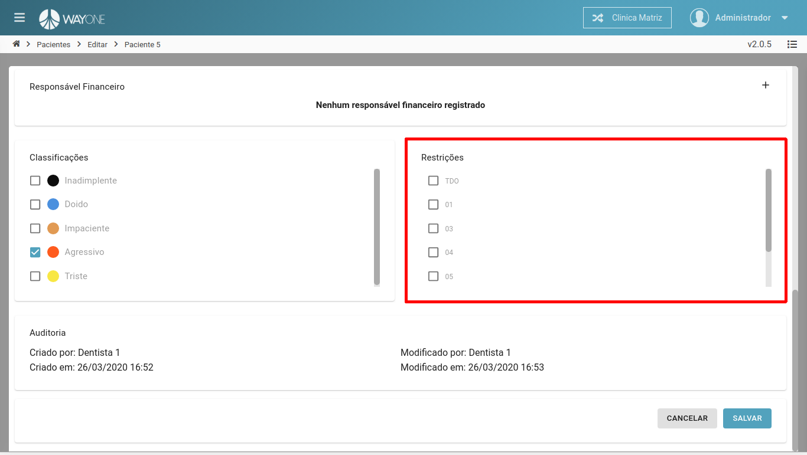
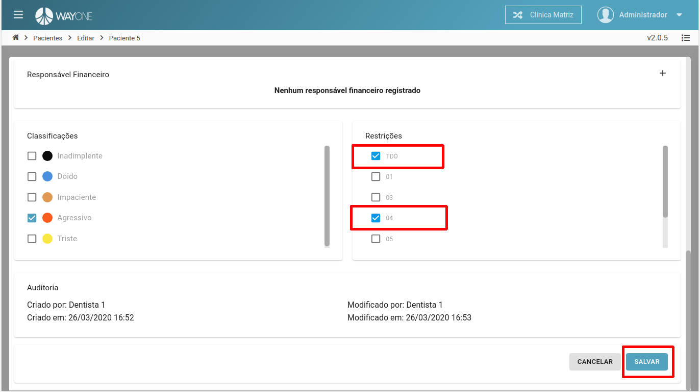
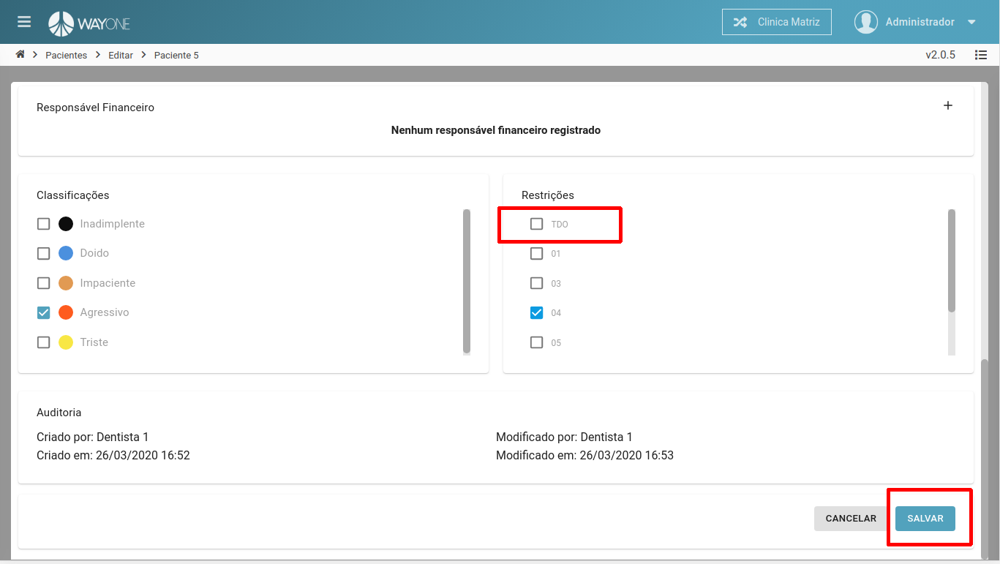

### Definição
No cadastro do paciente, existe uma área para adicionar/remover as **Restrições**

Se tiver dúvidas sobre como pesquisar por um paciente, [clique aqui](/pages/paciente/como-pesquisar-por-um-paciente)

* **Adicionando restrição**
* **Removendo restrição**

#### Adicionando restrição

Lista de todas as restrições possíveis para o paciente.

 
  

***Clique** sobre a **restrição** a ser adicionado ao paciente. Na imagem vemos que foram duas restrições.
Para salvar as modificações, **clique** no botão **SALVAR**

 
  

#### Removendo restrição

**Clique** sobre a **restrição** que deseja remover do paciente.
Para salvar as modificações, **clique** no botão **SALVAR**

 
  

