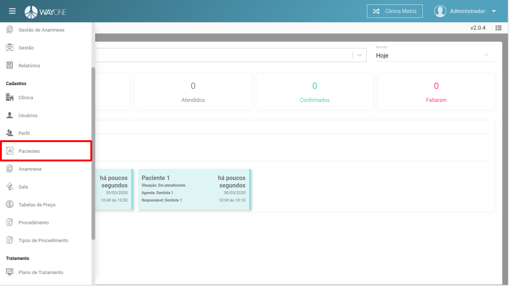
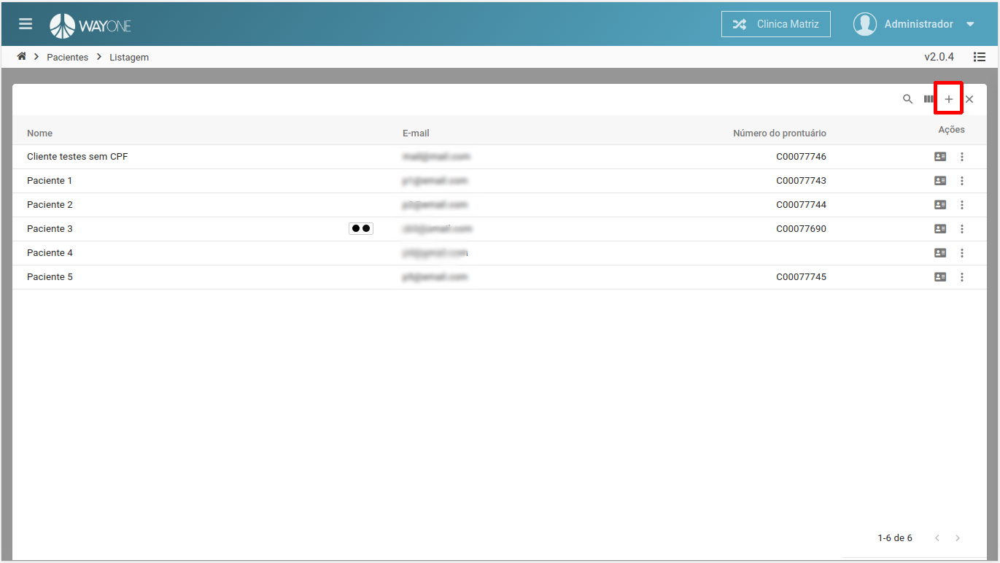
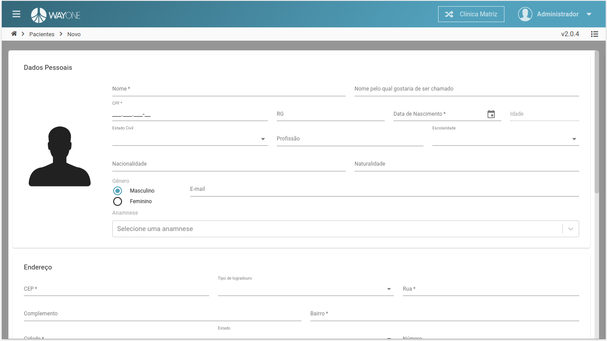
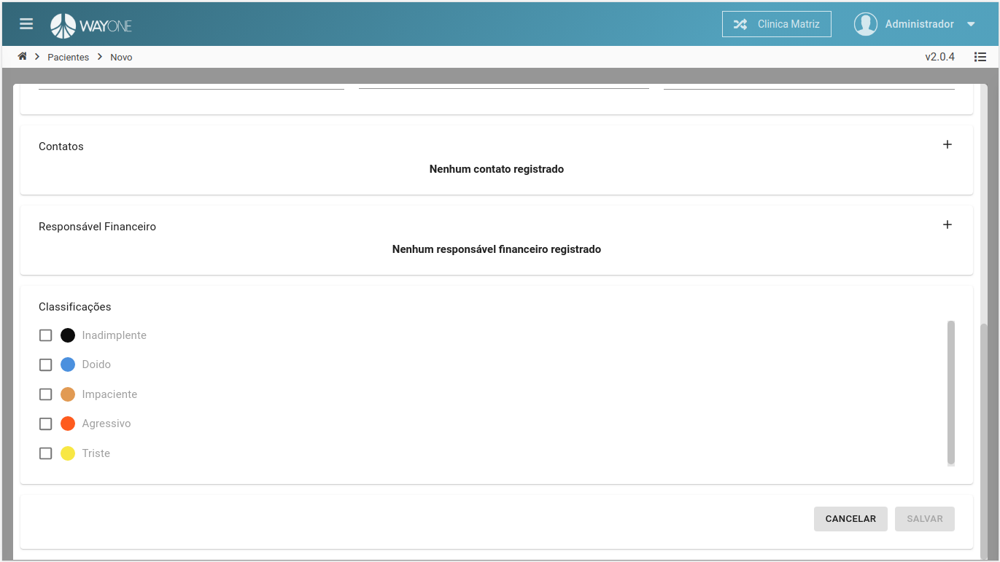
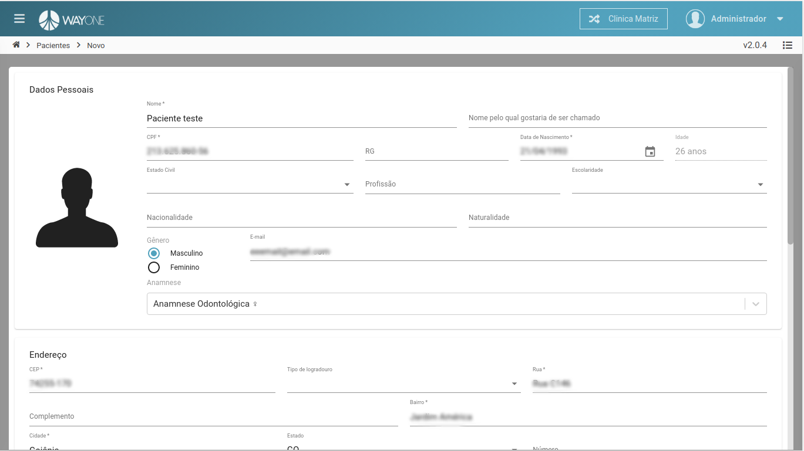
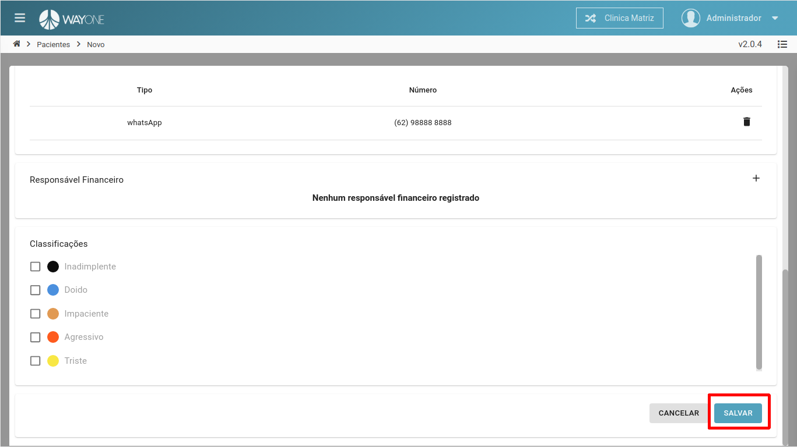
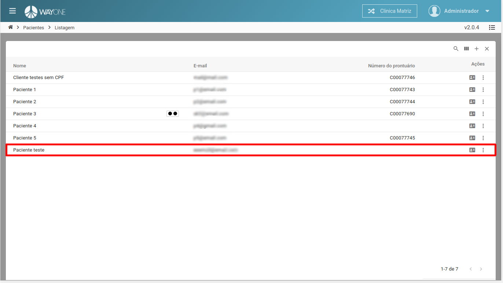

### Definição

Navegue no **menu lateral** e clique sobre **Pacientes**

 
  

Na parte superior da tela, do lado direito, clique no **ícone adicionar** para abrir o formulário.

 
  

Formulário do cadastro de paciente, onde temos algumas informações obrigatórias.
* Nome
* CPF
* Data de Nascimento
* E-mail ou Contatos(Caso o responsável financeiro não seja informado)
* Dados do endereço

 
  

 
  

Cadastrando um novo paciente.

 
  

Com todos os dados obrigatórios informados, basta clicar no botão **SALVAR**

 
  

O novo cadastro na lista de pacientes.

 
  

