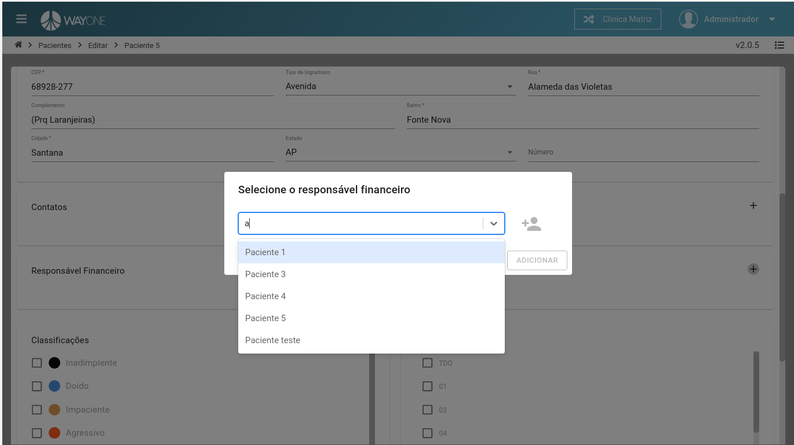

### Definição

O que é um responsável financeiro? [clique aqui](/pages/paciente/o-que-e-um-responsavel-financeiro)

Se tiver dúvidas sobre como pesquisar por um paciente, [clique aqui](/pages/paciente/como-pesquisar-por-um-paciente)

No formulário de paciente, clique sobre o **ícone adicionar** para poder abrir a busca de responsável financeiro.

 
  

Onde será possível pesquisar por um responsável financeiro ou adicionar um novo.

 
  

**Clique** sobre o **ícone de adicionar**, será redirecionado para o cadastro de responsável financeiro.

 
  

Formulário de cadastro.

 
  

Ao pesquisar pelo **nome** do responsável financeiro, selecione o desejado.

 
  

Clique sobre o botão **ADICIONAR** para poder fazer o vínculo.

 
  

Responsável financeiro adicionado ao paciente.

 
  

Salve a alteração **clicando** sobre o botão **SALVAR**

 
  

