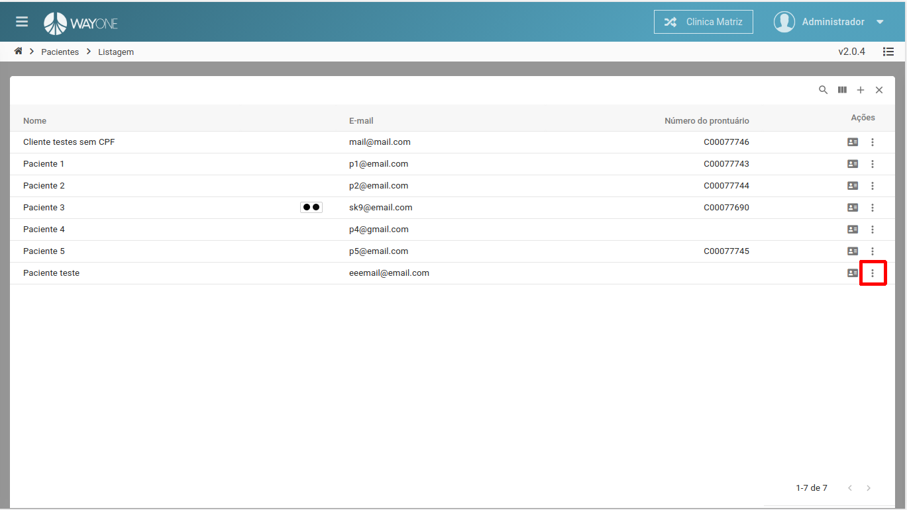
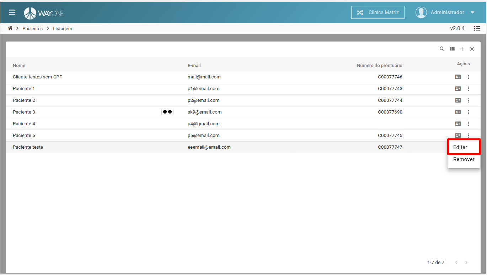
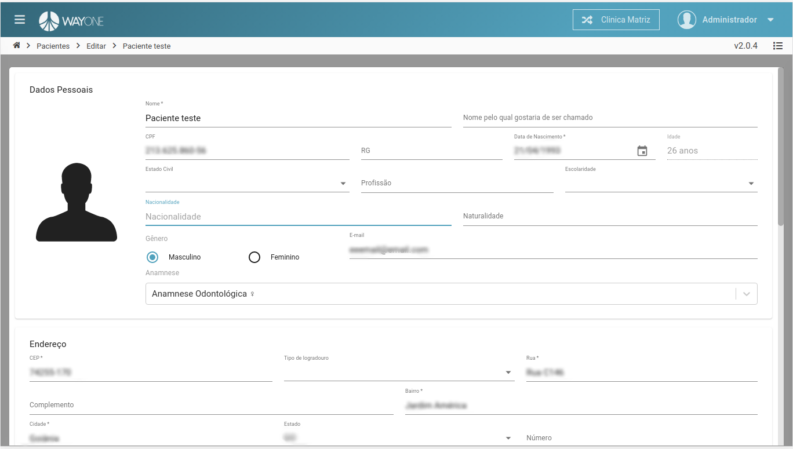
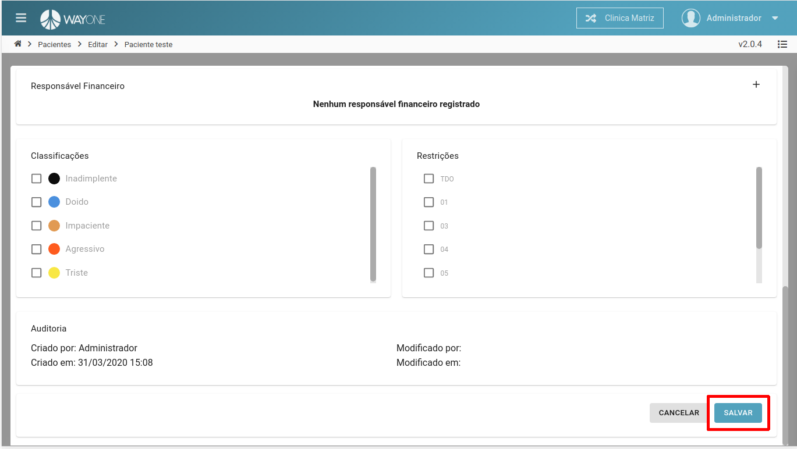

### Definição

Se tiver dúvidas sobre como pesquisar por um paciente, [clique aqui](/pages/paciente/como-pesquisar-por-um-paciente).

Após identificar na lista de pacientes o que deseja editar, clique na opção dos **três pontos**, será aberto um menu, depois clique na opção **Editar**

 
  

 
  

Formulário de edição dos dados do paciente.

 
  

Será aberto a tela de edição do perfil, edite conforme a necessidade e clique no final da página, no botão **salvar**

 
  

