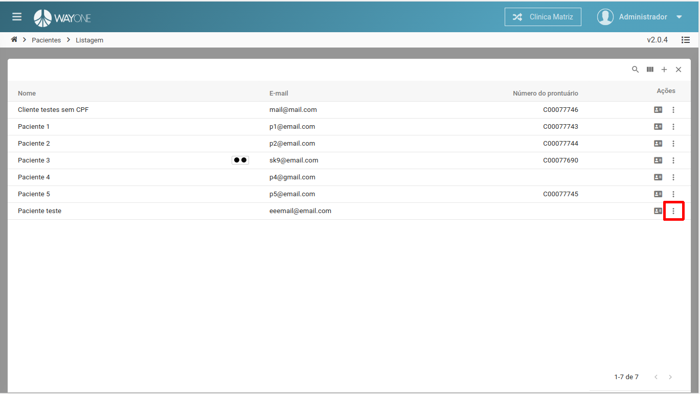
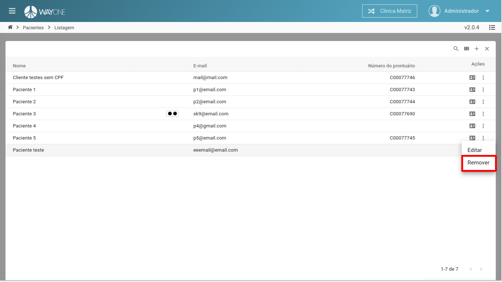
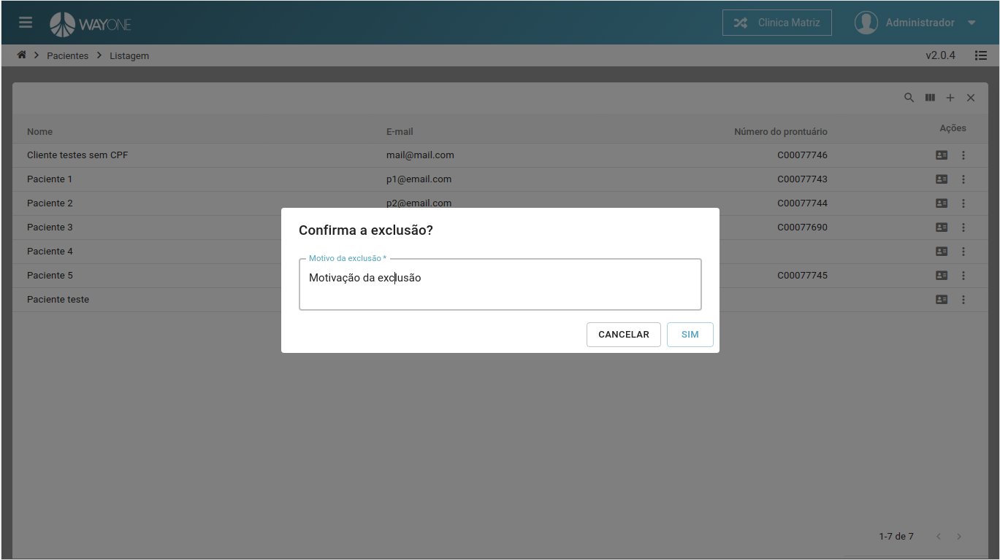

### Definição

Se tiver dúvidas sobre como pesquisar por um paciente, [clique aqui](/pages/paciente/como-pesquisar-por-um-paciente).

Após identificar na lista de pacientes o que deseja remover, clique na opção dos **três pontos**, será aberto um menu, depois clique na opção **Remover**

 
  

 
  

É obrigatório informar uma justificativa para poder confirmar a remoção do cadastro.

 
  

