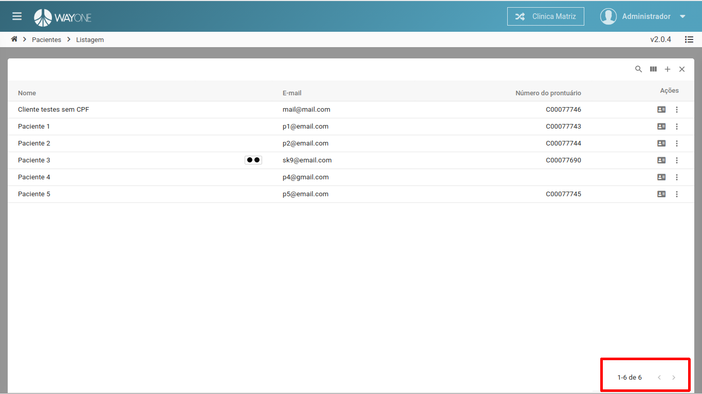
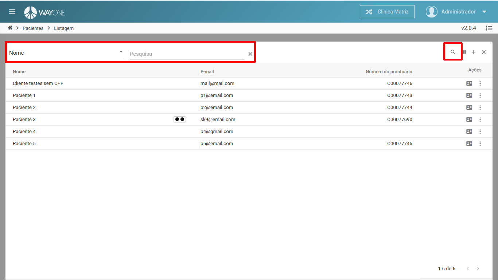
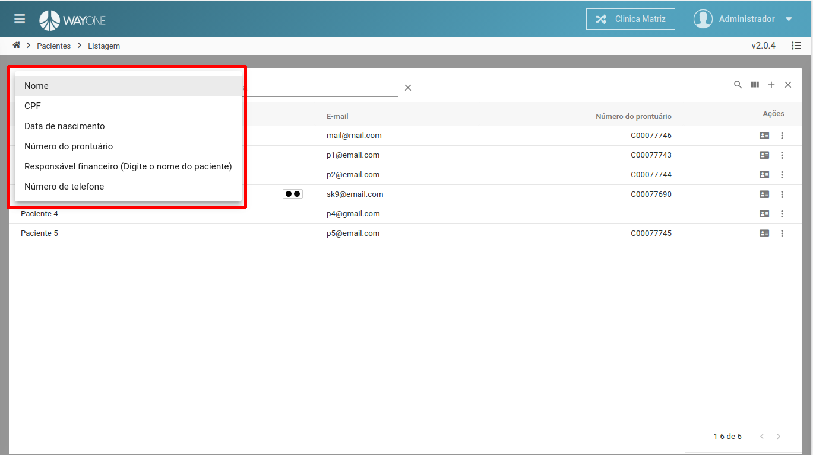
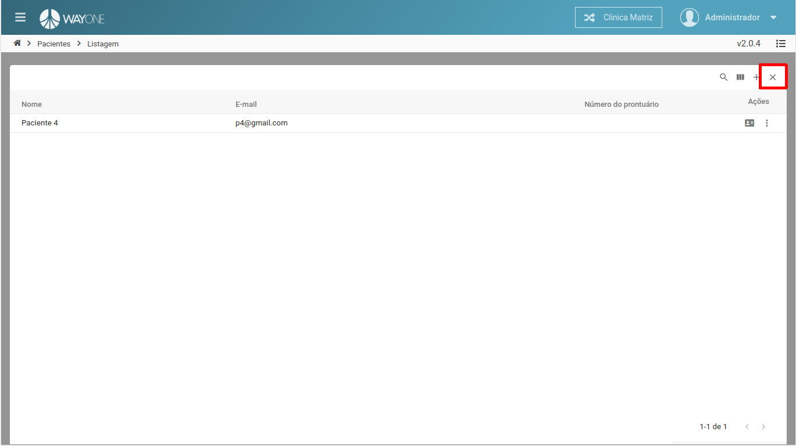

### Definição

Caso tenha dúvidas de como acessar o cadastro de paciente, [clique aqui](/pages/paciente/como-adicionar-um-paciente).

**Existem duas formas de pesquisar por um prontuário**

### Paginação

Navegando entre as páginas utilizando as setas localizadas na parte inferior direita da lista

  

### Busca

Na parte superior direita da lista, existe um **botão de lupa**, ao clicar nele será aberto **dois campos**, onde será possível pesquisar pelo:
* **Nome**
* **CPF**
* **Data de nascimento**
* **Número de prontuário**
* **Responsável financeiro**
* **Número de telefone**

  

  

Será mostrado o resultado filtrado, caso queira limpar o filtro, clique no **X** que está na parte superior direita da lista.

  

