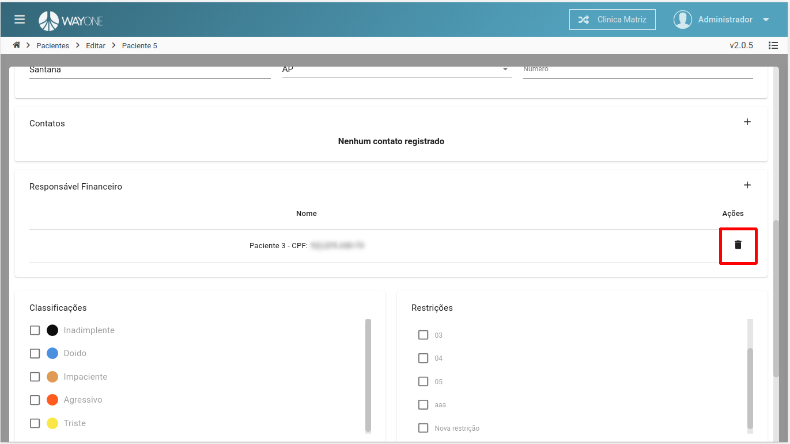
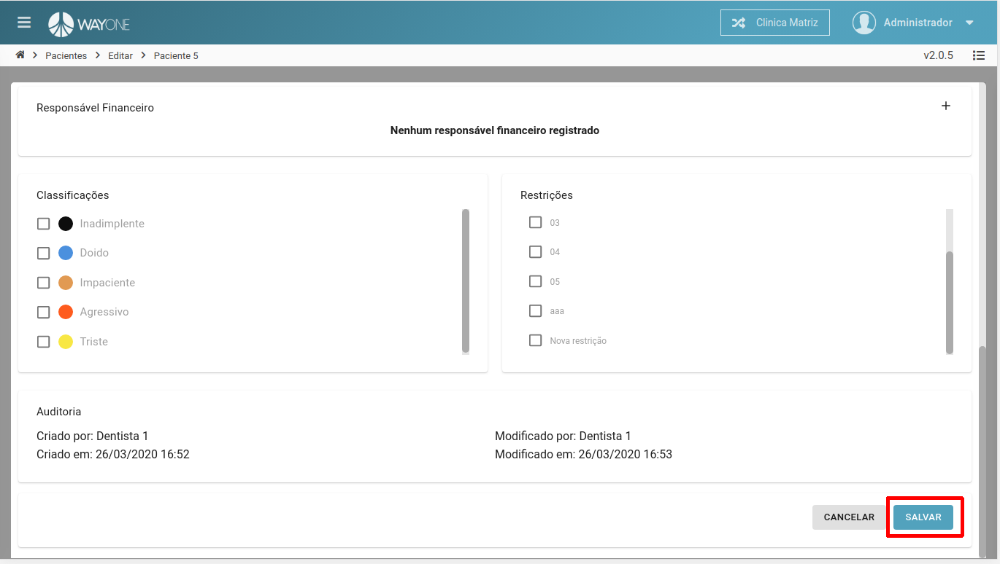

### Definição

O que é um responsável financeiro? [clique aqui](/pages/paciente/o-que-e-um-responsavel-financeiro)

Se tiver dúvidas sobre como pesquisar por um paciente, [clique aqui](/pages/paciente/como-pesquisar-por-um-paciente)

No cadastro do paciente, na lista de responsáveis financeiros, **clique** no botão **remover**

 
  

Para salvar alteração, **clique** no botão **SALVAR**

 
  

