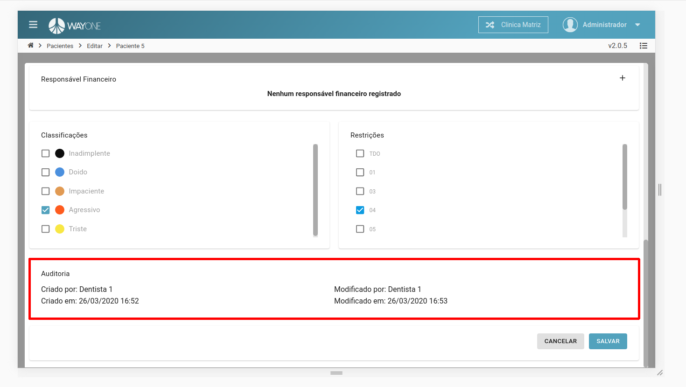

### Definição

Se tiver dúvidas sobre como pesquisar por um paciente, [clique aqui](/pages/paciente/como-pesquisar-por-um-paciente)

Em todos os cadastros dos pacientes, existe a área **Auditoria**. Nela contém as informações:

* Criado por
* Criado em
* Modificado por
* Modificado em

 
  

