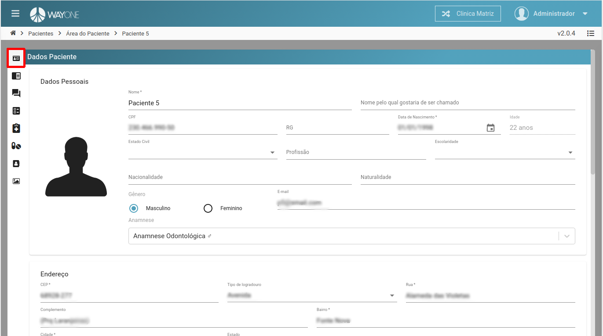

### Definição

**Dados do paciente** - Aba com os dados do paciente. Podendo alterar informações.

  

**Necessidades e Expectativas** - Aba que será possível adicionar infomações de necessidade e expectativas do paciente.

  

**Anamnese** - Podendo visualizar, editar e imprimir a anamnese.

  

**Plano de Tratamento** - Lista todos os planos de tratamento do paciente.

  

**Atestado** - Lista com todos atestados já feitos, podendo adicionar um novo e imprimir.

  

**Receitas** - Lista de todas as receitas, podendo adicionar um novo, remover e imprimir.

  

**Prontuário** - Prontuário/Histórico do paciente, podendo adicionar uma nova informação.

  

**Imagens / Vídeos** - Álbuns de imagens, vídeos, STL, PDF e ZIP, podendo visualizar, adicionar e remover.

  

