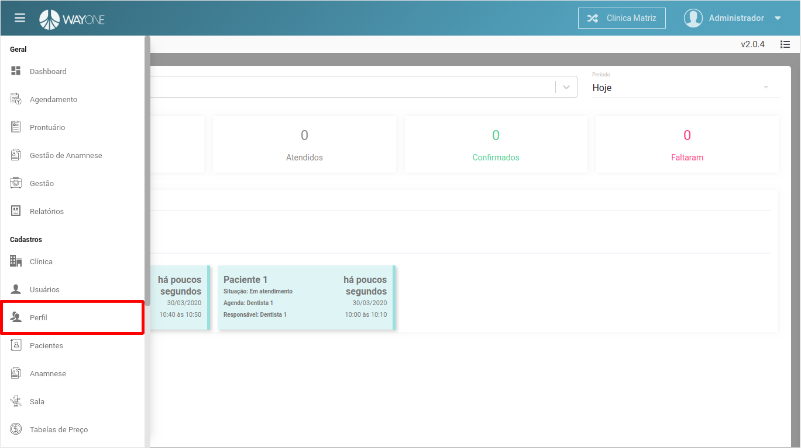
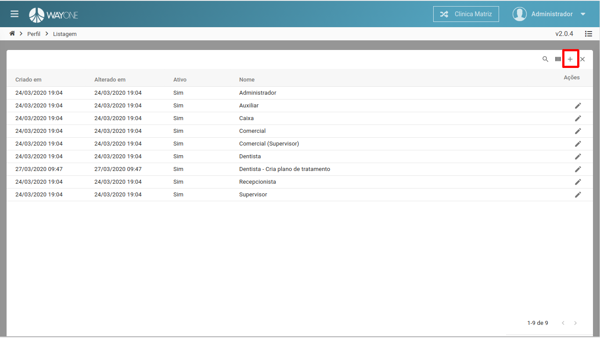
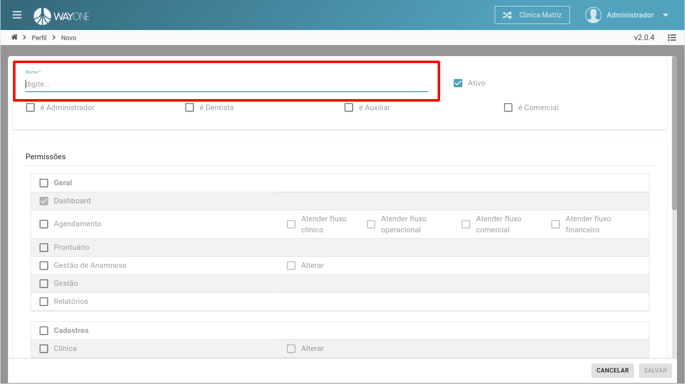
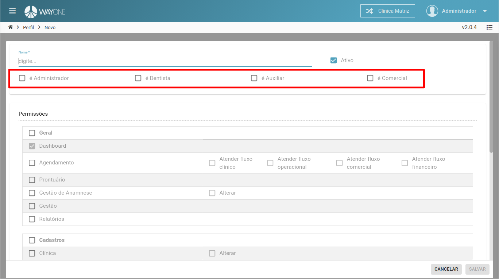
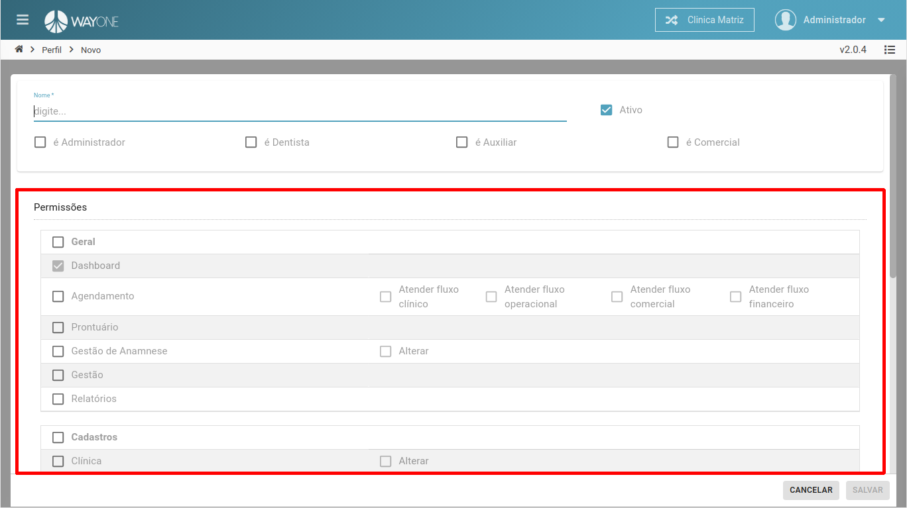
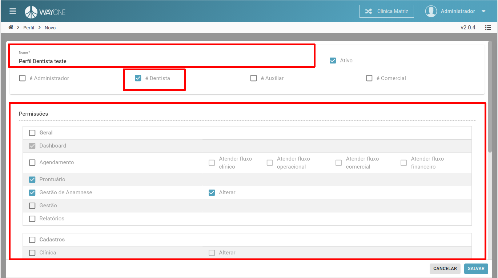
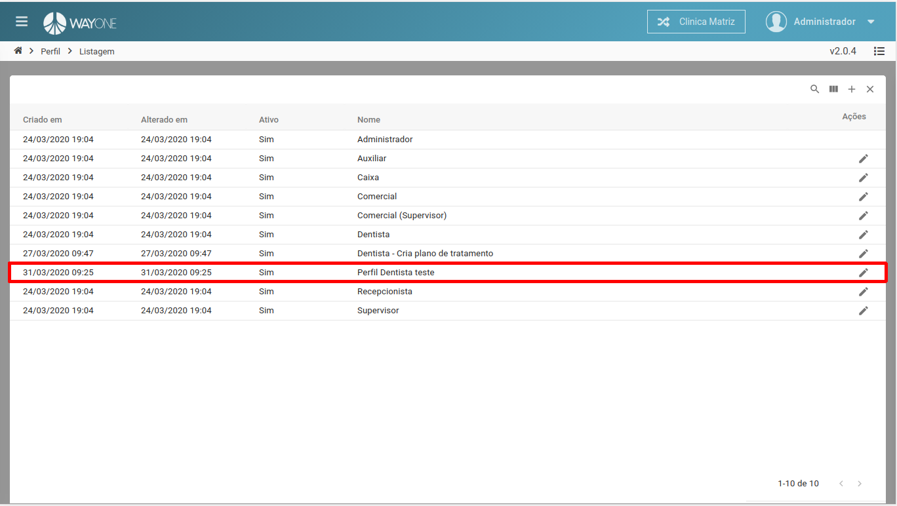

### Definição

Navegue no **menu lateral** e clique sobre **Perfil**

 
  

Na parte superior da tela, do lado direito, clique no **ícone adicionar** para abrir o formulário.

 
  

#### Nome
Defina o **nome** perfil.

 
  

#### Tipo
Defina o **tipo** de perfil.

 
  

#### Permissões
Defina as **permissões** do perfil.

 
  

Definindo **Nome**, **Tipo** e **Permissões**

 
  

Novo perfil cadastrado.

 
  

