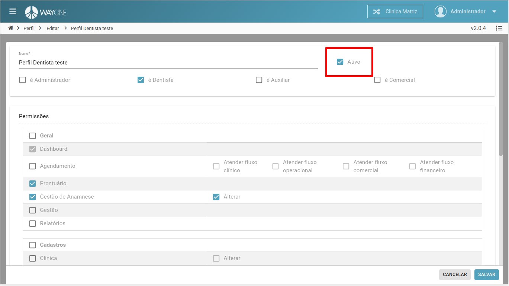
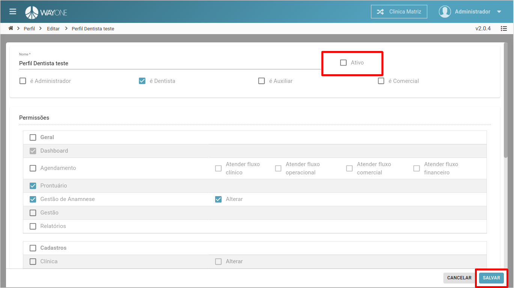
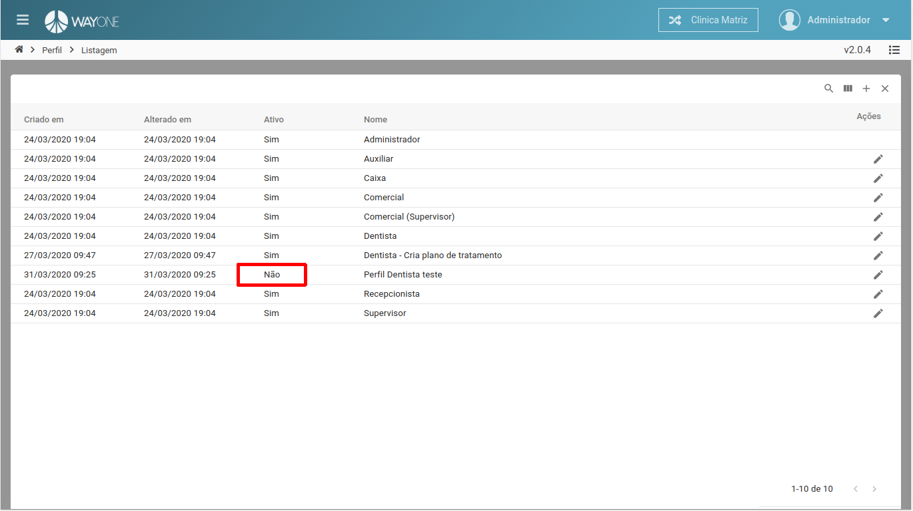

### Definição

Se tiver dúvidas sobre como pesquisar por um perfil, [clique aqui](/pages/perfil/como-pesquisar-por-um-perfil).

Para desativar o cadastro do perfil, **clique** na **caixa Ativo** 

 
  

Desativando o cadastro e salvando.

 
  

Lista de perfil com status inativo.

 
  

