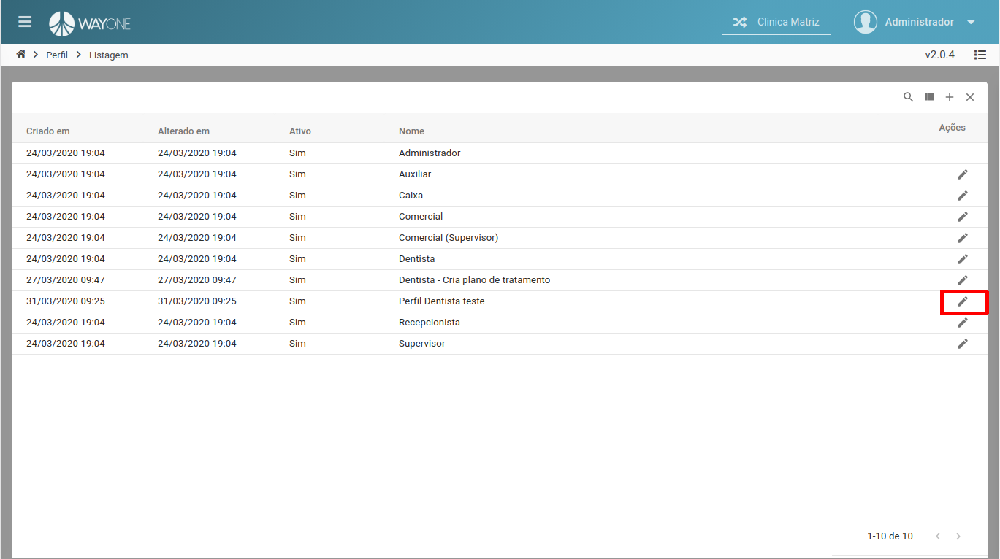
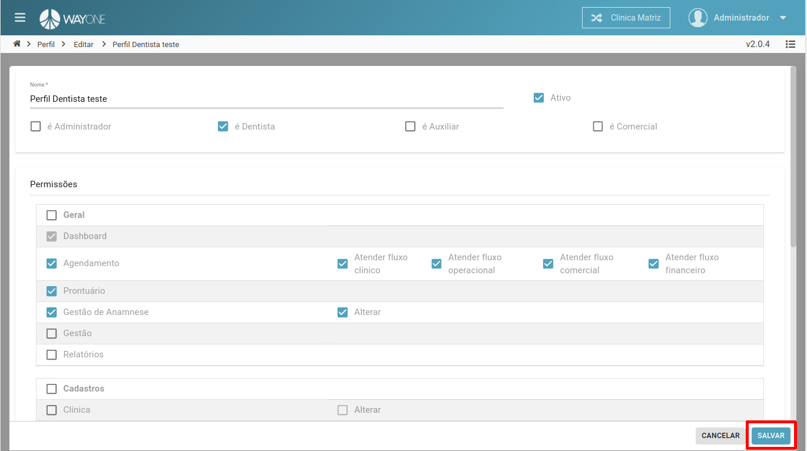

### Definição

Se tiver dúvidas sobre como pesquisar por um perfil, [clique aqui](/pages/perfil/como-pesquisar-por-um-perfil).

Após identificar na lista o perfil que deseja **editar**, clique na opção do **lápis**, para abrir o formulário de edição.

 
  

Será aberto a tela de edição do perfil, edite conforme a necessidade e clique no final da página, no botão **salvar**

 
  

