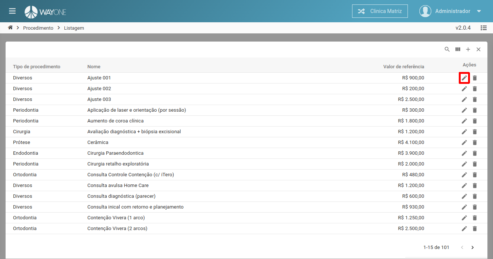
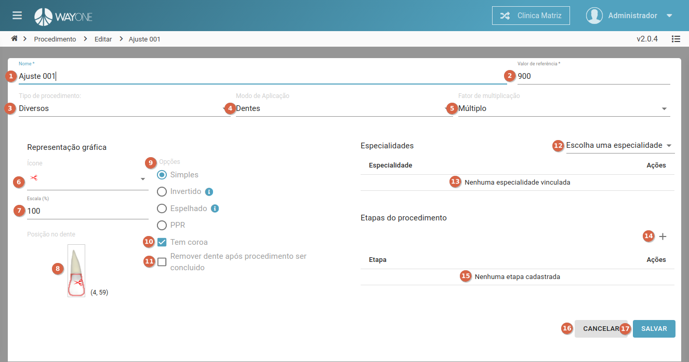

### Definição

Para editar um procedimento clique sobre o **ícone lápis** localizado na coluna de ações da tabela.

  

Sera apresentada a tela de edição com os dados da procedimento selecionado.

  

1. **Nome** - informe o nome do procedimento - campo **obrigatório**.
2. **Valor de referência** - informe o valor de referência do procedimento - campo **obrigatório**.
3. **Tipo de procedimento** - selecione o tipo do procedimento.
4. **Modo de aplicação** - selecione o modo de aplicação.
    - Os modos de aplicação são:
        - Boca Inteira.
        - Faces.
        - Dentes.
5. **Fator de Multiplicação** - selecione o fator de multiplicação.
    - Os fatores de multiplicação são:
        - Múltiplo.
        - Único.
6. **Ícone** - selecione o ícone que representa o procedimento.
7. **Escala** - altera o tamanho da imagem do ícone sobre o dente.
8. **Posição no dente** - altera a posição da imagem do ícone sobre o dente.
9. **Opções** - selecione a opção referente a imagem do ícone.
    - As opções são:
        - Simples.
        - Invertido.
        - Espelhado.
        - PGR.    
10. **Tem corroa** - selecione se o procedimento possui corroa.
11. **Remover dente após procedimento ser concluído** - selecione se e precisos remover o dente apos concluir o procedimento.
12. **Escolha uma especialidade** - selecione as especialidades do procedimento.
13. Lista das especialidades escolhida.
14. **Adicionar uma etapa** - adiciona uma nova etapa para o procedimento.
15. Lista das etapas adicionadas.
16. Botão **Cancelar** - cancela o cadastro de sala e retorna para a listagem.
17. Botão **Salvar** - salva o cadastro da sala e retorna para a listagem.

**Altere os campos desejados** e clique no botão **Salvar** para concluir a edição.

