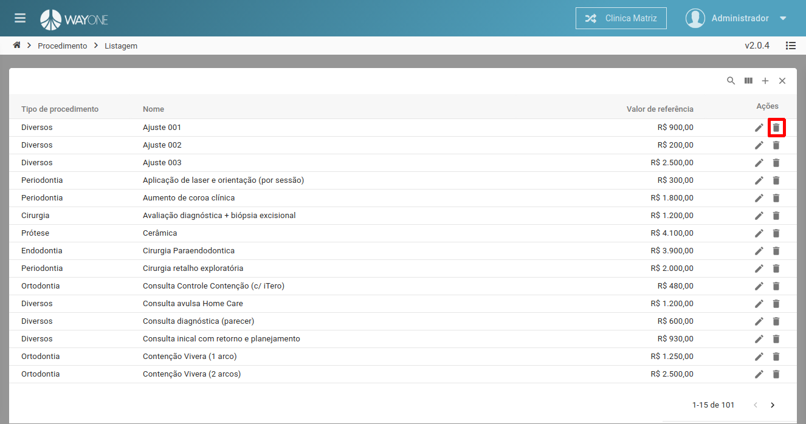
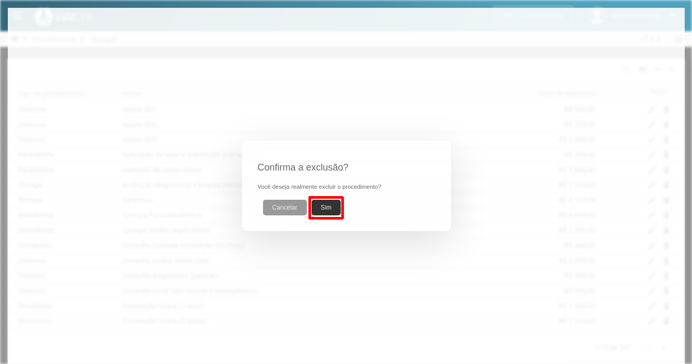

### Definição

Para excluir um procedimento clique sobre o **ícone lixeira** localizado na coluna de ações da tabela.

 
  

Sera solicitada a confirmação da exclusão.

 
  

Clique no botão **Sim** para confirmar a exclusão da procedimento.

