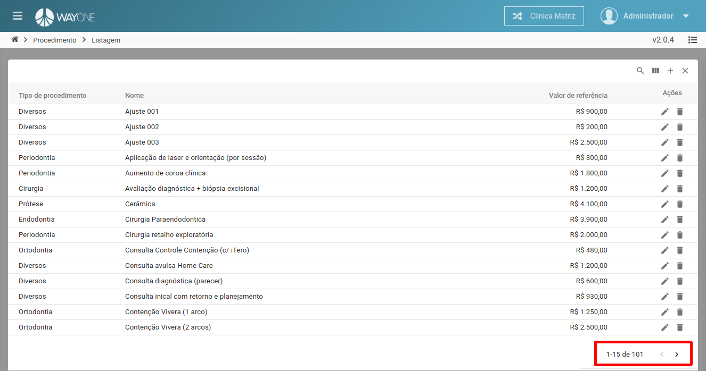
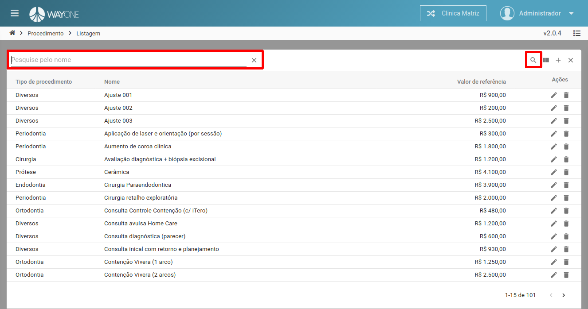
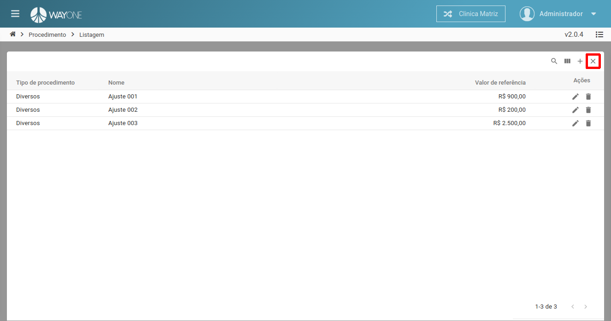

### Definição

**Existem duas formas de pesquisar por um procedimento**

### Paginação

Navegando entre as páginas utilizando as setas localizadas na parte inferior direita da lista

  

### Busca

Na parte superior direita da lista, existe um **botão de lupa**, ao clicar nele será aberto **no lado esquerdo um campo para digitar texto**, digite o nome do procedimento e **pressione a tecla enter para iniciar a busca**

  

Será mostrado o resultado filtrado, caso queira limpar o filtro, clique no **X** que está na parte superior direita da lista.

  

