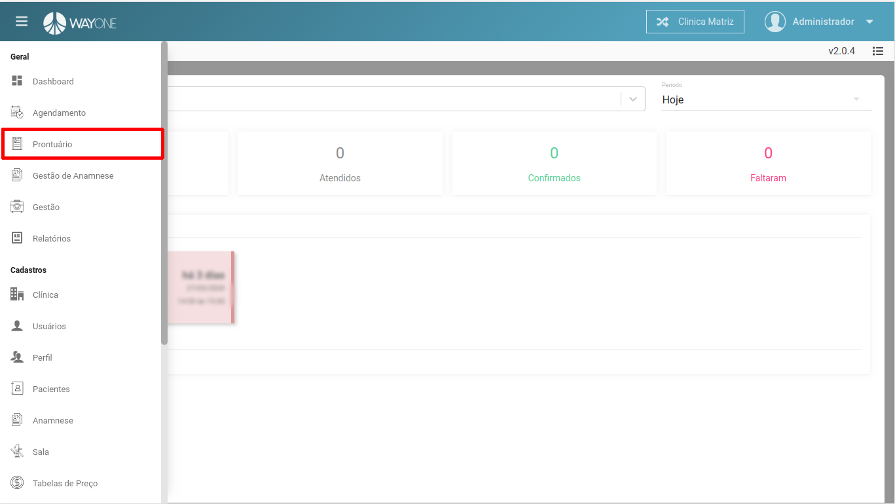
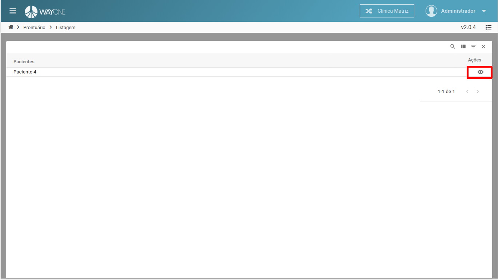
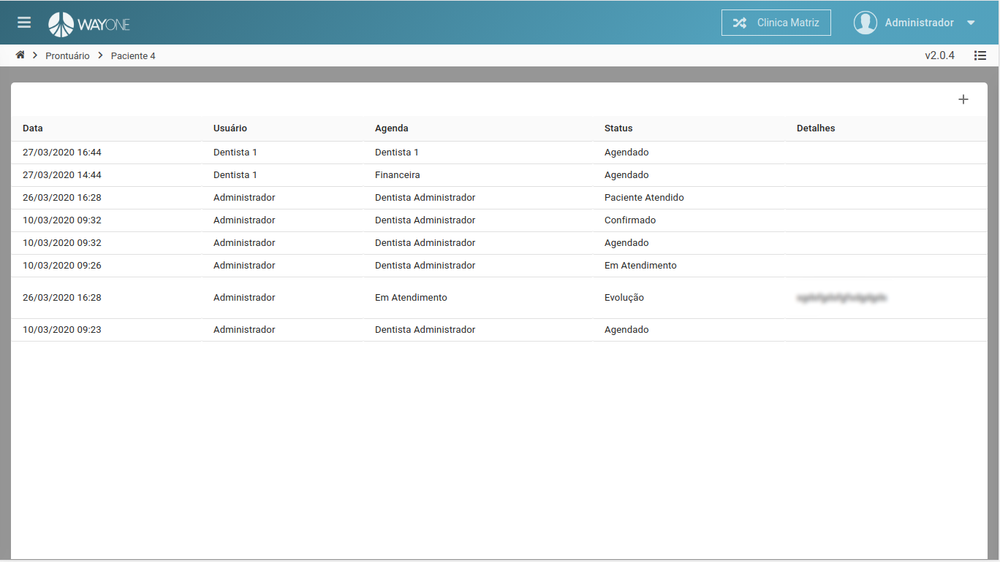

### Definição

Navegue no **menu lateral** e clique sobre **Prontuário**

 
  

Clique sobre o  **ícone** referente ao paciente para pode visualizar o prontuário

 
  

Lista de histórico do paciente

 
  

