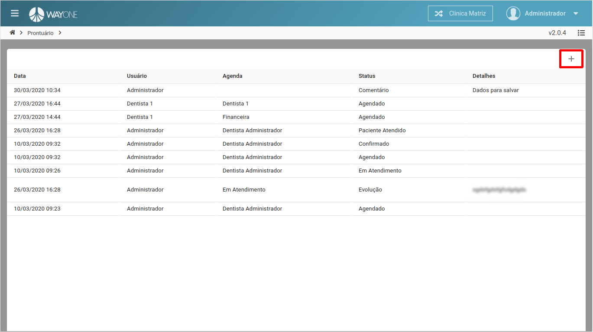
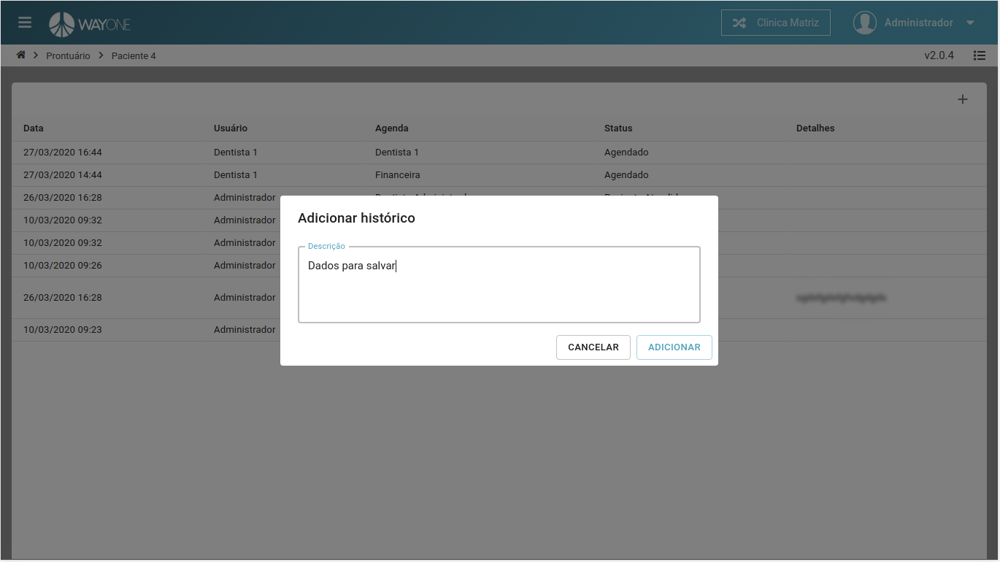
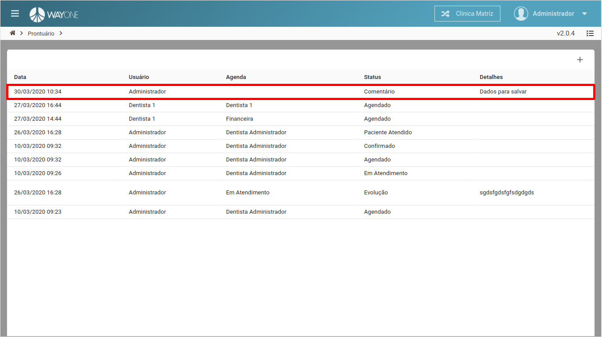

### Definição

Na lista de histórico do paciente, **clique** sobre o **ícone** para adicionar um novo histórico

  

Adicione a descrição do novo histórico

  

Lista com o novo histórico adicionado

  

