### Definição

Para editar um roteiro clique sobre o **ícone lápis** localizado na coluna de ações da tabela.

 
  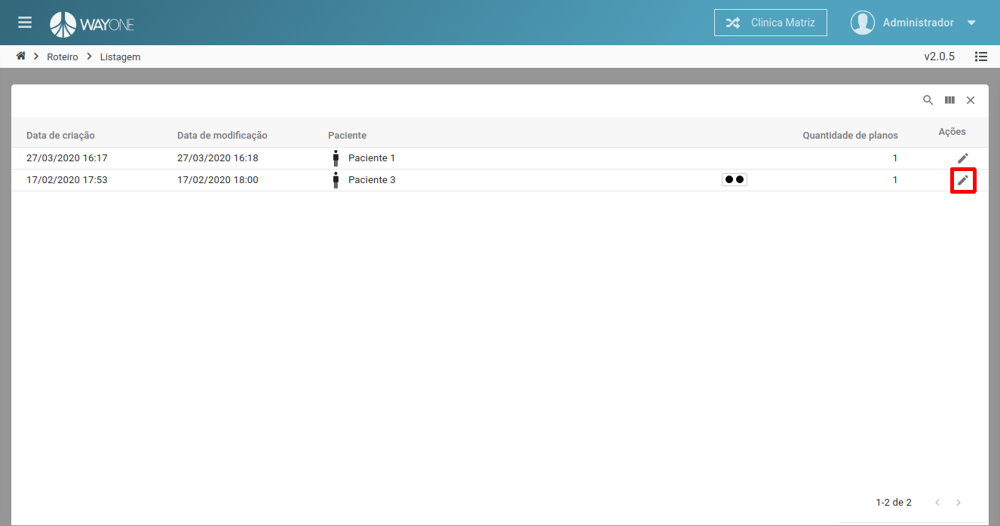

Sera apresentada a tela do roteiro, selecione o plano de tratamento desejado para criar o roteiro no canto superior esquerdo da tela e clique no botão **Exibir**.

 
  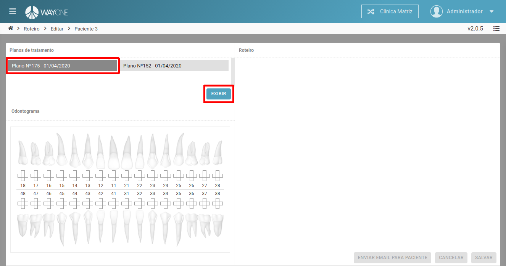

Sera apresentada o odontograma do plano de tratamento no lado esquerdo da tela e os dados do roteiro no lado direito da tela. **Os itens de um roteiro são divididos por procedimento**.

 
  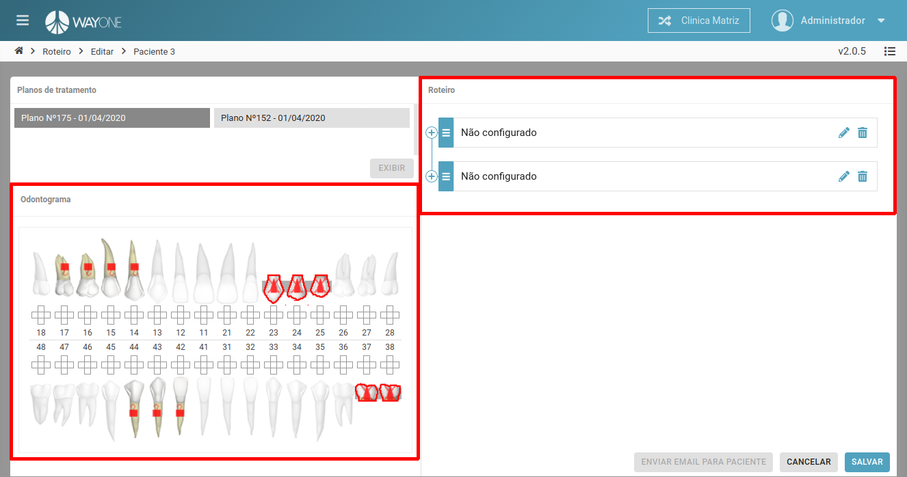

Clique sobre o **ícone mais** nos itens do roteiro para visualizar os subitens. **Cada subitem de um roteiro é um procedimento do plano de tratamento**.

 
  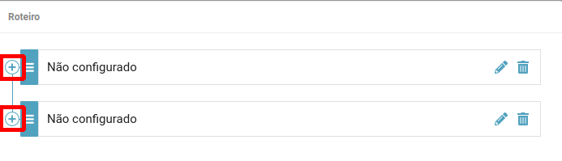

 
  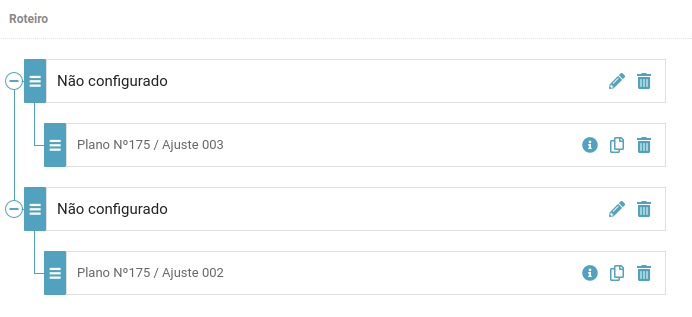

E possível reorganizar os subitens do roteiro clicando sobre o **ícone de lista** e arrastando para outro item.

 
  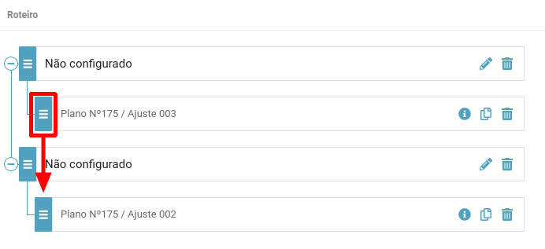

 
  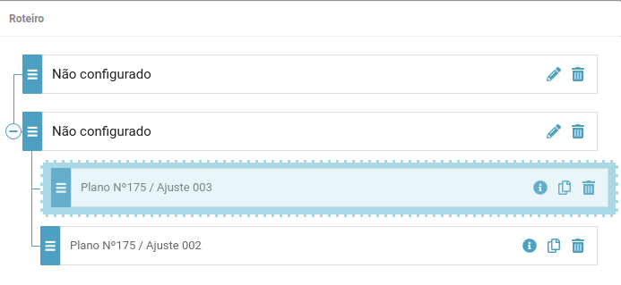

Para remover um item clique sobre o **ícone lixeira**.

 
  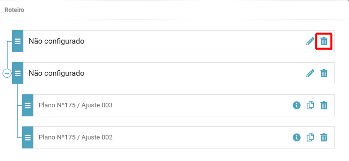

Sera solicitada a confirmação para remover.

 
  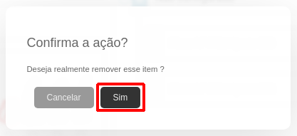

Para editar um item clique sobre o **ícone lápis** 

 
  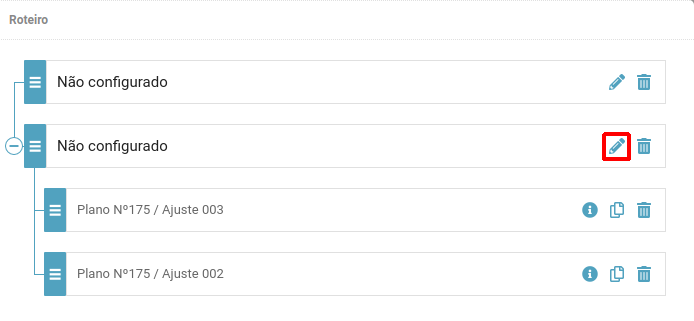

Sera apresentada a tela de edição do item selecionado.

 
  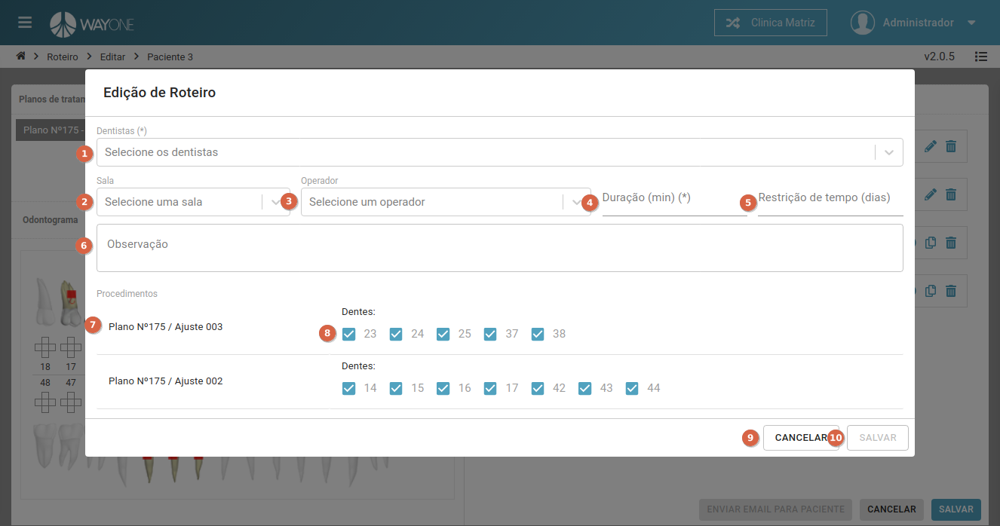

1. **Dentistas** - selecione quais dentistas poderão atender a este roteiro - campo **obrigatório**.
2. **Sala** - selecione a sala.
3. **Operador** - selecione o operador.
4. **Duração (min)** - selecione a duração minima para realização do roteiro - campo **obrigatório**.
5. **Restrição de tempo (dias)** - informe qual a restrição de tempo em dias para a realização deste roteiro.
6. **Observação** - informe uma observação para o roteiro.
7. **Procedimentos** - lista dos procedimento do roteiro.
8. **Dentes** - selecione quais dentes dos procedimentos faram parte deste roteiro.
    - **Observação** - caso não seja selecionado todos os dentes dos procedimentos apresentados os não selecionados se tornaram um novo item de roteiro.
9. botão **Cancelar** - cancela a edição do item de roteiro.
10. botão **Salvar** - salva as alterações do item de roteiro.

**Altere os campos desejados** e clique no botão **Salvar** para concluir a edição.

Exemplo de preenchimento dos dados de edição:

 
  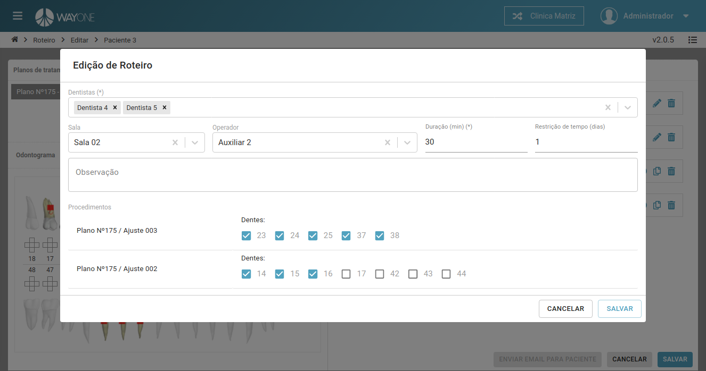

Ao **salvar** a edição o item ficara com status de **"Não agendado"** e ira liberar a opção de agendamento de consulta.
**Obs:** Neste caso como não foram selecionado todos os dentes do procedimento "Ajuste 002" os dentes não selecionados se tornaram um novo item de roteiro.

 
  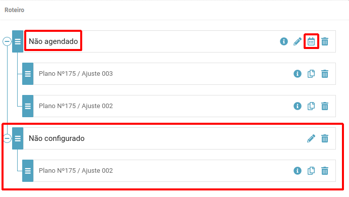

Para agendar uma consulta para este item de roteiro clique no **ícone calendário**

 
  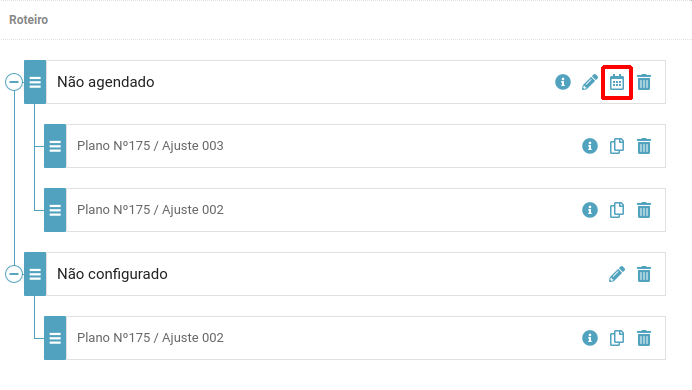

Sera exibida a tela de agendamento de consulta com os horários disponíveis, para gerar nova data e horários clique no botão **Nova Data** no canto inferior direito da tela.
Para agendar a consulta clique no botão **Agendar** sobre a data e horário desejado.

 
  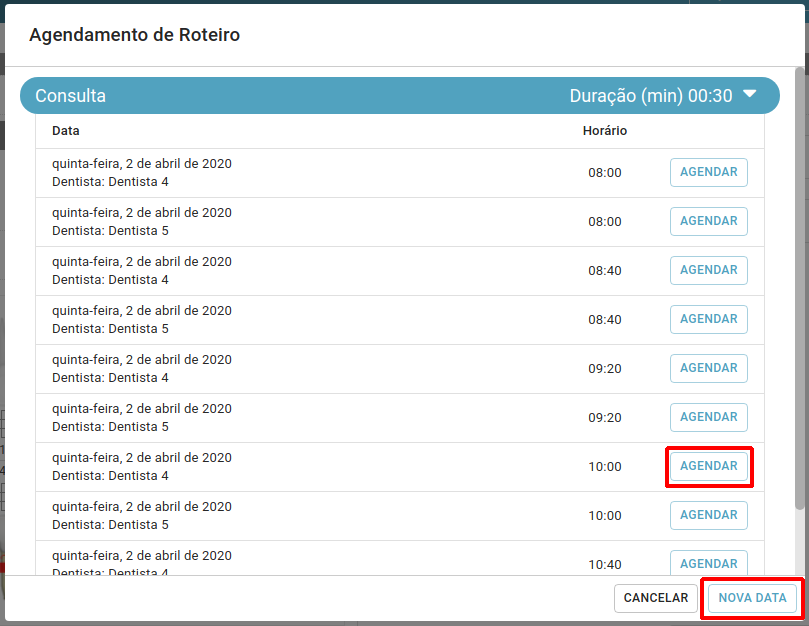

Sera solicitada a confirmação para agendar clique no botão Sim.

 
  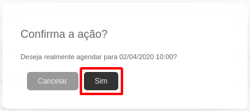

O item do roteiro mudara seu status para **"Agendado para DD/MM/AAAA HH:mm"** e não poderá mais ser editado.

 
  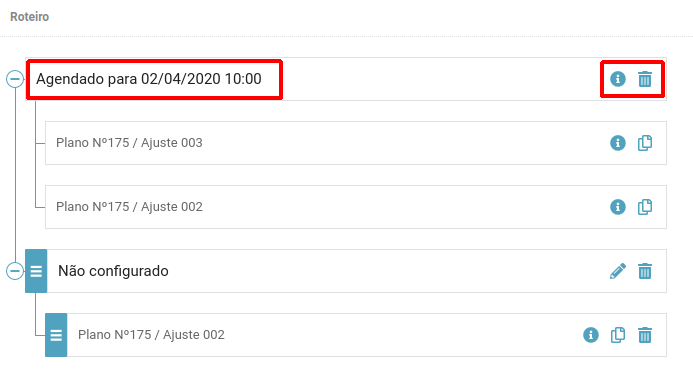

O agendamento do roteiro pode ser visualizado no calendário.

 
  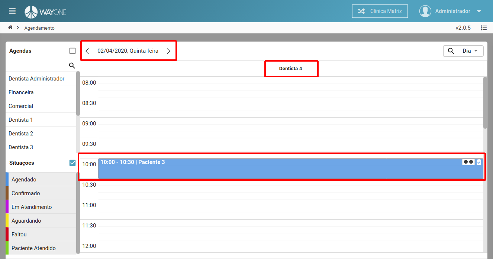

