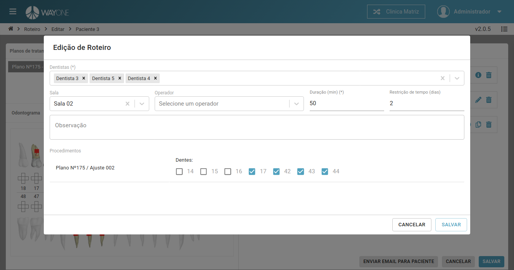

### Definição

Para editar um roteiro clique sobre o **ícone lápis** localizado na coluna de ações da tabela.

  

Sera apresentada a tela do roteiro, selecione o plano de tratamento desejado para criar o roteiro no canto superior esquerdo da tela e clique no botão **Exibir**.

  

Sera apresentada o odontograma do plano de tratamento no lado esquerdo da tela e os dados do roteiro no lado direito da tela. **Os itens de um roteiro são divididos por procedimento**.

  

Para enviar o email para o paciente com o roteiro **é necessário que os itens do roteiro estejam configurados**. Neste caso ainda possuímos um item **Não configurado** e precisamos configura-lo.

**Obs:** Para saber mais sobre configuração dos itens do roteiro veja: [Como editar um roteiro](/pages/roteiro/editar-roteiro/)

Configurando o roteiro.

  

Apos clicar em **Salvar** na tela de edição do roteiro o item do roteiro fica com o status **Não agendado** podendo ser agendado de forma manual clicando no **ícone calendário** e selecionando um horário ou este agendamento **pode ser feito pelo próprio paciente ao acessar o link que e enviado para seu email**.

Para enviar o email para o paciente clique no botão **Enviar Email Para Paciente**

  

<!-- O paciente ira receber um email parecido como este. Para que ele possa realizar o próprio agendamento para os itens de roteiro que ainda não possuem agendamento ele deve clicar no botão **Acessar**.

  

O paciente sera redirecionado para esta pagina.

  

 -->