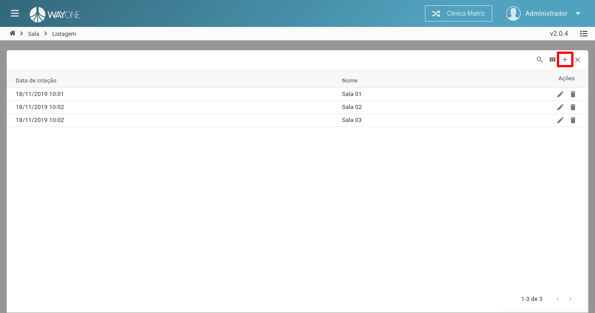
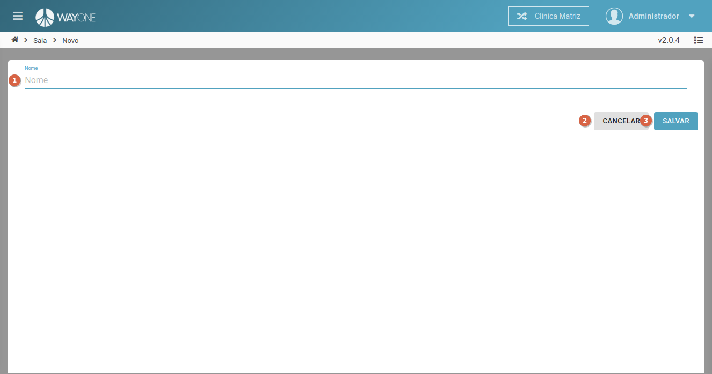

### Definição

Para adicionar uma sala clique sobre o **ícone mais** localizado no canto superior direito da tabela de sala

 
  

Sera apresentada a tela de cadastro de uma nova sala.

 
  

1. **Nome** - informe o nome da sala - campo **obrigatório**.
2. Botão **Cancelar** - cancela o cadastro de sala e retorna para a listagem.
3. Botão **Salvar** - salva o cadastro da sala e retorna para a listagem.

**Preencha os campos necessários** e clique no botão **Salvar** para concluir o cadastro.

