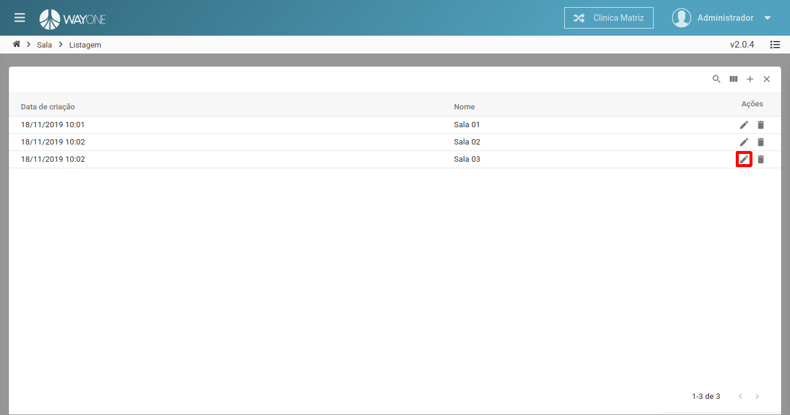

### Definição

Para editar uma sala clique sobre o **ícone lápis** localizado na coluna de ações da tabela.

  

Sera apresentada a tela de edição com os dados da sala selecionada.

  

1. **Nome** - informe o nome da sala - campo **obrigatório**.
2. Botão **Cancelar** - cancela a edição de sala e retorna para a listagem.
3. Botão **Salvar** - salva a edição da sala e retorna para a listagem.

**Altere os campos desejados** e clique no botão **Salvar** para concluir a edição.

