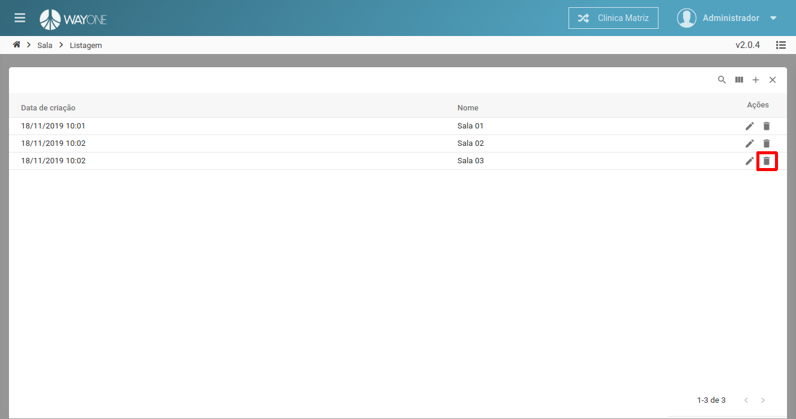
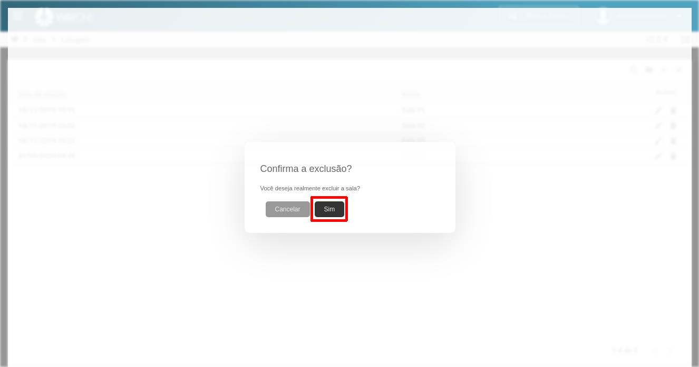

### Definição

Para excluir uma sala clique sobre o **ícone lixeira** localizado na coluna de ações da tabela.

  

Sera solicitada a confirmação da exclusão.

  

Clique no botão **Sim** para confirmar a exclusão da sala.

