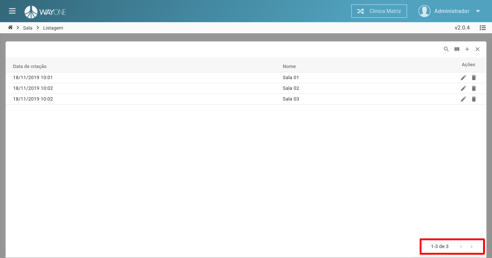
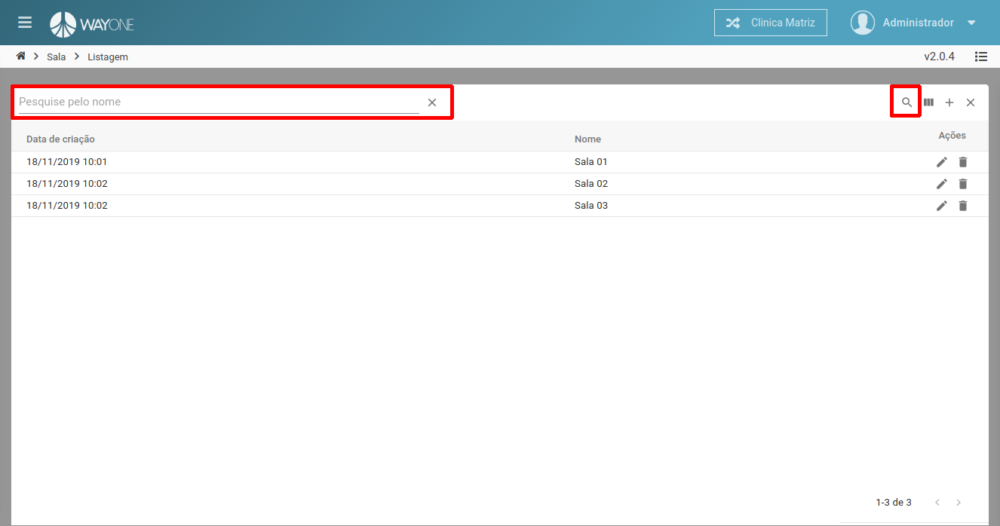
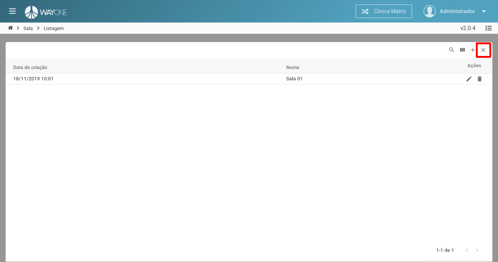

### Definição

**Existem duas formas de pesquisar por uma sala**

### Paginação

Navegando entre as páginas utilizando as setas localizadas na parte inferior direita da lista

 
  

### Busca

Na parte superior direita da lista, existe um **botão de lupa**, ao clicar nele será aberto **no lado esquerdo um campo para digitar texto**, digite o nome da sala e **pressione a tecla enter para iniciar a busca**

 
  

Será mostrado o resultado filtrado, caso queira limpar o filtro, clique no **X** que está na parte superior direita da lista.

 
  

