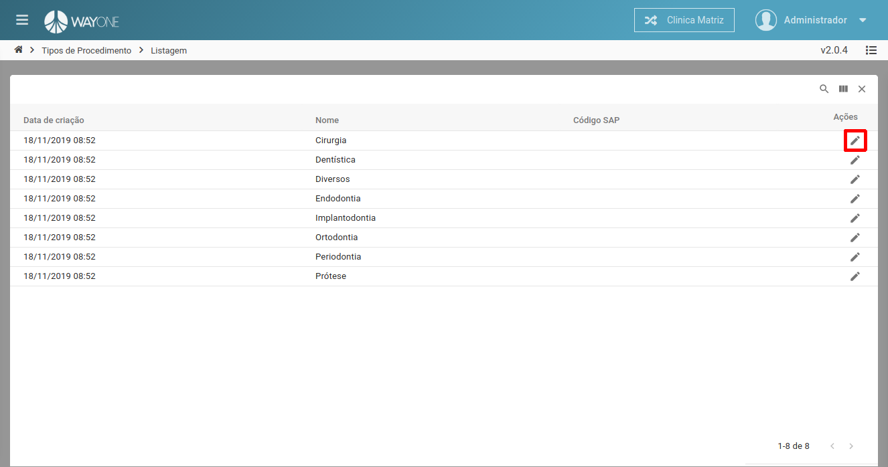
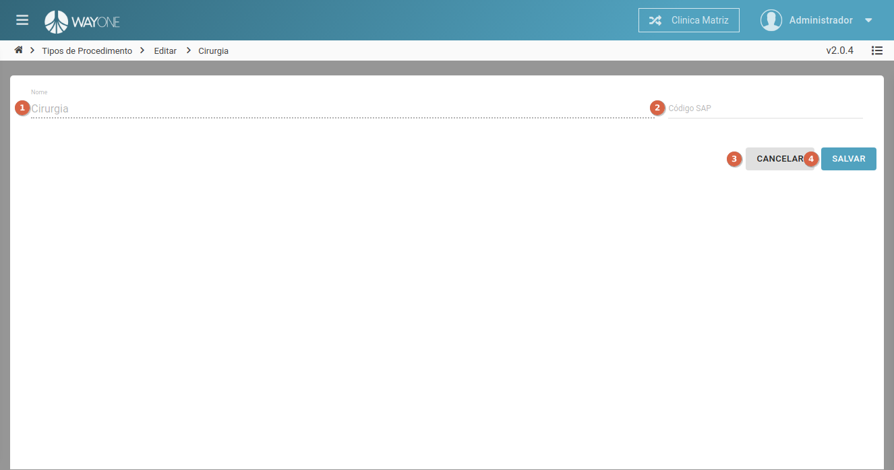

### Definição

Para editar uma tipo de procedimento clique sobre o **ícone lápis** localizado na coluna de ações da tabela.

  

Sera apresentada a tela de edição com os dados do tipo de procedimento selecionada.

  

1. **Nome** - campo **bloqueado**.
2. **Código SAP** - informe o código de vinculo com o SAP.
3. Botão **Cancelar** - cancela a edição do tipo de procedimento e retorna para a listagem.
4. Botão **Salvar** - salva a edição do tipo de procedimento e retorna para a listagem.

**Altere os campos desejados** e clique no botão **Salvar** para concluir a edição.

