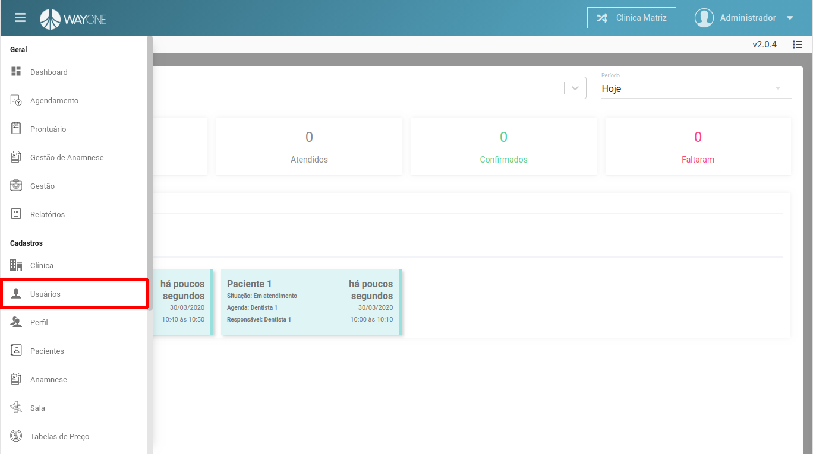
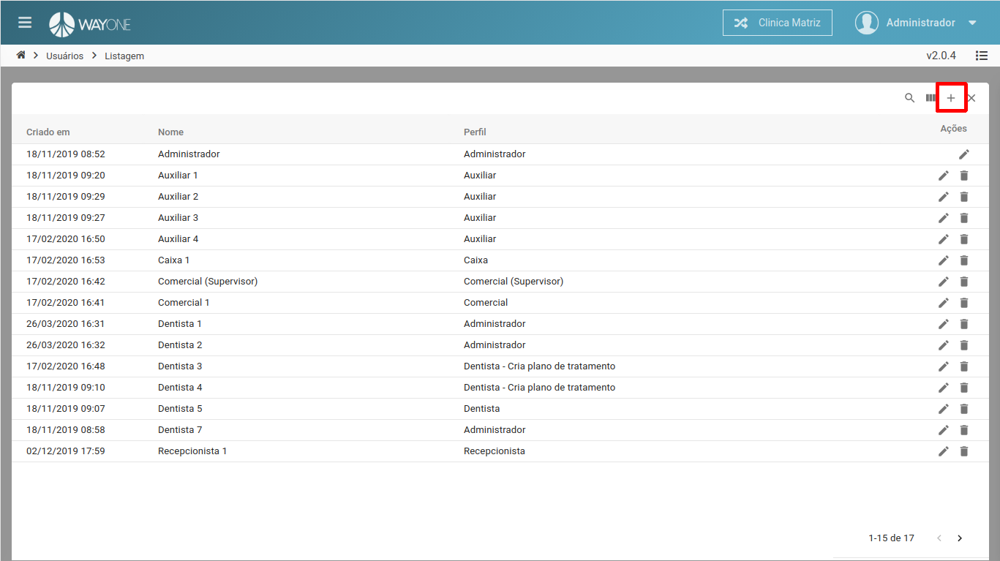
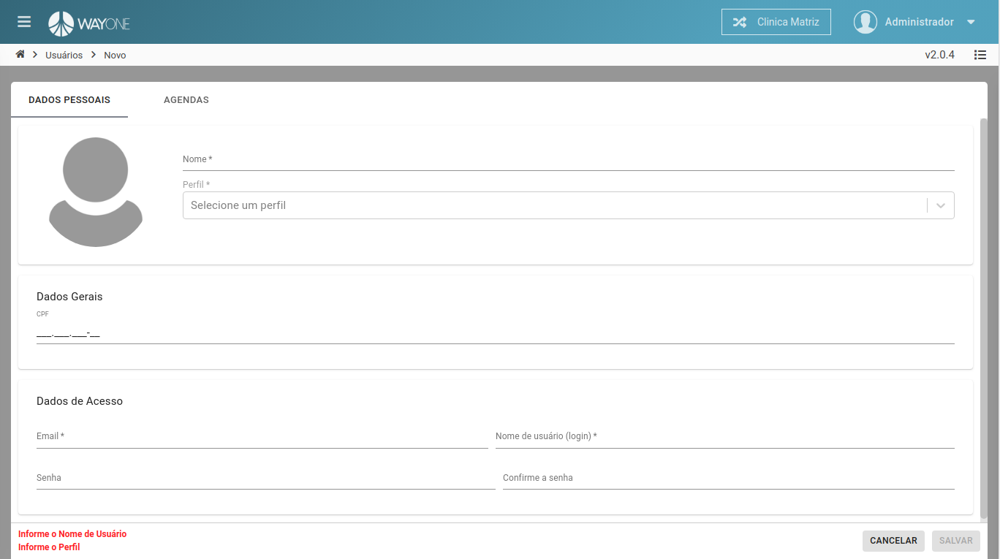
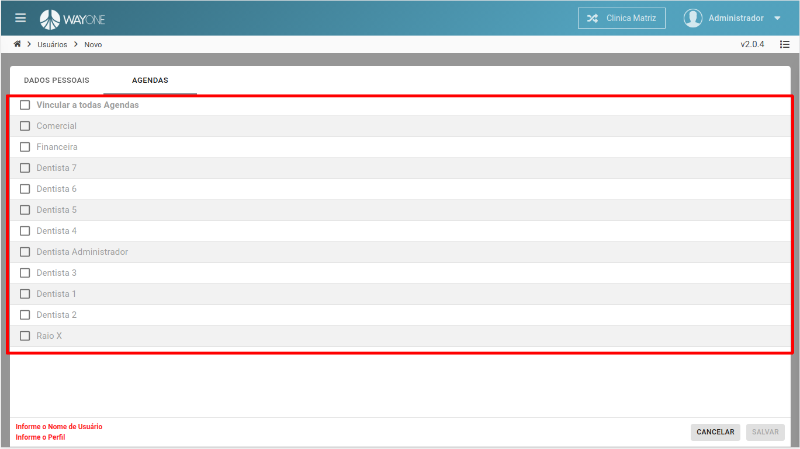
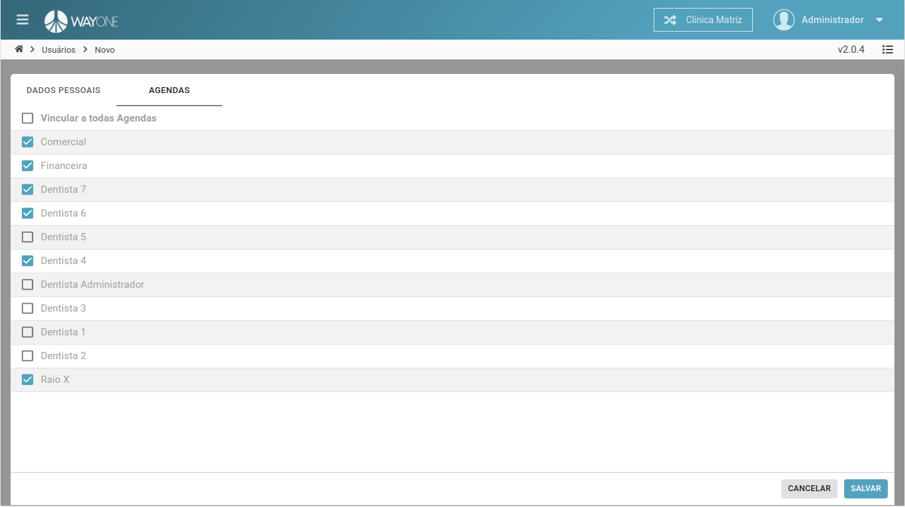
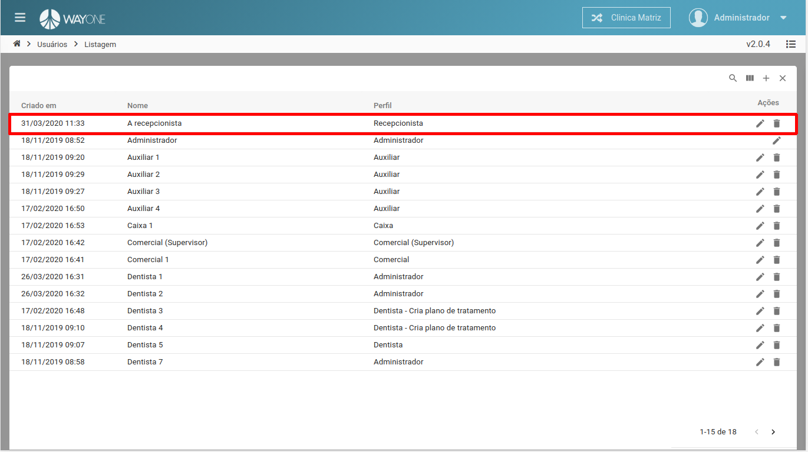

### Definição

Navegue no **menu lateral** e clique sobre **Usuários**

  

Na parte superior da tela, do lado direito, clique no **ícone adicionar** para abrir o formulário.

  

#### Informações necessárias para o cadastro
* **Nome**
* **Perfil**
* **CPF**
* **E-mail**
* **Nome de usuário**
* **Senha**

  

Selecione o perfil do usuário.
Caso tenha dúvidas em relação ao cadastro de perfil, [clique aqui](/pages/perfil/o-que-e-um-perfil).

  

Definindo as agendas que o usuário terá acesso.
Defina as **permissões** do perfil.

  

Exemplificando o cadastro.

  

  

O novo cadastro na lista de usuários.

  

