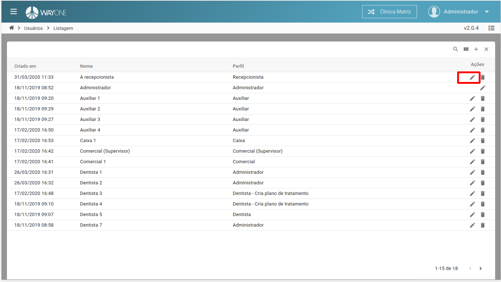
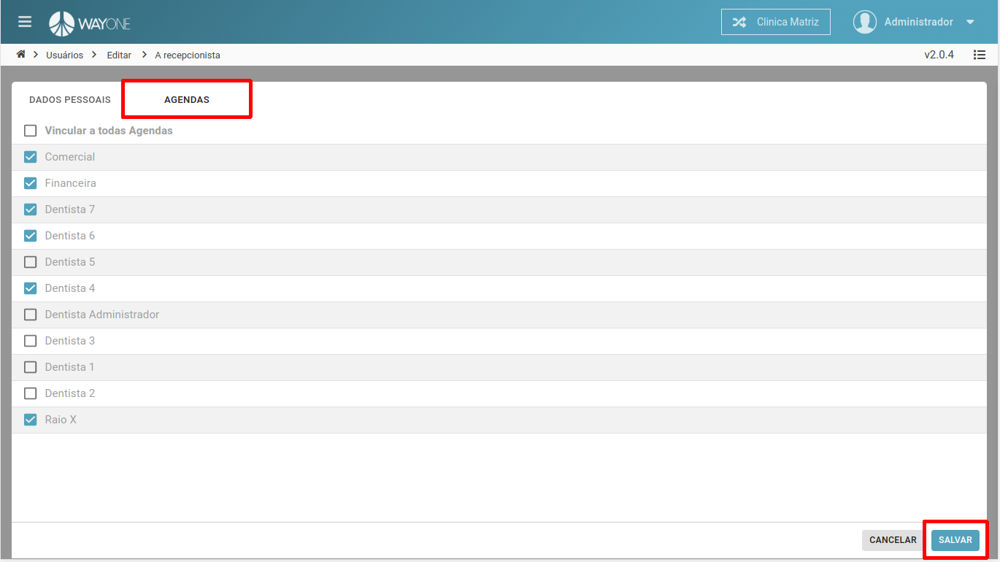

### Definição

Se tiver dúvidas sobre como pesquisar por um usuário, [clique aqui](/pages/usuario/como-pesquisar-por-um-usuario).

Selecione o usuário para alterar as configurações de agenda.

  

Na **Aba AGENDAS**, selecione as agendas para poder ter acesso, depois salve as alterações.

  

